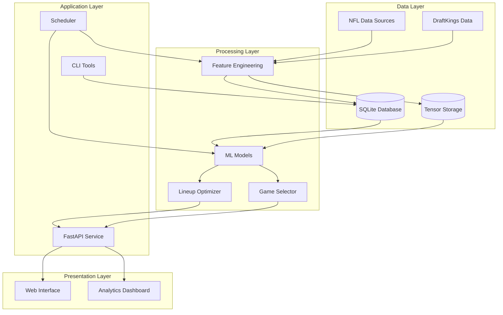

# NFL DFS System Architecture Overview

## Executive Summary

The NFL Daily Fantasy Sports (DFS) Machine Learning System is a comprehensive platform designed for personal use to predict NFL player performance, optimize DraftKings lineups, and continuously improve prediction accuracy through self-learning mechanisms. The system prioritizes entertainment value and fun-focused contest selection over profit maximization.

## System Goals

### Primary Objectives

- **Accurate NFL Player Predictions**: Leverage machine learning to forecast player performance using DraftKings scoring
- **Self-Improving Models**: Continuously learn from prediction errors to enhance accuracy
- **Optimal Lineup Generation**: Create mathematically optimized lineups for various contest types
- **Entertainment-Focused Game Selection**: Identify engaging games based on personal preferences
- **Local Deployment**: Designed for personal use with local-first architecture

### Non-Goals

- Profit maximization or gambling optimization
- Real-money betting integration
- Multi-sport support (NFL-only focus)
- Cloud-based deployment or multi-user support

## High-Level Architecture



## Core Components

### 1. Data Collection & Storage

- **NFL Data Pipeline**: Automated collection from nfl_data_py
- **DraftKings Integration**: Manual salary CSV uploads and processing
- **SQLite Database**: Persistent storage for structured data
- **Tensor Storage**: Pre-processed PyTorch tensors for fast model training

### 2. Feature Engineering

- **Position-Specific Processing**: Tailored features for QB, RB, WR/TE, DST
- **Game Environment Analysis**: Vegas lines, weather, stadium effects
- **Correlation Mapping**: Player and game stacking relationships
- **Ownership Projections**: Predicted contest ownership percentages

### 3. Machine Learning Pipeline

- **Position-Specific Models**: Separate architectures for each position
- **Ensemble Methods**: XGBoost, LightGBM, and Neural Networks
- **Self-Improvement Loop**: Automated learning from prediction errors
- **Backtesting Framework**: Historical validation and optimization

### 4. Optimization Engine

- **Lineup Optimizer**: Constraint-based optimization using PuLP
- **Contest Strategies**: Cash game vs GPP-specific approaches
- **Stacking Logic**: Correlation-based player groupings
- **Multi-lineup Generation**: Diverse lineup creation for tournaments

### 5. Game Selection System

- **Entertainment Scoring**: Evaluate games for fun potential
- **Personal Preferences**: User-specific game recommendations
- **Matchup Analysis**: Identify compelling storylines and rivalries

### 6. API & Interface Layer

- **RESTful API**: FastAPI-based service endpoints
- **CLI Tools**: Command-line utilities for data management
- **Scheduling Service**: Automated data updates and model retraining

## Technology Stack

### Core Technologies

- **Language**: Python 3.10+
- **Package Management**: Poetry
- **Database**: SQLite with SQLAlchemy ORM
- **API Framework**: FastAPI with Uvicorn
- **ML Frameworks**: PyTorch, XGBoost, LightGBM, scikit-learn

### Supporting Libraries

- **Data Processing**: Pandas, NumPy, PyArrow
- **Optimization**: PuLP (linear programming)
- **ML Operations**: MLflow, Optuna
- **Visualization**: Matplotlib, Seaborn, SHAP
- **Logging**: Loguru
- **Testing**: Pytest

## System Boundaries

### Internal Systems

- Local SQLite database
- File-based tensor storage
- MLflow tracking (local)
- Configuration management

### External Integrations

- nfl_data_py API (read-only)
- DraftKings CSV imports (manual)
- No external APIs or cloud services required

## Key Design Principles

### 1. Position-Specific Modeling

Each NFL position has unique statistical patterns and scoring characteristics, requiring specialized models and features.

### 2. Self-Improvement Through Feedback

The system learns from prediction errors, continuously adjusting weights and parameters to improve accuracy.

### 3. Local-First Architecture

All data processing and storage occurs locally, ensuring privacy and eliminating external dependencies.

### 4. Entertainment Over Profit

Game selection and lineup optimization prioritize fun and engagement rather than expected value maximization.

### 5. Modular Component Design

Each component operates independently with well-defined interfaces, enabling isolated testing and development.

## Data Flow Architecture

```mermaid
sequenceDiagram
    participant User
    participant API
    participant FE as Feature Engineering
    participant ML as ML Models
    participant OPT as Optimizer
    participant DB as Database

    User->>API: Request Predictions
    API->>DB: Fetch Raw Data
    DB-->>API: Return Data
    API->>FE: Process Features
    FE->>ML: Generate Predictions
    ML-->>API: Return Predictions
    API-->>User: Display Results

    User->>API: Optimize Lineup
    API->>ML: Get Projections
    ML-->>API: Player Projections
    API->>OPT: Run Optimization
    OPT-->>API: Optimal Lineup
    API-->>User: Return Lineup
```

## Deployment Architecture

### Local Deployment Model

- Single-machine deployment
- SQLite for data persistence
- File-based model storage
- Local API server (localhost:8000)

### Resource Requirements

- **CPU**: 4+ cores recommended for model training (8+ cores for optimal performance)
- **RAM**: 16GB minimum, 32GB recommended
- **Storage**: 50GB for historical data and models
- **GPU**: Not currently required. System optimized for CPU-based training with provisions for future GPU acceleration

## System Constraints

### Technical Constraints

- **SQLite Limitations**: Single-writer, limited concurrent access
- **Local Processing**: Bounded by single machine resources
- **Manual Data Entry**: DraftKings salaries require manual upload

### Business Constraints

- **NFL Season Schedule**: System primarily active during NFL season
- **Weekly Cycles**: Predictions align with NFL weekly schedule
- **Personal Use Only**: Not designed for commercial deployment

## Evolution Strategy

### Near-term Enhancements

1. Automated salary scraping (if permitted)
1. Real-time injury report integration
1. Advanced visualization dashboard
1. Mobile-responsive web interface

### Potential Future Expansions

1. Additional DFS platforms (FanDuel, Yahoo)
1. Season-long fantasy support
1. Advanced betting models (player props)
1. Social features for league play

## Architecture Decision Records

### ADR-001: SQLite for Data Storage

**Decision**: Use SQLite instead of PostgreSQL **Rationale**: Simplicity, zero configuration, sufficient for single-user load **Trade-offs**: Limited concurrency, no network access

### ADR-002: Position-Specific Models

**Decision**: Separate models per position vs unified model **Rationale**: Different positions have unique statistical patterns **Trade-offs**: More models to maintain, increased complexity

### ADR-003: Local-First Design

**Decision**: All processing and storage local **Rationale**: Privacy, no external dependencies, cost-free operation **Trade-offs**: Limited scalability, manual updates required

### ADR-004: UV for Dependency Management

**Decision**: Use UV instead of pip/poetry/requirements.txt **Rationale**: UV is the fastest Python package manager available (10-100x faster than pip/poetry), written in Rust for maximum performance. Provides deterministic lockfiles, drop-in pip replacement, and minimal system resource usage while maintaining compatibility with existing Python workflows. **Trade-offs**: Newer tool with growing ecosystem, but rapidly becoming the standard for modern Python projects due to its exceptional performance

## Success Criteria

### Technical Metrics

- Prediction accuracy: MAE < 3.5 FP for QBs, < 3.0 for RBs, < 2.5 for WRs
- Optimization speed: < 5 seconds for full slate
- Model training: < 10 minutes for weekly update
- API response time: < 200ms for predictions

### Business Metrics

- Weekly prediction improvement trend
- Successful lineup generation for all contest types
- Accurate game entertainment scoring
- Consistent data pipeline operation

## Risk Mitigation

### Data Risks

- **Risk**: NFL data source changes
- **Mitigation**: Abstract data collection, maintain fallback sources

### Model Risks

- **Risk**: Overfitting to recent data
- **Mitigation**: Time-decay weighting, backtesting validation

### System Risks

- **Risk**: Database corruption
- **Mitigation**: Regular backups, data validation checks

### Performance Risks

- **Risk**: Slow optimization for large slates
- **Mitigation**: Tensor pre-processing, algorithm optimization
