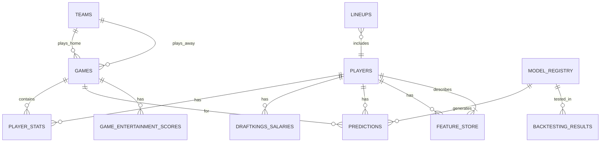

# NFL DFS Data Models and Database Schema

## Overview

This document defines the complete data model architecture for the NFL DFS system, including database schemas, data relationships, and storage strategies. The system uses SQLite for relational data and file-based storage for tensors and model artifacts.

## Database Architecture

### Storage Strategy

- **Primary Database**: SQLite (`data/database/nfl_dfs.db`)
- **Tensor Storage**: File-based PyTorch tensors (`data/tensors/`)
- **Model Artifacts**: MLflow tracking store (`data/mlflow/`)
- **Cache Layer**: File-based cache for API responses (`data/cache/`)

## Core Database Schema

### Players Table

```sql
CREATE TABLE players (
    player_id VARCHAR(50) PRIMARY KEY,
    full_name VARCHAR(100) NOT NULL,
    first_name VARCHAR(50),
    last_name VARCHAR(50),
    position VARCHAR(10) NOT NULL,
    team VARCHAR(5),
    jersey_number INTEGER,
    height FLOAT,
    weight FLOAT,
    birth_date DATE,
    college VARCHAR(100),
    draft_year INTEGER,
    draft_round INTEGER,
    draft_pick INTEGER,
    years_experience INTEGER,
    status VARCHAR(20), -- 'Active', 'Injured', 'Inactive'
    injury_status VARCHAR(20), -- 'Questionable', 'Doubtful', 'Out'
    injury_body_part VARCHAR(50),
    created_at TIMESTAMP DEFAULT CURRENT_TIMESTAMP,
    updated_at TIMESTAMP DEFAULT CURRENT_TIMESTAMP,

    INDEX idx_players_position (position),
    INDEX idx_players_team (team),
    INDEX idx_players_status (status)
);
```

### Teams Table

```sql
CREATE TABLE teams (
    team_id VARCHAR(5) PRIMARY KEY,
    team_name VARCHAR(50) NOT NULL,
    team_city VARCHAR(50),
    conference VARCHAR(3), -- 'AFC', 'NFC'
    division VARCHAR(10), -- 'East', 'West', 'North', 'South'
    primary_color VARCHAR(7),
    secondary_color VARCHAR(7),
    stadium_name VARCHAR(100),
    stadium_type VARCHAR(20), -- 'Dome', 'Outdoor', 'Retractable'
    stadium_surface VARCHAR(20), -- 'Grass', 'Turf'
    timezone VARCHAR(50),
    created_at TIMESTAMP DEFAULT CURRENT_TIMESTAMP,
    updated_at TIMESTAMP DEFAULT CURRENT_TIMESTAMP
);
```

### Games Table

```sql
CREATE TABLE games (
    game_id VARCHAR(20) PRIMARY KEY,
    season INTEGER NOT NULL,
    week INTEGER NOT NULL,
    game_type VARCHAR(10), -- 'REG', 'POST', 'PRE'
    game_date TIMESTAMP NOT NULL,
    home_team VARCHAR(5) NOT NULL,
    away_team VARCHAR(5) NOT NULL,
    home_score INTEGER,
    away_score INTEGER,
    overtime BOOLEAN DEFAULT FALSE,
    weather_temp FLOAT,
    weather_wind_mph FLOAT,
    weather_humidity FLOAT,
    weather_conditions VARCHAR(50),
    vegas_spread FLOAT, -- negative for home favorite
    vegas_total FLOAT,
    home_implied_total FLOAT,
    away_implied_total FLOAT,
    stadium_id VARCHAR(100),
    is_divisional BOOLEAN DEFAULT FALSE,
    is_primetime BOOLEAN DEFAULT FALSE, -- SNF, MNF, TNF
    game_status VARCHAR(20), -- 'Scheduled', 'InProgress', 'Final'
    created_at TIMESTAMP DEFAULT CURRENT_TIMESTAMP,
    updated_at TIMESTAMP DEFAULT CURRENT_TIMESTAMP,

    FOREIGN KEY (home_team) REFERENCES teams(team_id),
    FOREIGN KEY (away_team) REFERENCES teams(team_id),
    INDEX idx_games_season_week (season, week),
    INDEX idx_games_date (game_date),
    INDEX idx_games_teams (home_team, away_team)
);
```

### Player Stats Table

```sql
CREATE TABLE player_stats (
    stat_id INTEGER PRIMARY KEY AUTOINCREMENT,
    player_id VARCHAR(50) NOT NULL,
    game_id VARCHAR(20) NOT NULL,
    team VARCHAR(5) NOT NULL,
    opponent VARCHAR(5) NOT NULL,
    season INTEGER NOT NULL,
    week INTEGER NOT NULL,

    -- Passing Stats
    pass_attempts INTEGER DEFAULT 0,
    pass_completions INTEGER DEFAULT 0,
    pass_yards INTEGER DEFAULT 0,
    pass_touchdowns INTEGER DEFAULT 0,
    pass_interceptions INTEGER DEFAULT 0,
    pass_sacks INTEGER DEFAULT 0,
    pass_sack_yards INTEGER DEFAULT 0,
    pass_rating FLOAT,
    pass_epa FLOAT,
    pass_cpoe FLOAT,
    pass_success_rate FLOAT,

    -- Rushing Stats
    rush_attempts INTEGER DEFAULT 0,
    rush_yards INTEGER DEFAULT 0,
    rush_touchdowns INTEGER DEFAULT 0,
    rush_long INTEGER DEFAULT 0,
    rush_yards_after_contact FLOAT,
    rush_broken_tackles INTEGER DEFAULT 0,
    rush_epa FLOAT,
    rush_success_rate FLOAT,

    -- Receiving Stats
    targets INTEGER DEFAULT 0,
    receptions INTEGER DEFAULT 0,
    receiving_yards INTEGER DEFAULT 0,
    receiving_touchdowns INTEGER DEFAULT 0,
    receiving_long INTEGER DEFAULT 0,
    receiving_yards_after_catch FLOAT,
    receiving_air_yards FLOAT,
    receiving_drops INTEGER DEFAULT 0,
    target_share FLOAT,
    air_yards_share FLOAT,
    adot FLOAT, -- Average Depth of Target

    -- Defense Stats
    def_tackles INTEGER DEFAULT 0,
    def_sacks FLOAT DEFAULT 0,
    def_interceptions INTEGER DEFAULT 0,
    def_forced_fumbles INTEGER DEFAULT 0,
    def_fumble_recoveries INTEGER DEFAULT 0,
    def_touchdowns INTEGER DEFAULT 0,
    def_safeties INTEGER DEFAULT 0,
    def_passes_defended INTEGER DEFAULT 0,

    -- Special Teams
    kick_return_yards INTEGER DEFAULT 0,
    kick_return_touchdowns INTEGER DEFAULT 0,
    punt_return_yards INTEGER DEFAULT 0,
    punt_return_touchdowns INTEGER DEFAULT 0,

    -- Fantasy Points
    draftkings_points FLOAT,
    fanduel_points FLOAT,
    yahoo_points FLOAT,

    -- Snap Data
    snaps INTEGER DEFAULT 0,
    snap_percentage FLOAT,
    routes_run INTEGER DEFAULT 0,
    route_participation FLOAT,

    -- Advanced Metrics
    pff_grade FLOAT,
    dvoa FLOAT,

    created_at TIMESTAMP DEFAULT CURRENT_TIMESTAMP,
    updated_at TIMESTAMP DEFAULT CURRENT_TIMESTAMP,

    FOREIGN KEY (player_id) REFERENCES players(player_id),
    FOREIGN KEY (game_id) REFERENCES games(game_id),
    UNIQUE KEY unique_player_game (player_id, game_id),
    INDEX idx_stats_player (player_id),
    INDEX idx_stats_game (game_id),
    INDEX idx_stats_season_week (season, week)
);
```

### DraftKings Salaries Table

```sql
CREATE TABLE draftkings_salaries (
    salary_id INTEGER PRIMARY KEY AUTOINCREMENT,
    player_id VARCHAR(50) NOT NULL,
    slate_id VARCHAR(50) NOT NULL,
    slate_type VARCHAR(20), -- 'Classic', 'Showdown', 'Tiers'
    season INTEGER NOT NULL,
    week INTEGER NOT NULL,
    game_date DATE,
    position VARCHAR(10) NOT NULL,
    salary INTEGER NOT NULL,
    is_captain_eligible BOOLEAN DEFAULT FALSE,
    projected_ownership FLOAT,
    actual_ownership FLOAT,
    value_rating FLOAT, -- points per $1000
    created_at TIMESTAMP DEFAULT CURRENT_TIMESTAMP,
    updated_at TIMESTAMP DEFAULT CURRENT_TIMESTAMP,

    FOREIGN KEY (player_id) REFERENCES players(player_id),
    INDEX idx_dk_salaries_slate (slate_id),
    INDEX idx_dk_salaries_player (player_id),
    INDEX idx_dk_salaries_week (season, week),
    UNIQUE KEY unique_player_slate (player_id, slate_id)
);
```

### Predictions Table

```sql
CREATE TABLE predictions (
    prediction_id INTEGER PRIMARY KEY AUTOINCREMENT,
    player_id VARCHAR(50) NOT NULL,
    game_id VARCHAR(20) NOT NULL,
    model_version VARCHAR(50) NOT NULL,
    prediction_type VARCHAR(20), -- 'median', 'floor', 'ceiling'

    -- Predicted Stats
    predicted_dk_points FLOAT NOT NULL,
    predicted_fd_points FLOAT,
    confidence_interval_low FLOAT,
    confidence_interval_high FLOAT,
    prediction_std_dev FLOAT,

    -- Actual Results (filled post-game)
    actual_dk_points FLOAT,
    actual_fd_points FLOAT,
    prediction_error FLOAT,
    absolute_error FLOAT,

    -- Model Metadata
    features_used TEXT, -- JSON array of feature names
    model_confidence FLOAT,
    is_injury_adjusted BOOLEAN DEFAULT FALSE,

    created_at TIMESTAMP DEFAULT CURRENT_TIMESTAMP,
    updated_at TIMESTAMP DEFAULT CURRENT_TIMESTAMP,

    FOREIGN KEY (player_id) REFERENCES players(player_id),
    FOREIGN KEY (game_id) REFERENCES games(game_id),
    INDEX idx_predictions_player (player_id),
    INDEX idx_predictions_game (game_id),
    INDEX idx_predictions_model (model_version)
);
```

### Lineups Table

```sql
CREATE TABLE lineups (
    lineup_id VARCHAR(50) PRIMARY KEY,
    slate_id VARCHAR(50) NOT NULL,
    contest_type VARCHAR(20), -- 'Cash', 'GPP', 'H2H'
    optimization_strategy VARCHAR(50),

    -- Classic Lineup Positions
    qb_id VARCHAR(50),
    rb1_id VARCHAR(50),
    rb2_id VARCHAR(50),
    wr1_id VARCHAR(50),
    wr2_id VARCHAR(50),
    wr3_id VARCHAR(50),
    te_id VARCHAR(50),
    flex_id VARCHAR(50),
    dst_id VARCHAR(50),

    -- Showdown Positions
    captain_id VARCHAR(50),
    flex1_id VARCHAR(50),
    flex2_id VARCHAR(50),
    flex3_id VARCHAR(50),
    flex4_id VARCHAR(50),
    flex5_id VARCHAR(50),

    total_salary INTEGER,
    projected_points FLOAT,
    actual_points FLOAT,
    projected_ownership FLOAT,
    actual_ownership FLOAT,
    correlation_score FLOAT,
    leverage_score FLOAT,

    -- Performance Tracking
    contest_rank INTEGER,
    contest_size INTEGER,
    winnings FLOAT,
    roi FLOAT,

    created_at TIMESTAMP DEFAULT CURRENT_TIMESTAMP,
    updated_at TIMESTAMP DEFAULT CURRENT_TIMESTAMP,

    INDEX idx_lineups_slate (slate_id),
    INDEX idx_lineups_contest (contest_type)
);
```

### Feature Store Table

```sql
CREATE TABLE feature_store (
    feature_id INTEGER PRIMARY KEY AUTOINCREMENT,
    player_id VARCHAR(50) NOT NULL,
    season INTEGER NOT NULL,
    week INTEGER NOT NULL,
    feature_type VARCHAR(50), -- 'engineered', 'rolling', 'opponent_adjusted'

    -- Rolling Averages (L3, L5, Season)
    l3_dk_points FLOAT,
    l3_targets FLOAT,
    l3_touches FLOAT,
    l3_snap_pct FLOAT,
    l5_dk_points FLOAT,
    l5_targets FLOAT,
    l5_touches FLOAT,
    l5_snap_pct FLOAT,
    season_dk_points FLOAT,
    season_targets FLOAT,
    season_touches FLOAT,

    -- Opponent Adjustments
    opp_rank_vs_position INTEGER,
    opp_dk_points_allowed FLOAT,
    opp_dvoa_vs_position FLOAT,

    -- Game Script Features
    implied_team_total FLOAT,
    game_total FLOAT,
    spread FLOAT,
    is_home BOOLEAN,

    -- Trend Features
    salary_change INTEGER,
    ownership_trend FLOAT,
    performance_trend FLOAT, -- regression/improvement

    -- Correlation Features
    qb_correlation FLOAT,
    game_stack_value FLOAT,
    opposing_correlation FLOAT,

    created_at TIMESTAMP DEFAULT CURRENT_TIMESTAMP,
    updated_at TIMESTAMP DEFAULT CURRENT_TIMESTAMP,

    FOREIGN KEY (player_id) REFERENCES players(player_id),
    UNIQUE KEY unique_player_week (player_id, season, week),
    INDEX idx_features_player (player_id),
    INDEX idx_features_week (season, week)
);
```

### Model Registry Table

```sql
CREATE TABLE model_registry (
    model_id VARCHAR(50) PRIMARY KEY,
    model_name VARCHAR(100) NOT NULL,
    model_type VARCHAR(50), -- 'XGBoost', 'LightGBM', 'NeuralNet', 'Ensemble'
    position VARCHAR(10), -- 'QB', 'RB', 'WR', 'TE', 'DST', 'ALL'
    version VARCHAR(20) NOT NULL,

    -- Performance Metrics
    training_mae FLOAT,
    validation_mae FLOAT,
    test_mae FLOAT,
    training_r2 FLOAT,
    validation_r2 FLOAT,

    -- Model Metadata
    features_count INTEGER,
    training_samples INTEGER,
    training_date TIMESTAMP,
    hyperparameters TEXT, -- JSON
    feature_importance TEXT, -- JSON

    -- Deployment Status
    is_active BOOLEAN DEFAULT FALSE,
    is_production BOOLEAN DEFAULT FALSE,
    deployment_date TIMESTAMP,
    retirement_date TIMESTAMP,

    -- File Paths
    model_path VARCHAR(255),
    scaler_path VARCHAR(255),
    metadata_path VARCHAR(255),

    created_at TIMESTAMP DEFAULT CURRENT_TIMESTAMP,
    updated_at TIMESTAMP DEFAULT CURRENT_TIMESTAMP,

    INDEX idx_models_position (position),
    INDEX idx_models_active (is_active),
    INDEX idx_models_version (version)
);
```

### Backtesting Results Table

```sql
CREATE TABLE backtesting_results (
    backtest_id INTEGER PRIMARY KEY AUTOINCREMENT,
    model_id VARCHAR(50) NOT NULL,
    test_season INTEGER NOT NULL,
    test_week INTEGER NOT NULL,

    -- Aggregate Metrics
    total_predictions INTEGER,
    mean_absolute_error FLOAT,
    mean_squared_error FLOAT,
    r_squared FLOAT,

    -- Position-Specific Metrics
    qb_mae FLOAT,
    rb_mae FLOAT,
    wr_mae FLOAT,
    te_mae FLOAT,
    dst_mae FLOAT,

    -- Percentile Accuracy
    within_1_point_pct FLOAT,
    within_3_points_pct FLOAT,
    within_5_points_pct FLOAT,

    -- Lineup Performance
    optimal_lineup_points FLOAT,
    predicted_lineup_points FLOAT,
    lineup_correlation FLOAT,

    parameters_tested TEXT, -- JSON
    execution_time_seconds INTEGER,

    created_at TIMESTAMP DEFAULT CURRENT_TIMESTAMP,

    FOREIGN KEY (model_id) REFERENCES model_registry(model_id),
    INDEX idx_backtest_model (model_id),
    INDEX idx_backtest_week (test_season, test_week)
);
```

### Game Entertainment Scores Table

```sql
CREATE TABLE game_entertainment_scores (
    score_id INTEGER PRIMARY KEY AUTOINCREMENT,
    game_id VARCHAR(20) NOT NULL,
    slate_id VARCHAR(50),

    -- Entertainment Metrics
    shootout_potential FLOAT, -- 0-100
    star_power_score FLOAT, -- 0-100
    rivalry_score FLOAT, -- 0-100
    playoff_implications FLOAT, -- 0-100
    primetime_bonus FLOAT, -- 0-100

    -- DFS Metrics
    lineup_diversity_score FLOAT, -- 0-100
    correlation_opportunities FLOAT, -- 0-100
    ownership_leverage_potential FLOAT, -- 0-100

    -- Composite Scores
    overall_entertainment_score FLOAT, -- 0-100
    dfs_complexity_score FLOAT, -- 0-100
    recommendation_score FLOAT, -- 0-100

    -- User Preferences Applied
    user_team_bonus FLOAT,
    user_player_bonus FLOAT,
    weather_preference_adjustment FLOAT,

    created_at TIMESTAMP DEFAULT CURRENT_TIMESTAMP,
    updated_at TIMESTAMP DEFAULT CURRENT_TIMESTAMP,

    FOREIGN KEY (game_id) REFERENCES games(game_id),
    INDEX idx_entertainment_game (game_id),
    INDEX idx_entertainment_score (overall_entertainment_score)
);
```

## Data Relationships



## Tensor Storage Schema

### Position Tensors

```python
# File: data/tensors/qb_tensors.pth
{
    'features': torch.Tensor,  # Shape: (n_samples, n_features)
    'targets': torch.Tensor,   # Shape: (n_samples,)
    'player_ids': List[str],
    'game_ids': List[str],
    'feature_names': List[str],
    'scaler_params': {
        'mean': np.ndarray,
        'std': np.ndarray
    },
    'metadata': {
        'created_at': datetime,
        'n_samples': int,
        'n_features': int,
        'seasons': List[int],
        'position': str
    }
}
```

### Correlation Matrices

```python
# File: data/tensors/correlation_matrix.pth
{
    'qb_wr_correlation': torch.Tensor,  # Shape: (n_qbs, n_wrs)
    'qb_te_correlation': torch.Tensor,  # Shape: (n_qbs, n_tes)
    'game_correlation': torch.Tensor,   # Shape: (n_teams, n_teams)
    'metadata': {
        'season': int,
        'weeks': List[int],
        'calculation_method': str
    }
}
```

## Data Validation Rules

### Player Data Validation

- Player IDs must follow format: `{first_initial}{last_name}_{number}` (e.g., "TBrady_12")
- Positions must be in: ['QB', 'RB', 'WR', 'TE', 'K', 'DST', 'FLEX']
- Heights in inches (60-85 range)
- Weights in pounds (150-400 range)

### Game Data Validation

- Game IDs format: `{season}_{week}_{away}_{home}` (e.g., "2024_01_DAL_NYG")
- Weeks 1-18 for regular season, 19-22 for playoffs
- Vegas totals typically 35-65 points
- Spreads typically -20 to +20

### Salary Data Validation

- DraftKings salaries: $3,000 - $10,000 range
- Captain multiplier: exactly 1.5x
- Total salary cap: $50,000
- Minimum 9 players for Classic, 6 for Showdown

### Statistical Validation

- Fantasy points cannot be negative for offensive players
- Completion percentage: 0-100
- Catch rate: 0-100
- Snap percentage: 0-100

## Data Retention Policies

### Historical Data

- **Player Stats**: Keep 3 seasons of detailed stats
- **Predictions**: Keep all predictions for model improvement
- **Lineups**: Keep all generated lineups for analysis
- **Model Artifacts**: Keep best 3 versions per position

### Cache Policies

- **NFL Data**: Refresh weekly during season
- **Feature Store**: Rebuild weekly after games
- **Tensors**: Regenerate after feature engineering updates

### Archival Strategy

- Archive data older than 3 seasons to compressed format
- Maintain aggregate statistics indefinitely
- Keep model performance metrics permanently

## Migration Strategy

### Version Control

- All schema changes tracked in `migrations/` directory
- Rollback scripts for each migration
- Data validation before and after migration

### Backward Compatibility

- New columns added with defaults
- Deprecated columns retained for 1 season
- API versioning for schema changes

## Performance Optimization

### Indexing Strategy

- Primary keys on all tables
- Composite indexes for common queries
- Covering indexes for read-heavy operations

### Query Optimization

- Prepared statements for repetitive queries
- Batch inserts for bulk data loading
- Connection pooling for concurrent access

### Storage Optimization

- VACUUM operations weekly
- Compression for archived data
- Partitioning by season for large tables
