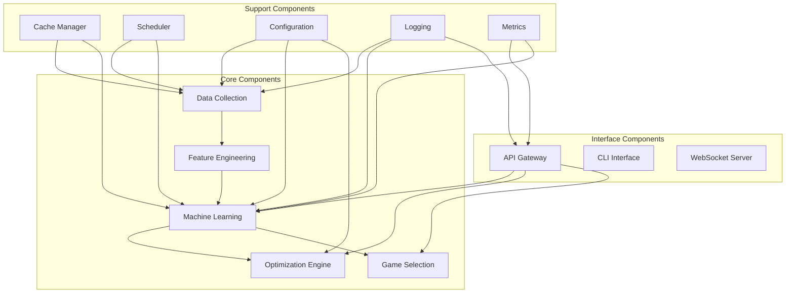
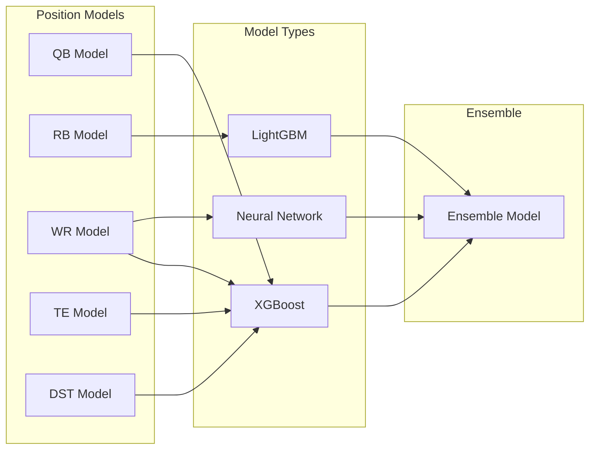
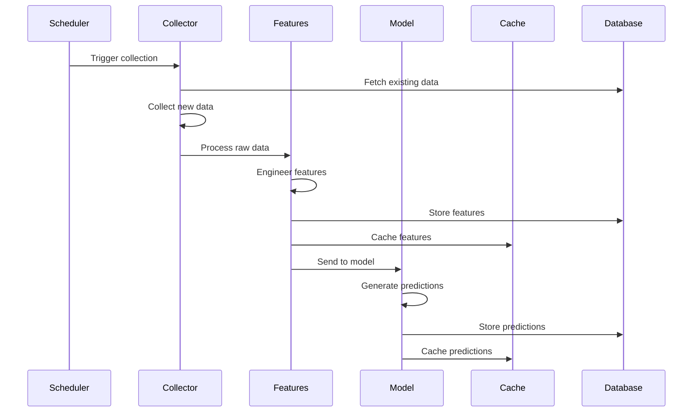
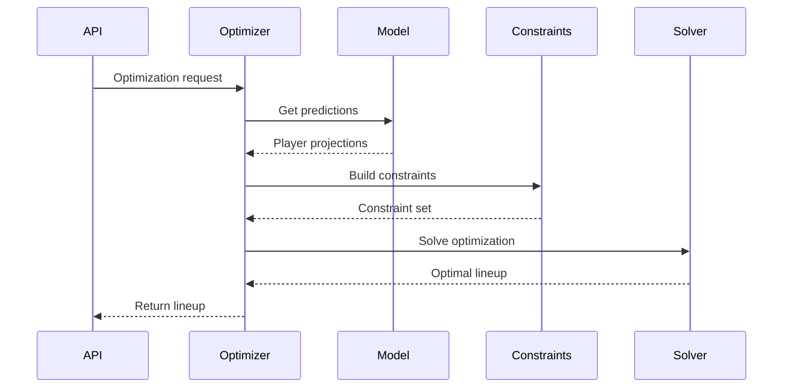

# Component Architecture

## Overview

This document details the component architecture of the NFL DFS system, defining the structure, responsibilities, and interactions of each major component. The system follows a modular, loosely-coupled design enabling independent development and testing.

## Component Hierarchy



## Data Collection Components

### NFL Data Collector

**Location:** `src/data/collection/nfl_data_collector.py`

**Responsibilities:**

- Fetch data from nfl_data_py API
- Handle rate limiting and retries
- Validate and clean raw data
- Store in database and cache

**Key Classes:**

```python
class NFLDataCollector:
    def __init__(self, config: DataConfig):
        self.client = nfl_data_py.Client()
        self.db_manager = DatabaseManager()
        self.cache = CacheManager()

    async def collect_weekly_data(self, season: int, week: int) -> DataResult:
        """Collect all NFL data for a specific week"""

    async def collect_play_by_play(self, game_id: str) -> PlayByPlayData:
        """Fetch detailed play-by-play data"""

    async def collect_player_stats(self, season: int, week: int) -> PlayerStats:
        """Fetch player statistics"""
```

**Configuration:**

```yaml
nfl_data_collector:
  retry_attempts: 3
  retry_delay: 1000
  batch_size: 100
  cache_ttl: 86400
  parallel_workers: 4
```

### DraftKings CSV Processor

**Location:** `src/data/collection/dk_salary_processor.py`

**Responsibilities:**

- Process manually uploaded DraftKings CSV files
- Map players to database IDs
- Validate current season salary data
- Calculate value metrics for current contest slate

**Key Classes:**

```python
class DKSalaryProcessor:
    def process_salary_csv(self, file_path: Path) -> SalaryData:
        """Process manually uploaded DraftKings salary CSV file"""

    def validate_current_salary_data(self, data: pd.DataFrame) -> ValidationResult:
        """Validate current season salary data integrity"""

    def calculate_value_metrics(self, salaries: SalaryData) -> ValueMetrics:
        """Calculate points per dollar and other value metrics"""
        
    def map_to_current_players(self, csv_data: pd.DataFrame) -> MappedData:
        """Map CSV player names to current season player database IDs"""
```

### Schedule Manager

**Location:** `src/data/collection/schedule_manager.py`

**Responsibilities:**

- Track NFL schedule
- Manage data refresh timing
- Handle bye weeks and postponements
- Coordinate collection tasks

**Key Classes:**

```python
class ScheduleManager:
    def get_current_week(self) -> NFLWeek:
        """Determine current NFL week"""

    def get_upcoming_games(self, days_ahead: int) -> List[Game]:
        """Get games in next N days"""

    def schedule_data_refresh(self, game: Game) -> ScheduledTask:
        """Schedule pre-game data refresh"""
```

## Feature Engineering Components

### Position Feature Engineers

**Location:** `src/data/features/`

**QB Feature Engineer:**

```python
class QBFeatureEngineer:
    def engineer_features(self, player_data: PlayerData) -> QBFeatures:
        """Generate QB-specific features"""

    def calculate_epa(self, plays: List[Play]) -> float:
        """Calculate Expected Points Added"""

    def calculate_cpoe(self, attempts: List[Pass]) -> float:
        """Calculate Completion Percentage Over Expected"""

    def calculate_pressure_metrics(self, snaps: List[Snap]) -> PressureMetrics:
        """Calculate performance under pressure"""
```

**RB Feature Engineer:**

```python
class RBFeatureEngineer:
    def calculate_yac(self, carries: List[Rush]) -> float:
        """Yards after contact"""

    def calculate_target_share(self, targets: int, team_targets: int) -> float:
        """RB target share in passing game"""

    def calculate_goal_line_share(self, carries: List[Rush]) -> float:
        """Goal line carry percentage"""
```

**WR/TE Feature Engineer:**

```python
class ReceiverFeatureEngineer:
    def calculate_separation(self, routes: List[Route]) -> float:
        """Average separation at catch point"""

    def calculate_adot(self, targets: List[Target]) -> float:
        """Average Depth of Target"""

    def calculate_air_yards_share(self, air_yards: float, team_air_yards: float) -> float:
        """Share of team air yards"""
```

### Game Environment Features

**Location:** `src/data/features/game_script_features.py`

```python
class GameEnvironmentFeatures:
    def calculate_pace_metrics(self, team_stats: TeamStats) -> PaceMetrics:
        """Calculate team pace and play tendency"""

    def calculate_vegas_features(self, game: Game) -> VegasFeatures:
        """Extract features from betting lines"""

    def calculate_weather_impact(self, weather: Weather) -> WeatherImpact:
        """Assess weather impact on scoring"""
```

### Correlation Calculator

**Location:** `src/data/features/stacking_correlations.py`

```python
class CorrelationCalculator:
    def calculate_player_correlations(self,
                                     historical_data: pd.DataFrame) -> CorrelationMatrix:
        """Calculate historical player correlations"""

    def calculate_game_correlations(self, game_id: str) -> GameCorrelations:
        """Calculate within-game correlations"""

    def identify_stack_opportunities(self,
                                    correlations: CorrelationMatrix) -> List[Stack]:
        """Find high-value stacking opportunities"""
```

## Machine Learning Components

### Model Architecture

**Location:** `src/models/`



### Base Model Interface

```python
class BasePositionModel(ABC):
    @abstractmethod
    def train(self, features: np.ndarray, targets: np.ndarray) -> None:
        """Train the model"""

    @abstractmethod
    def predict(self, features: np.ndarray) -> PredictionResult:
        """Generate predictions"""

    @abstractmethod
    def get_feature_importance(self) -> Dict[str, float]:
        """Get feature importance scores"""
```

### Position-Specific Models

**QB Model:**

```python
class QBModel(BasePositionModel):
    def __init__(self):
        self.primary_model = XGBRegressor(
            n_estimators=300,
            max_depth=7,
            learning_rate=0.05
        )
        self.rushing_adjustment = RushingQBModel()
        self.primetime_adjustment = PrimetimeModel()

    def predict(self, features: np.ndarray) -> QBPrediction:
        base_prediction = self.primary_model.predict(features)
        rushing_bonus = self.rushing_adjustment.predict(features)
        primetime_factor = self.primetime_adjustment.predict(features)
        return self.combine_predictions(base_prediction, rushing_bonus, primetime_factor)
```

### Training Pipeline

**Location:** `src/models/training/`

```python
class ModelTrainer:
    def train_position_model(self,
                            position: str,
                            training_data: TrainingData) -> TrainedModel:
        """Train a position-specific model"""

    def perform_cross_validation(self,
                                model: BasePositionModel,
                                data: TrainingData) -> CVResults:
        """Cross-validate model performance"""

    def apply_time_decay(self,
                        features: np.ndarray,
                        timestamps: np.ndarray) -> np.ndarray:
        """Apply time decay to training samples"""
```

### Self-Improvement System

**Location:** `src/models/self_improvement/`

```python
class SelfImprovementEngine:
    def analyze_prediction_errors(self,
                                 predictions: List[Prediction],
                                 actuals: List[float]) -> ErrorAnalysis:
        """Analyze systematic prediction errors"""

    def adjust_feature_weights(self,
                              error_analysis: ErrorAnalysis) -> FeatureAdjustments:
        """Adjust feature importance based on errors"""

    def trigger_retraining(self,
                          error_threshold: float) -> bool:
        """Determine if model needs retraining"""
```

## Optimization Engine

### Lineup Optimizer

**Location:** `src/optimization/dk_lineup_optimizer.py`

```python
class DKLineupOptimizer:
    def __init__(self):
        self.solver = pulp.PULP_CBC_CMD(msg=0)
        self.constraints = ConstraintManager()
        self.objective = ObjectiveFunction()

    def optimize_classic(self,
                        players: List[Player],
                        settings: OptimizationSettings) -> Lineup:
        """Optimize single-entry classic DraftKings lineup"""

    def apply_stacking_rules(self,
                           problem: pulp.LpProblem,
                           stacking_rules: StackingRules) -> None:
        """Apply correlation-based stacking constraints"""

    def optimize_alternate_lineup(self,
                                 base_lineup: Lineup,
                                 pivot_settings: PivotSettings) -> Lineup:
        """Generate alternate lineup based on existing lineup for single-entry contests"""
```

### Constraint Manager

```python
class ConstraintManager:
    def apply_salary_cap(self, problem: pulp.LpProblem, salary_cap: int) -> None:
        """Apply salary cap constraint"""

    def apply_position_requirements(self,
                                   problem: pulp.LpProblem,
                                   roster_construction: RosterRules) -> None:
        """Apply position requirements"""

    def apply_player_exposure(self,
                            problem: pulp.LpProblem,
                            max_exposure: float) -> None:
        """Limit player exposure across lineups"""
```

### Stacking Engine

**Location:** `src/optimization/stacking/`

```python
class StackingEngine:
    def identify_qb_stacks(self,
                         qb: Player,
                         receivers: List[Player]) -> List[Stack]:
        """Find QB-receiver stacks"""

    def build_game_stacks(self,
                        game: Game,
                        players: List[Player]) -> List[GameStack]:
        """Build game-based stacks"""

    def calculate_stack_value(self, stack: Stack) -> float:
        """Calculate combined value of stack"""
```

## Game Selection Components

### Entertainment Scorer

**Location:** `src/game_selection/game_scorer.py`

```python
class EntertainmentScorer:
    def score_game(self, game: Game) -> EntertainmentScore:
        """Calculate entertainment value of game"""

    def calculate_shootout_potential(self, game: Game) -> float:
        """Assess high-scoring potential"""

    def calculate_star_power(self, rosters: List[Player]) -> float:
        """Calculate star player presence"""

    def calculate_rivalry_factor(self, teams: Tuple[Team, Team]) -> float:
        """Assess rivalry intensity"""
```

### Contest Recommender

```python
class ContestRecommender:
    def recommend_contests(self,
                         games: List[Game],
                         preferences: UserPreferences) -> List[Contest]:
        """Recommend contests based on preferences"""

    def filter_by_entertainment(self,
                               contests: List[Contest],
                               min_score: float) -> List[Contest]:
        """Filter contests by entertainment value"""
```

## Support Components

### Cache Manager

**Location:** `src/utils/cache_manager.py`

```python
class CacheManager:
    def __init__(self, cache_dir: Path):
        self.cache_dir = cache_dir
        self.memory_cache = TTLCache(maxsize=1000, ttl=3600)

    def get(self, key: str) -> Optional[Any]:
        """Retrieve from cache"""

    def set(self, key: str, value: Any, ttl: int = 3600) -> None:
        """Store in cache with TTL"""

    def invalidate_pattern(self, pattern: str) -> int:
        """Invalidate keys matching pattern"""
```

### Configuration Manager

**Location:** `src/config/`

```python
class ConfigurationManager:
    def load_config(self, env: str = "development") -> Config:
        """Load configuration for environment"""

    def get_model_config(self, position: str) -> ModelConfig:
        """Get position-specific model configuration"""

    def get_optimization_config(self) -> OptimizationConfig:
        """Get optimization settings"""
```

### Scheduler

**Location:** `src/scheduler/task_scheduler.py`

```python
class TaskScheduler:
    def schedule_data_collection(self) -> None:
        """Schedule periodic data collection"""

    def schedule_model_retraining(self) -> None:
        """Schedule model retraining tasks"""

    def schedule_prediction_updates(self) -> None:
        """Schedule prediction refreshes"""
```

### Logging System

**Location:** `src/utils/logging/`

```python
class StructuredLogger:
    def __init__(self):
        self.logger = loguru.logger
        self.configure_handlers()

    def log_prediction(self, player: Player, prediction: Prediction) -> None:
        """Log prediction with context"""

    def log_optimization(self, lineup: Lineup, metrics: OptimizationMetrics) -> None:
        """Log optimization results"""

    def log_error(self, error: Exception, context: Dict) -> None:
        """Log error with full context"""
```

## Component Interactions

### Data Flow Sequence



### Optimization Flow



## Component Configuration

### Environment-Specific Settings

```yaml
development:
  data_collection:
    parallel_workers: 2
    cache_enabled: true
  models:
    auto_retrain: false
    use_cpu_optimization: true  # CPU-optimized settings
    num_threads: 4  # Control CPU thread usage
  optimization:
    timeout_seconds: 30

production:
  data_collection:
    parallel_workers: 8
    cache_enabled: true
  models:
    auto_retrain: true
    use_cpu_optimization: true  # CPU-optimized by default
    num_threads: 8  # Use more CPU threads in production
    future_gpu_support: true  # Ready for GPU when available
  optimization:
    timeout_seconds: 5
```

### Component Dependencies

```yaml
dependencies:
  data_collector:
    - database_manager
    - cache_manager
    - logger

  feature_engineer:
    - data_collector
    - database_manager
    - cache_manager

  model_trainer:
    - feature_engineer
    - model_registry
    - mlflow_tracker

  optimizer:
    - model_predictor
    - constraint_manager
    - pulp_solver
```

## Component Lifecycle

### Initialization Sequence

1. Load configuration
1. Initialize logging
1. Connect to database
1. Initialize cache
1. Load models
1. Start scheduler
1. Initialize API server

### Shutdown Sequence

1. Stop accepting new requests
1. Complete in-flight operations
1. Flush caches
1. Close database connections
1. Save model state
1. Shutdown logging

## Error Handling

### Component-Level Error Handling

```python
class ComponentErrorHandler:
    def handle_data_collection_error(self, error: Exception) -> ErrorResponse:
        """Handle data collection failures"""

    def handle_model_prediction_error(self, error: Exception) -> ErrorResponse:
        """Handle prediction failures with fallback"""

    def handle_optimization_error(self, error: Exception) -> ErrorResponse:
        """Handle optimization failures"""
```

### Circuit Breaker Pattern

```python
class CircuitBreaker:
    def __init__(self, failure_threshold: int = 5):
        self.failure_count = 0
        self.failure_threshold = failure_threshold
        self.is_open = False

    def call(self, func: Callable) -> Any:
        """Execute function with circuit breaker protection"""
```

## Component Testing

### Unit Testing Strategy

- Mock external dependencies
- Test individual component methods
- Validate error handling
- Check edge cases

### Integration Testing

- Test component interactions
- Validate data flow
- Check error propagation
- Performance testing

### Component Benchmarks

```yaml
benchmarks:
  data_collection:
    weekly_update: < 60 seconds
    player_stats: < 10 seconds

  feature_engineering:
    full_slate: < 30 seconds
    per_player: < 100ms

  model_prediction:
    full_slate: < 5 seconds
    per_player: < 50ms

  optimization:
    single_lineup: < 1 second
    20_lineups: < 5 seconds
```
