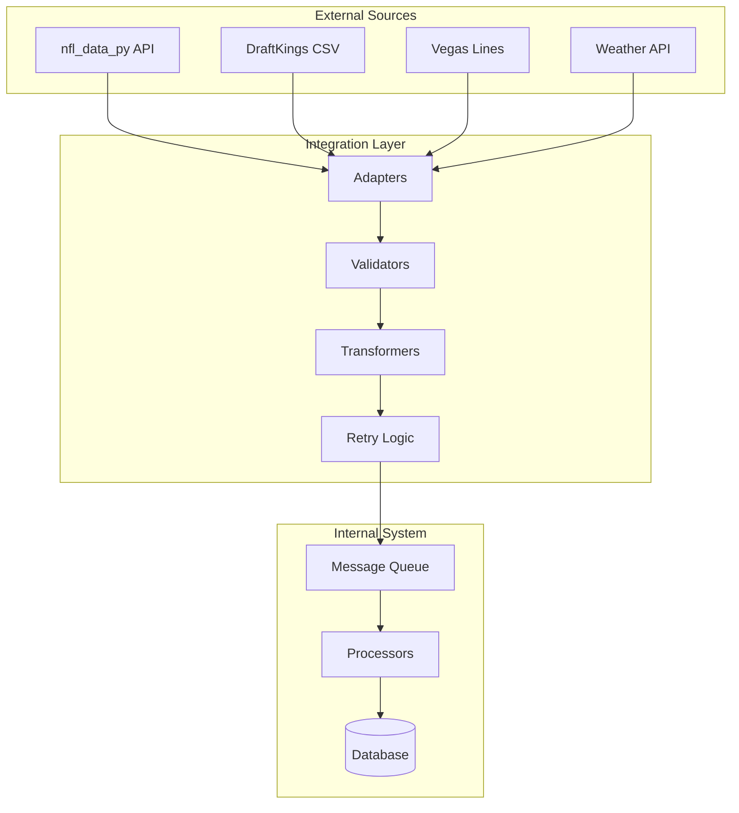

# Integration Specifications

## Overview

This document defines the integration architecture for external data sources and services, including NFL data providers, DraftKings, and other third-party systems. All integrations are designed with resilience, error handling, and data quality validation.

## Integration Architecture



## NFL Data Integration

### nfl_data_py Integration

**Primary data source for NFL statistics and play-by-play data**

#### Configuration

```python
class NFLDataConfig:
    BASE_URL = "https://github.com/nflverse/nfldata"
    RETRY_ATTEMPTS = 3
    RETRY_DELAY = 1000  # milliseconds
    TIMEOUT = 30  # seconds
    BATCH_SIZE = 100
    PARALLEL_DOWNLOADS = 4
```

#### Data Endpoints

```python
class NFLDataEndpoints:
    PLAY_BY_PLAY = "play_by_play/{season}"
    PLAYER_STATS = "player_stats/weekly/{season}"
    ROSTERS = "rosters/{season}"
    SCHEDULES = "schedules/{season}"
    TEAM_STATS = "team_stats/{season}"
    COMBINE = "combine/{season}"
    DRAFT = "draft/{season}"
    DEPTH_CHARTS = "depth_charts/{season}"
```

#### Integration Adapter

```python
class NFLDataAdapter:
    def __init__(self, config: NFLDataConfig):
        self.client = nfl_data_py.import_pbp_data
        self.retry_policy = RetryPolicy(config)
        self.validator = NFLDataValidator()

    async def fetch_play_by_play(self, season: int, week: int) -> pd.DataFrame:
        """
        Fetch play-by-play data with retry logic
        """
        @self.retry_policy.retry
        async def _fetch():
            data = await self.client(years=[season], weeks=[week])
            validated_data = self.validator.validate_pbp(data)
            return validated_data

        return await _fetch()

    async def fetch_player_stats(self, season: int, week: int) -> pd.DataFrame:
        """
        Fetch weekly player statistics
        """
        @self.retry_policy.retry
        async def _fetch():
            data = nfl_data_py.import_weekly_data(years=[season], weeks=[week])
            validated_data = self.validator.validate_player_stats(data)
            return validated_data

        return await _fetch()
```

#### Data Validation

```python
class NFLDataValidator:
    def validate_pbp(self, data: pd.DataFrame) -> pd.DataFrame:
        """
        Validate play-by-play data integrity
        """
        required_columns = [
            'game_id', 'play_id', 'posteam', 'defteam',
            'yards_gained', 'play_type', 'epa', 'wp'
        ]

        # Check required columns
        missing_cols = set(required_columns) - set(data.columns)
        if missing_cols:
            raise ValidationError(f"Missing columns: {missing_cols}")

        # Validate data types
        data = self._validate_dtypes(data)

        # Check for anomalies
        data = self._check_anomalies(data)

        return data

    def validate_player_stats(self, data: pd.DataFrame) -> pd.DataFrame:
        """
        Validate player statistics
        """
        # Validate player IDs format
        invalid_ids = data[~data['player_id'].str.match(r'^[A-Z]\.[A-Za-z]+_\d+$')]
        if not invalid_ids.empty:
            logger.warning(f"Invalid player IDs found: {invalid_ids['player_id'].tolist()}")

        # Validate statistical ranges
        data = self._validate_stat_ranges(data)

        return data
```

#### Data Transformation

```python
class NFLDataTransformer:
    def transform_to_internal_format(self,
                                    raw_data: pd.DataFrame,
                                    data_type: str) -> InternalFormat:
        """
        Transform NFL data to internal schema
        """
        if data_type == "player_stats":
            return self._transform_player_stats(raw_data)
        elif data_type == "play_by_play":
            return self._transform_pbp(raw_data)
        elif data_type == "rosters":
            return self._transform_rosters(raw_data)

    def _transform_player_stats(self, data: pd.DataFrame) -> PlayerStats:
        """
        Map NFL data columns to internal schema
        """
        mapping = {
            'player_id': 'player_id',
            'player_name': 'full_name',
            'recent_team': 'team',
            'completions': 'pass_completions',
            'attempts': 'pass_attempts',
            'passing_yards': 'pass_yards',
            'passing_tds': 'pass_touchdowns',
            'interceptions': 'pass_interceptions',
            'carries': 'rush_attempts',
            'rushing_yards': 'rush_yards',
            'rushing_tds': 'rush_touchdowns',
            'targets': 'targets',
            'receptions': 'receptions',
            'receiving_yards': 'receiving_yards',
            'receiving_tds': 'receiving_touchdowns'
        }

        transformed = data.rename(columns=mapping)
        transformed['draftkings_points'] = self._calculate_dk_points(transformed)

        return transformed
```

## DraftKings Integration

### Historical DFS Salaries (Kaggle)

**Kaggle datasets for historical DraftKings NFL salary data**

#### Data Source Configuration

```python
class KaggleHistoricalConfig:
    KAGGLE_DATASETS = [
        "jacobchapman91/draftkings-nfl-salaries-2009-2023",
        "tobycrabtree/draftkings-nfl-salaries-2020-2024", 
        "chrisfeller/draftkings-nfl-contest-data-2018-2023"
    ]
    
    DATA_COLUMNS = [
        'Name', 'Position', 'Team', 'Opponent', 'Salary', 
        'AvgPointsPerGame', 'Week', 'Season', 'Game_Date'
    ]
    
    DOWNLOAD_PATH = "data/raw/kaggle/dfs_salaries/"
    BATCH_SIZE = 10000
    COMPRESSION = 'gzip'
```

#### Kaggle Data Collector

```python
class KaggleHistoricalCollector:
    def __init__(self, config: KaggleHistoricalConfig):
        self.kaggle_api = kaggle.KaggleApi()
        self.kaggle_api.authenticate()
        self.config = config
        self.validator = HistoricalSalaryValidator()

    async def download_historical_salaries(self, seasons: List[int]) -> pd.DataFrame:
        """
        Download historical DFS salary data from Kaggle
        """
        all_data = []
        
        for dataset in self.config.KAGGLE_DATASETS:
            try:
                # Download dataset
                dataset_path = await self._download_dataset(dataset)
                
                # Load and process CSV files
                csv_files = glob.glob(f"{dataset_path}/*.csv")
                
                for csv_file in csv_files:
                    df = pd.read_csv(csv_file, encoding='utf-8-sig')
                    
                    # Filter by requested seasons
                    if 'Season' in df.columns:
                        df = df[df['Season'].isin(seasons)]
                    
                    # Validate and clean data
                    df = self.validator.validate_historical_data(df)
                    
                    all_data.append(df)
                    
            except Exception as e:
                logger.warning(f"Failed to process dataset {dataset}: {e}")
        
        # Combine all datasets
        combined_data = pd.concat(all_data, ignore_index=True)
        
        # Remove duplicates based on player, week, season
        combined_data = combined_data.drop_duplicates(
            subset=['Name', 'Position', 'Team', 'Week', 'Season']
        )
        
        return combined_data

    async def _download_dataset(self, dataset: str) -> Path:
        """
        Download Kaggle dataset to local directory
        """
        download_path = Path(self.config.DOWNLOAD_PATH) / dataset.split('/')[-1]
        download_path.mkdir(parents=True, exist_ok=True)
        
        self.kaggle_api.dataset_download_files(
            dataset, 
            path=str(download_path),
            unzip=True,
            quiet=False
        )
        
        return download_path
```

#### Historical Data Validation

```python
class HistoricalSalaryValidator:
    def validate_historical_data(self, data: pd.DataFrame) -> pd.DataFrame:
        """
        Validate historical salary data from Kaggle
        """
        # Check for required columns
        required_cols = ['Name', 'Position', 'Team', 'Salary']
        missing_cols = set(required_cols) - set(data.columns)
        if missing_cols:
            raise ValidationError(f"Missing required columns: {missing_cols}")
        
        # Standardize position names
        data['Position'] = data['Position'].map({
            'QB': 'QB', 'RB': 'RB', 'WR': 'WR', 'TE': 'TE',
            'DST': 'DST', 'DEF': 'DST', 'K': 'K'
        })
        
        # Validate salary ranges (historical context)
        data = self._validate_historical_salary_ranges(data)
        
        # Clean player names
        data['Name'] = data['Name'].str.strip()
        data['Name'] = data['Name'].str.replace(r'[^\w\s\-\.]', '', regex=True)
        
        # Standardize team abbreviations
        data['Team'] = data['Team'].str.upper()
        
        return data
    
    def _validate_historical_salary_ranges(self, data: pd.DataFrame) -> pd.DataFrame:
        """
        Validate salary ranges considering historical inflation
        """
        # Define historical salary ranges by season
        historical_ranges = {
            2018: {'QB': (4000, 8500), 'RB': (3000, 9500), 'WR': (3000, 9000)},
            2019: {'QB': (4200, 8700), 'RB': (3200, 9700), 'WR': (3200, 9200)},
            2020: {'QB': (4400, 8900), 'RB': (3400, 9900), 'WR': (3400, 9400)},
            2021: {'QB': (4600, 9100), 'RB': (3600, 10100), 'WR': (3600, 9600)},
            2022: {'QB': (4800, 9300), 'RB': (3800, 10300), 'WR': (3800, 9800)},
            2023: {'QB': (5000, 9500), 'RB': (4000, 10500), 'WR': (4000, 10000)},
            2024: {'QB': (5200, 9700), 'RB': (4200, 10700), 'WR': (4200, 10200)}
        }
        
        # Flag unusual salaries for manual review
        for season, ranges in historical_ranges.items():
            season_data = data[data.get('Season', 2024) == season]
            
            for position, (min_sal, max_sal) in ranges.items():
                pos_data = season_data[season_data['Position'] == position]
                outliers = pos_data[
                    (pos_data['Salary'] < min_sal * 0.5) | 
                    (pos_data['Salary'] > max_sal * 1.5)
                ]
                
                if not outliers.empty:
                    logger.warning(f"Salary outliers in {season} {position}: {len(outliers)} players")
        
        return data
```

### CSV File Processing

**Manual upload and processing of DraftKings salary files**

#### File Format Specification

```python
class DKCSVFormat:
    EXPECTED_COLUMNS = [
        'Name',
        'Position',
        'Team',
        'Opponent',
        'Game Info',
        'Salary',
        'AvgPointsPerGame',
        'TeamAbbrev',
        'ID'
    ]

    POSITION_MAPPING = {
        'QB': 'QB',
        'RB': 'RB',
        'WR': 'WR',
        'TE': 'TE',
        'DST': 'DST',
        'DEF': 'DST',
        'FLEX': 'FLEX'
    }
```

#### CSV Parser

```python
class DKCSVParser:
    def parse_salary_file(self, file_path: Path) -> pd.DataFrame:
        """
        Parse DraftKings salary CSV file
        """
        try:
            # Read CSV with specific encoding
            df = pd.read_csv(file_path, encoding='utf-8-sig')

            # Validate columns
            self._validate_columns(df)

            # Clean and transform data
            df = self._clean_salary_data(df)

            # Map to internal format
            df = self._map_to_internal(df)

            return df

        except Exception as e:
            logger.error(f"Failed to parse DK CSV: {e}")
            raise DKParseError(f"CSV parsing failed: {e}")

    def _clean_salary_data(self, df: pd.DataFrame) -> pd.DataFrame:
        """
        Clean and standardize salary data
        """
        # Remove special characters from names
        df['Name'] = df['Name'].str.replace('[^A-Za-z\s\.\-\']', '', regex=True)

        # Clean salary values
        df['Salary'] = df['Salary'].astype(int)

        # Parse game info
        df = self._parse_game_info(df)

        return df
```

#### Player Matching

```python
class DKPlayerMatcher:
    def __init__(self, db_manager: DatabaseManager):
        self.db = db_manager
        self.name_cache = {}
        self.fuzzy_matcher = FuzzyMatcher()

    def match_players(self, dk_data: pd.DataFrame) -> pd.DataFrame:
        """
        Match DraftKings players to database IDs
        """
        matched_data = []

        for _, row in dk_data.iterrows():
            player_id = self._find_player_id(
                name=row['Name'],
                team=row['Team'],
                position=row['Position']
            )

            if player_id:
                row['player_id'] = player_id
                matched_data.append(row)
            else:
                logger.warning(f"Could not match player: {row['Name']}")

        return pd.DataFrame(matched_data)

    def _find_player_id(self, name: str, team: str, position: str) -> Optional[str]:
        """
        Find player ID using multiple matching strategies
        """
        # Try exact match
        player_id = self.db.find_player_by_name(name, team)
        if player_id:
            return player_id

        # Try fuzzy matching
        player_id = self.fuzzy_matcher.match(name, team, position)
        if player_id:
            return player_id

        # Try nickname/alternate names
        player_id = self._try_alternate_names(name, team)

        return player_id
```

#### Salary Validator

```python
class DKSalaryValidator:
    SALARY_RANGES = {
        'QB': (4000, 9000),
        'RB': (3000, 10000),
        'WR': (3000, 10000),
        'TE': (2500, 8000),
        'DST': (2000, 5000)
    }

    def validate_salaries(self, salary_data: pd.DataFrame) -> ValidationResult:
        """
        Validate salary data integrity
        """
        errors = []
        warnings = []

        # Check salary ranges
        for position, (min_sal, max_sal) in self.SALARY_RANGES.items():
            pos_data = salary_data[salary_data['Position'] == position]

            out_of_range = pos_data[
                (pos_data['Salary'] < min_sal) |
                (pos_data['Salary'] > max_sal)
            ]

            if not out_of_range.empty:
                warnings.append(f"Unusual salaries for {position}: {out_of_range['Name'].tolist()}")

        # Check for duplicates
        duplicates = salary_data[salary_data.duplicated(subset=['Name', 'Team'])]
        if not duplicates.empty:
            errors.append(f"Duplicate players: {duplicates['Name'].tolist()}")

        # Verify salary cap feasibility
        if not self._verify_lineup_feasibility(salary_data):
            warnings.append("Salary structure may not allow valid lineups")

        return ValidationResult(errors=errors, warnings=warnings)
```

## Vegas Lines Integration

### Odds API Integration

```python
class VegasLinesAdapter:
    def __init__(self, config: VegasConfig):
        self.sources = [
            DraftKingsSportsbook(),
            FanduelSportsbook(),
            ConsensusLines()
        ]
        self.aggregator = LineAggregator()

    async def fetch_game_lines(self, week: int) -> List[GameLine]:
        """
        Fetch betting lines from multiple sources
        """
        all_lines = []

        for source in self.sources:
            try:
                lines = await source.fetch_nfl_lines(week)
                all_lines.extend(lines)
            except Exception as e:
                logger.warning(f"Failed to fetch from {source.name}: {e}")

        # Aggregate and normalize
        consensus_lines = self.aggregator.aggregate(all_lines)

        return consensus_lines
```

### Line Aggregation

```python
class LineAggregator:
    def aggregate(self, lines: List[GameLine]) -> List[ConsensusLine]:
        """
        Aggregate lines from multiple sources
        """
        grouped = defaultdict(list)

        for line in lines:
            key = (line.home_team, line.away_team)
            grouped[key].append(line)

        consensus = []
        for game, game_lines in grouped.items():
            consensus.append(ConsensusLine(
                home_team=game[0],
                away_team=game[1],
                spread=np.median([l.spread for l in game_lines]),
                total=np.median([l.total for l in game_lines]),
                home_ml=np.median([l.home_ml for l in game_lines]),
                away_ml=np.median([l.away_ml for l in game_lines]),
                source_count=len(game_lines)
            ))

        return consensus
```

## Weather Data Integration

### Weather API Adapter

```python
class WeatherAdapter:
    def __init__(self, config: WeatherConfig):
        self.api_key = config.api_key
        self.base_url = "https://api.weather.gov"
        self.cache = WeatherCache()

    async def fetch_game_weather(self, game: Game) -> WeatherData:
        """
        Fetch weather for game location and time
        """
        # Check if indoor stadium
        if game.stadium_type == "Dome":
            return WeatherData(indoor=True)

        # Check cache
        cached = self.cache.get(game.game_id)
        if cached:
            return cached

        # Fetch from API
        weather = await self._fetch_weather(
            lat=game.stadium_lat,
            lon=game.stadium_lon,
            datetime=game.game_time
        )

        # Process for fantasy impact
        weather.fantasy_impact = self._calculate_impact(weather)

        # Cache result
        self.cache.set(game.game_id, weather)

        return weather

    def _calculate_impact(self, weather: WeatherData) -> WeatherImpact:
        """
        Calculate fantasy impact of weather
        """
        impact = WeatherImpact()

        # Wind impact on passing
        if weather.wind_speed > 20:
            impact.passing_penalty = -0.15
        elif weather.wind_speed > 15:
            impact.passing_penalty = -0.10
        elif weather.wind_speed > 10:
            impact.passing_penalty = -0.05

        # Precipitation impact
        if weather.precipitation > 0.5:
            impact.fumble_risk = 0.10
            impact.passing_penalty -= 0.10

        # Temperature impact
        if weather.temperature < 32:
            impact.kicking_penalty = -0.10

        return impact
```

## FantasyPros Integration

### Opponent Matchup Stats Scraping

**FantasyPros defensive rankings and matchup statistics**

#### FantasyPros Scraper Configuration

```python
class FantasyProsConfig:
    BASE_URL = "https://www.fantasypros.com"
    ENDPOINTS = {
        'defense_vs_position': '/nfl/stats/defense-vs-position.php',
        'rankings': '/nfl/rankings/{position}.php',
        'matchups': '/nfl/stats/points-allowed.php'
    }
    
    SCRAPING_HEADERS = {
        'User-Agent': 'Mozilla/5.0 (Windows NT 10.0; Win64; x64) AppleWebKit/537.36',
        'Accept': 'text/html,application/xhtml+xml,application/xml;q=0.9,*/*;q=0.8'
    }
    
    RATE_LIMIT_DELAY = 2  # seconds between requests
    MAX_RETRIES = 3
    TIMEOUT = 30
```

#### Defensive Matchup Scraper

```python
class FantasyProsDefenseScraper:
    def __init__(self, config: FantasyProsConfig):
        self.config = config
        self.session = requests.Session()
        self.session.headers.update(config.SCRAPING_HEADERS)
        self.rate_limiter = RateLimiter(config.RATE_LIMIT_DELAY)

    async def scrape_defense_vs_position(self, position: str) -> pd.DataFrame:
        """
        Scrape defensive stats vs specific position (QB, RB, WR, TE)
        """
        url = f"{self.config.BASE_URL}{self.config.ENDPOINTS['defense_vs_position']}"
        params = {'pos': position.upper()}
        
        await self.rate_limiter.wait()
        
        try:
            response = await self._make_request(url, params)
            soup = BeautifulSoup(response.content, 'html.parser')
            
            # Find the main data table
            table = soup.find('table', {'id': 'data'})
            if not table:
                raise ScrapingError(f"Could not find data table for {position}")
            
            # Extract table data
            headers = [th.text.strip() for th in table.find('thead').find_all('th')]
            rows = []
            
            for tr in table.find('tbody').find_all('tr'):
                row_data = [td.text.strip() for td in tr.find_all('td')]
                if len(row_data) == len(headers):
                    rows.append(row_data)
            
            df = pd.DataFrame(rows, columns=headers)
            
            # Clean and standardize data
            df = self._clean_defense_data(df, position)
            
            return df
            
        except Exception as e:
            logger.error(f"Failed to scrape defense vs {position}: {e}")
            raise ScrapingError(f"Defense scraping failed: {e}")

    def _clean_defense_data(self, df: pd.DataFrame, position: str) -> pd.DataFrame:
        """
        Clean and standardize defensive matchup data
        """
        # Standardize team names
        df['Team'] = df['Team'].apply(self._standardize_team_name)
        
        # Convert numeric columns
        numeric_cols = ['Fantasy Points Allowed', 'Yards Allowed', 'TDs Allowed']
        for col in numeric_cols:
            if col in df.columns:
                df[col] = pd.to_numeric(df[col], errors='coerce')
        
        # Add position context
        df['vs_position'] = position.upper()
        
        # Calculate rankings
        df['fp_allowed_rank'] = df['Fantasy Points Allowed'].rank(ascending=False)
        df['yards_allowed_rank'] = df['Yards Allowed'].rank(ascending=False)
        
        # Add difficulty ratings
        df['matchup_difficulty'] = self._calculate_matchup_difficulty(df)
        
        return df

    def _calculate_matchup_difficulty(self, df: pd.DataFrame) -> pd.Series:
        """
        Calculate matchup difficulty score (1-10, 10 being hardest)
        """
        # Normalize fantasy points allowed to 1-10 scale
        fp_allowed = df['Fantasy Points Allowed']
        min_fp, max_fp = fp_allowed.min(), fp_allowed.max()
        
        # Higher points allowed = easier matchup (lower difficulty)
        difficulty = 10 - 9 * ((fp_allowed - min_fp) / (max_fp - min_fp))
        
        return difficulty.round(1)

    async def scrape_points_allowed_trends(self, weeks: int = 4) -> pd.DataFrame:
        """
        Scrape recent trends in points allowed by defense
        """
        url = f"{self.config.BASE_URL}{self.config.ENDPOINTS['matchups']}"
        
        await self.rate_limiter.wait()
        
        try:
            response = await self._make_request(url)
            soup = BeautifulSoup(response.content, 'html.parser')
            
            # Extract trending data
            trend_data = self._extract_trend_data(soup, weeks)
            
            return pd.DataFrame(trend_data)
            
        except Exception as e:
            logger.error(f"Failed to scrape points allowed trends: {e}")
            raise ScrapingError(f"Trends scraping failed: {e}")

    def _standardize_team_name(self, team_name: str) -> str:
        """
        Convert FantasyPros team names to standard abbreviations
        """
        team_mapping = {
            'Arizona Cardinals': 'ARI', 'Atlanta Falcons': 'ATL',
            'Baltimore Ravens': 'BAL', 'Buffalo Bills': 'BUF',
            'Carolina Panthers': 'CAR', 'Chicago Bears': 'CHI',
            'Cincinnati Bengals': 'CIN', 'Cleveland Browns': 'CLE',
            'Dallas Cowboys': 'DAL', 'Denver Broncos': 'DEN',
            'Detroit Lions': 'DET', 'Green Bay Packers': 'GB',
            'Houston Texans': 'HOU', 'Indianapolis Colts': 'IND',
            'Jacksonville Jaguars': 'JAX', 'Kansas City Chiefs': 'KC',
            'Las Vegas Raiders': 'LV', 'Los Angeles Chargers': 'LAC',
            'Los Angeles Rams': 'LAR', 'Miami Dolphins': 'MIA',
            'Minnesota Vikings': 'MIN', 'New England Patriots': 'NE',
            'New Orleans Saints': 'NO', 'New York Giants': 'NYG',
            'New York Jets': 'NYJ', 'Philadelphia Eagles': 'PHI',
            'Pittsburgh Steelers': 'PIT', 'San Francisco 49ers': 'SF',
            'Seattle Seahawks': 'SEA', 'Tampa Bay Buccaneers': 'TB',
            'Tennessee Titans': 'TEN', 'Washington Commanders': 'WAS'
        }
        
        return team_mapping.get(team_name.strip(), team_name.upper()[:3])

    async def _make_request(self, url: str, params: dict = None) -> requests.Response:
        """
        Make HTTP request with retry logic
        """
        for attempt in range(self.config.MAX_RETRIES):
            try:
                response = self.session.get(
                    url, 
                    params=params, 
                    timeout=self.config.TIMEOUT
                )
                response.raise_for_status()
                return response
                
            except requests.RequestException as e:
                if attempt == self.config.MAX_RETRIES - 1:
                    raise e
                
                wait_time = (2 ** attempt) * self.config.RATE_LIMIT_DELAY
                await asyncio.sleep(wait_time)
```

#### Matchup Data Validator

```python
class FantasyProsValidator:
    def validate_matchup_data(self, data: pd.DataFrame) -> pd.DataFrame:
        """
        Validate scraped matchup data
        """
        # Check required columns
        required_cols = ['Team', 'vs_position', 'Fantasy Points Allowed']
        missing_cols = set(required_cols) - set(data.columns)
        if missing_cols:
            raise ValidationError(f"Missing columns: {missing_cols}")
        
        # Validate team count (should be 32 NFL teams)
        unique_teams = data['Team'].nunique()
        if unique_teams < 30 or unique_teams > 32:
            logger.warning(f"Unexpected team count: {unique_teams}")
        
        # Validate numeric ranges
        data = self._validate_numeric_ranges(data)
        
        # Check for reasonable fantasy points values
        fp_allowed = data['Fantasy Points Allowed']
        if fp_allowed.min() < 0 or fp_allowed.max() > 50:
            logger.warning("Fantasy points allowed values seem unusual")
        
        return data
    
    def _validate_numeric_ranges(self, data: pd.DataFrame) -> pd.DataFrame:
        """
        Validate numeric columns are within expected ranges
        """
        numeric_validations = {
            'Fantasy Points Allowed': (0, 50),
            'Yards Allowed': (0, 500),
            'TDs Allowed': (0, 5)
        }
        
        for col, (min_val, max_val) in numeric_validations.items():
            if col in data.columns:
                outliers = data[
                    (data[col] < min_val) | (data[col] > max_val)
                ]
                if not outliers.empty:
                    logger.warning(f"Outliers in {col}: {len(outliers)} rows")
        
        return data
```

## DraftKings Injury Reports

### Injury Report Scraping

**DraftKings injury report data collection**

#### Injury Scraper Configuration

```python
class DKInjuryConfig:
    BASE_URL = "https://www.draftkings.com"
    INJURY_ENDPOINT = "/lineup/injury-report/nfl"
    
    SCRAPING_HEADERS = {
        'User-Agent': 'Mozilla/5.0 (Windows NT 10.0; Win64; x64) AppleWebKit/537.36',
        'Accept': 'text/html,application/xhtml+xml,application/xml;q=0.9,*/*;q=0.8',
        'Accept-Language': 'en-US,en;q=0.5',
        'Accept-Encoding': 'gzip, deflate',
        'Connection': 'keep-alive'
    }
    
    RATE_LIMIT_DELAY = 3  # seconds between requests
    MAX_RETRIES = 3
    TIMEOUT = 30
    
    INJURY_STATUS_MAPPING = {
        'Out': 'OUT',
        'Doubtful': 'DOUBTFUL', 
        'Questionable': 'QUESTIONABLE',
        'Probable': 'PROBABLE',
        'IR': 'IR',
        'PUP': 'PUP',
        'Suspended': 'SUSPENDED'
    }
```

#### DraftKings Injury Scraper

```python
class DKInjuryScraper:
    def __init__(self, config: DKInjuryConfig):
        self.config = config
        self.session = requests.Session()
        self.session.headers.update(config.SCRAPING_HEADERS)
        self.rate_limiter = RateLimiter(config.RATE_LIMIT_DELAY)

    async def scrape_injury_reports(self) -> pd.DataFrame:
        """
        Scrape current NFL injury reports from DraftKings
        """
        url = f"{self.config.BASE_URL}{self.config.INJURY_ENDPOINT}"
        
        await self.rate_limiter.wait()
        
        try:
            response = await self._make_request(url)
            soup = BeautifulSoup(response.content, 'html.parser')
            
            # Find injury report container
            injury_container = soup.find('div', {'class': 'injury-report-container'})
            if not injury_container:
                # Try alternative selectors
                injury_container = soup.find('section', {'id': 'injury-report'})
            
            if not injury_container:
                raise ScrapingError("Could not find injury report container")
            
            # Extract injury data
            injury_data = self._extract_injury_data(injury_container)
            
            # Convert to DataFrame
            df = pd.DataFrame(injury_data)
            
            # Clean and validate
            df = self._clean_injury_data(df)
            
            return df
            
        except Exception as e:
            logger.error(f"Failed to scrape injury reports: {e}")
            raise ScrapingError(f"Injury scraping failed: {e}")

    def _extract_injury_data(self, container) -> List[Dict]:
        """
        Extract injury data from HTML container
        """
        injuries = []
        
        # Look for player injury cards/rows
        player_elements = container.find_all(['div', 'tr'], 
                                           class_=re.compile(r'player|injury'))
        
        for element in player_elements:
            try:
                injury_info = self._parse_player_injury(element)
                if injury_info:
                    injuries.append(injury_info)
            except Exception as e:
                logger.debug(f"Failed to parse injury element: {e}")
                continue
        
        return injuries

    def _parse_player_injury(self, element) -> Optional[Dict]:
        """
        Parse individual player injury information
        """
        # Extract player name
        name_elem = element.find(['span', 'div', 'td'], 
                                class_=re.compile(r'name|player'))
        if not name_elem:
            return None
        
        player_name = name_elem.get_text(strip=True)
        
        # Extract team
        team_elem = element.find(['span', 'div', 'td'], 
                                class_=re.compile(r'team'))
        team = team_elem.get_text(strip=True) if team_elem else None
        
        # Extract position
        pos_elem = element.find(['span', 'div', 'td'], 
                               class_=re.compile(r'position|pos'))
        position = pos_elem.get_text(strip=True) if pos_elem else None
        
        # Extract injury status
        status_elem = element.find(['span', 'div', 'td'], 
                                  class_=re.compile(r'status|injury'))
        status = status_elem.get_text(strip=True) if status_elem else None
        
        # Extract injury description
        desc_elem = element.find(['span', 'div', 'td'], 
                                class_=re.compile(r'description|injury-desc'))
        description = desc_elem.get_text(strip=True) if desc_elem else None
        
        return {
            'player_name': player_name,
            'team': team,
            'position': position,
            'injury_status': status,
            'injury_description': description,
            'report_date': datetime.now().date()
        }

    def _clean_injury_data(self, df: pd.DataFrame) -> pd.DataFrame:
        """
        Clean and standardize injury report data
        """
        if df.empty:
            return df
        
        # Clean player names
        df['player_name'] = df['player_name'].str.strip()
        df['player_name'] = df['player_name'].str.replace(r'[^\w\s\-\.]', '', regex=True)
        
        # Standardize injury status
        df['injury_status'] = df['injury_status'].map(
            self.config.INJURY_STATUS_MAPPING
        ).fillna(df['injury_status'])
        
        # Standardize team names
        df['team'] = df['team'].str.upper()
        
        # Clean injury descriptions
        df['injury_description'] = df['injury_description'].str.title()
        
        # Remove duplicates
        df = df.drop_duplicates(subset=['player_name', 'team'])
        
        return df

    async def _make_request(self, url: str) -> requests.Response:
        """
        Make HTTP request with retry logic and error handling
        """
        for attempt in range(self.config.MAX_RETRIES):
            try:
                response = self.session.get(url, timeout=self.config.TIMEOUT)
                response.raise_for_status()
                return response
                
            except requests.RequestException as e:
                if attempt == self.config.MAX_RETRIES - 1:
                    raise e
                
                wait_time = (2 ** attempt) * self.config.RATE_LIMIT_DELAY
                await asyncio.sleep(wait_time)
```

#### Injury Data Validator

```python
class InjuryDataValidator:
    VALID_STATUSES = {'OUT', 'DOUBTFUL', 'QUESTIONABLE', 'PROBABLE', 'IR', 'PUP', 'SUSPENDED'}
    VALID_POSITIONS = {'QB', 'RB', 'WR', 'TE', 'K', 'DST'}

    def validate_injury_data(self, data: pd.DataFrame) -> ValidationResult:
        """
        Validate scraped injury report data
        """
        errors = []
        warnings = []
        
        if data.empty:
            warnings.append("No injury data found")
            return ValidationResult(errors=errors, warnings=warnings)
        
        # Check required columns
        required_cols = ['player_name', 'injury_status']
        missing_cols = set(required_cols) - set(data.columns)
        if missing_cols:
            errors.append(f"Missing required columns: {missing_cols}")
        
        # Validate injury statuses
        if 'injury_status' in data.columns:
            invalid_statuses = data[
                ~data['injury_status'].isin(self.VALID_STATUSES)
            ]
            if not invalid_statuses.empty:
                warnings.append(f"Unknown injury statuses: {invalid_statuses['injury_status'].unique()}")
        
        # Validate positions
        if 'position' in data.columns:
            invalid_positions = data[
                ~data['position'].isin(self.VALID_POSITIONS)
            ]
            if not invalid_positions.empty:
                warnings.append(f"Unknown positions: {invalid_positions['position'].unique()}")
        
        # Check for reasonable data volume
        if len(data) > 200:
            warnings.append(f"Unusually high injury count: {len(data)}")
        elif len(data) < 10:
            warnings.append(f"Unusually low injury count: {len(data)}")
        
        return ValidationResult(errors=errors, warnings=warnings)
```

## ESPN Data Integration (Optional)

### ESPN API Adapter

```python
class ESPNAdapter:
    def __init__(self):
        self.base_url = "https://site.api.espn.com/apis/site/v2/sports/football/nfl"
        self.endpoints = {
            'scoreboard': '/scoreboard',
            'teams': '/teams',
            'players': '/players'
        }

    async def fetch_supplemental_data(self, week: int) -> SupplementalData:
        """
        Fetch additional context from ESPN
        """
        data = SupplementalData()

        # Get injury reports
        data.injuries = await self._fetch_injuries()

        # Get team news
        data.team_news = await self._fetch_team_news()

        # Get player news
        data.player_news = await self._fetch_player_news()

        return data
```

## Data Quality Monitoring

### Integration Health Checks

```python
class IntegrationMonitor:
    def __init__(self):
        self.health_checks = {
            'nfl_data': NFLDataHealthCheck(),
            'dk_upload': DKUploadHealthCheck(),
            'vegas_lines': VegasHealthCheck(),
            'weather': WeatherHealthCheck()
        }

    async def check_all_integrations(self) -> HealthReport:
        """
        Run health checks on all integrations
        """
        report = HealthReport()

        for name, checker in self.health_checks.items():
            try:
                status = await checker.check()
                report.add_status(name, status)
            except Exception as e:
                report.add_failure(name, str(e))

        return report
```

### Data Freshness Validation

```python
class DataFreshnessValidator:
    def validate_data_freshness(self) -> FreshnessReport:
        """
        Check data recency across all sources
        """
        report = FreshnessReport()

        # Check NFL data
        last_nfl_update = self.db.get_last_update('nfl_data')
        if self._is_stale(last_nfl_update, hours=24):
            report.add_stale('nfl_data', last_nfl_update)

        # Check DK salaries
        last_dk_update = self.db.get_last_update('dk_salaries')
        if self._is_stale(last_dk_update, hours=48):
            report.add_stale('dk_salaries', last_dk_update)

        # Check Vegas lines
        last_vegas_update = self.db.get_last_update('vegas_lines')
        if self._is_stale(last_vegas_update, hours=6):
            report.add_stale('vegas_lines', last_vegas_update)

        return report
```

## Error Recovery Strategies

### Retry Policies

```python
class RetryPolicy:
    def __init__(self, max_attempts: int = 3, base_delay: int = 1000):
        self.max_attempts = max_attempts
        self.base_delay = base_delay

    def retry(self, func: Callable) -> Callable:
        """
        Decorator for retry logic with exponential backoff
        """
        @wraps(func)
        async def wrapper(*args, **kwargs):
            last_exception = None

            for attempt in range(self.max_attempts):
                try:
                    return await func(*args, **kwargs)
                except (NetworkError, TimeoutError) as e:
                    last_exception = e
                    delay = self.base_delay * (2 ** attempt)
                    logger.warning(f"Attempt {attempt + 1} failed, retrying in {delay}ms")
                    await asyncio.sleep(delay / 1000)
                except Exception as e:
                    # Don't retry on other exceptions
                    raise e

            raise last_exception

        return wrapper
```

### Fallback Strategies

```python
class FallbackStrategy:
    def with_fallback(self, primary: Callable, fallback: Callable) -> Any:
        """
        Try primary source, fall back to secondary on failure
        """
        try:
            return primary()
        except Exception as e:
            logger.warning(f"Primary source failed: {e}, using fallback")
            return fallback()
```

## Integration Testing

### Mock Data Sources

```python
class MockNFLDataSource:
    def __init__(self):
        self.test_data = self._load_test_data()

    async def fetch_play_by_play(self, season: int, week: int) -> pd.DataFrame:
        """
        Return mock play-by-play data for testing
        """
        return self.test_data['play_by_play']

    async def fetch_player_stats(self, season: int, week: int) -> pd.DataFrame:
        """
        Return mock player stats for testing
        """
        return self.test_data['player_stats']
```

### Integration Test Suite

```python
class IntegrationTestSuite:
    def test_nfl_data_integration(self):
        """Test NFL data fetching and processing"""

    def test_dk_csv_parsing(self):
        """Test DraftKings CSV parsing"""

    def test_player_matching(self):
        """Test player ID matching across sources"""

    def test_data_transformation(self):
        """Test data transformation to internal format"""

    def test_error_recovery(self):
        """Test retry and fallback mechanisms"""
```

## Performance Optimization

### Batch Processing

```python
class BatchProcessor:
    def __init__(self, batch_size: int = 100):
        self.batch_size = batch_size

    async def process_in_batches(self, items: List, processor: Callable) -> List:
        """
        Process items in batches for efficiency
        """
        results = []

        for i in range(0, len(items), self.batch_size):
            batch = items[i:i + self.batch_size]
            batch_results = await asyncio.gather(*[processor(item) for item in batch])
            results.extend(batch_results)

        return results
```

### Connection Pooling

```python
class ConnectionPool:
    def __init__(self, max_connections: int = 10):
        self.pool = []
        self.max_connections = max_connections
        self.semaphore = asyncio.Semaphore(max_connections)

    async def acquire(self) -> Connection:
        """Acquire connection from pool"""
        async with self.semaphore:
            if self.pool:
                return self.pool.pop()
            return await self._create_connection()

    def release(self, conn: Connection) -> None:
        """Return connection to pool"""
        if len(self.pool) < self.max_connections:
            self.pool.append(conn)
        else:
            conn.close()
```
