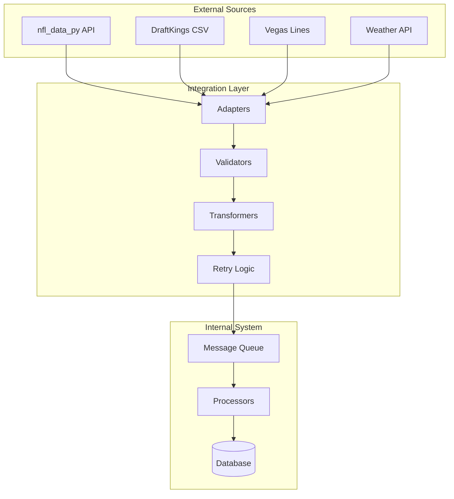

# Integration Specifications

## Overview

This document defines the integration architecture for external data sources and services, including NFL data providers, DraftKings, and other third-party systems. All integrations are designed with resilience, error handling, and data quality validation.

## Integration Architecture



## NFL Data Integration

### nfl_data_py Integration

**Primary data source for NFL statistics and play-by-play data**

#### Configuration

```python
class NFLDataConfig:
    BASE_URL = "https://github.com/nflverse/nfldata"
    RETRY_ATTEMPTS = 3
    RETRY_DELAY = 1000  # milliseconds
    TIMEOUT = 30  # seconds
    BATCH_SIZE = 100
    PARALLEL_DOWNLOADS = 4
```

#### Data Endpoints

```python
class NFLDataEndpoints:
    PLAY_BY_PLAY = "play_by_play/{season}"
    PLAYER_STATS = "player_stats/weekly/{season}"
    ROSTERS = "rosters/{season}"
    SCHEDULES = "schedules/{season}"
    TEAM_STATS = "team_stats/{season}"
    COMBINE = "combine/{season}"
    DRAFT = "draft/{season}"
    DEPTH_CHARTS = "depth_charts/{season}"
```

#### Integration Adapter

```python
class NFLDataAdapter:
    def __init__(self, config: NFLDataConfig):
        self.client = nfl_data_py.import_pbp_data
        self.retry_policy = RetryPolicy(config)
        self.validator = NFLDataValidator()

    async def fetch_play_by_play(self, season: int, week: int) -> pd.DataFrame:
        """
        Fetch play-by-play data with retry logic
        """
        @self.retry_policy.retry
        async def _fetch():
            data = await self.client(years=[season], weeks=[week])
            validated_data = self.validator.validate_pbp(data)
            return validated_data

        return await _fetch()

    async def fetch_player_stats(self, season: int, week: int) -> pd.DataFrame:
        """
        Fetch weekly player statistics
        """
        @self.retry_policy.retry
        async def _fetch():
            data = nfl_data_py.import_weekly_data(years=[season], weeks=[week])
            validated_data = self.validator.validate_player_stats(data)
            return validated_data

        return await _fetch()
```

#### Data Validation

```python
class NFLDataValidator:
    def validate_pbp(self, data: pd.DataFrame) -> pd.DataFrame:
        """
        Validate play-by-play data integrity
        """
        required_columns = [
            'game_id', 'play_id', 'posteam', 'defteam',
            'yards_gained', 'play_type', 'epa', 'wp'
        ]

        # Check required columns
        missing_cols = set(required_columns) - set(data.columns)
        if missing_cols:
            raise ValidationError(f"Missing columns: {missing_cols}")

        # Validate data types
        data = self._validate_dtypes(data)

        # Check for anomalies
        data = self._check_anomalies(data)

        return data

    def validate_player_stats(self, data: pd.DataFrame) -> pd.DataFrame:
        """
        Validate player statistics
        """
        # Validate player IDs format
        invalid_ids = data[~data['player_id'].str.match(r'^[A-Z]\.[A-Za-z]+_\d+$')]
        if not invalid_ids.empty:
            logger.warning(f"Invalid player IDs found: {invalid_ids['player_id'].tolist()}")

        # Validate statistical ranges
        data = self._validate_stat_ranges(data)

        return data
```

#### Data Transformation

```python
class NFLDataTransformer:
    def transform_to_internal_format(self,
                                    raw_data: pd.DataFrame,
                                    data_type: str) -> InternalFormat:
        """
        Transform NFL data to internal schema
        """
        if data_type == "player_stats":
            return self._transform_player_stats(raw_data)
        elif data_type == "play_by_play":
            return self._transform_pbp(raw_data)
        elif data_type == "rosters":
            return self._transform_rosters(raw_data)

    def _transform_player_stats(self, data: pd.DataFrame) -> PlayerStats:
        """
        Map NFL data columns to internal schema
        """
        mapping = {
            'player_id': 'player_id',
            'player_name': 'full_name',
            'recent_team': 'team',
            'completions': 'pass_completions',
            'attempts': 'pass_attempts',
            'passing_yards': 'pass_yards',
            'passing_tds': 'pass_touchdowns',
            'interceptions': 'pass_interceptions',
            'carries': 'rush_attempts',
            'rushing_yards': 'rush_yards',
            'rushing_tds': 'rush_touchdowns',
            'targets': 'targets',
            'receptions': 'receptions',
            'receiving_yards': 'receiving_yards',
            'receiving_tds': 'receiving_touchdowns'
        }

        transformed = data.rename(columns=mapping)
        transformed['draftkings_points'] = self._calculate_dk_points(transformed)

        return transformed
```

## DraftKings Integration

### CSV File Processing

**Manual upload and processing of DraftKings salary files**

#### File Format Specification

```python
class DKCSVFormat:
    EXPECTED_COLUMNS = [
        'Name',
        'Position',
        'Team',
        'Opponent',
        'Game Info',
        'Salary',
        'AvgPointsPerGame',
        'TeamAbbrev',
        'ID'
    ]

    POSITION_MAPPING = {
        'QB': 'QB',
        'RB': 'RB',
        'WR': 'WR',
        'TE': 'TE',
        'DST': 'DST',
        'DEF': 'DST',
        'FLEX': 'FLEX'
    }
```

#### CSV Parser

```python
class DKCSVParser:
    def parse_salary_file(self, file_path: Path) -> pd.DataFrame:
        """
        Parse DraftKings salary CSV file
        """
        try:
            # Read CSV with specific encoding
            df = pd.read_csv(file_path, encoding='utf-8-sig')

            # Validate columns
            self._validate_columns(df)

            # Clean and transform data
            df = self._clean_salary_data(df)

            # Map to internal format
            df = self._map_to_internal(df)

            return df

        except Exception as e:
            logger.error(f"Failed to parse DK CSV: {e}")
            raise DKParseError(f"CSV parsing failed: {e}")

    def _clean_salary_data(self, df: pd.DataFrame) -> pd.DataFrame:
        """
        Clean and standardize salary data
        """
        # Remove special characters from names
        df['Name'] = df['Name'].str.replace('[^A-Za-z\s\.\-\']', '', regex=True)

        # Clean salary values
        df['Salary'] = df['Salary'].astype(int)

        # Parse game info
        df = self._parse_game_info(df)

        return df
```

#### Player Matching

```python
class DKPlayerMatcher:
    def __init__(self, db_manager: DatabaseManager):
        self.db = db_manager
        self.name_cache = {}
        self.fuzzy_matcher = FuzzyMatcher()

    def match_players(self, dk_data: pd.DataFrame) -> pd.DataFrame:
        """
        Match DraftKings players to database IDs
        """
        matched_data = []

        for _, row in dk_data.iterrows():
            player_id = self._find_player_id(
                name=row['Name'],
                team=row['Team'],
                position=row['Position']
            )

            if player_id:
                row['player_id'] = player_id
                matched_data.append(row)
            else:
                logger.warning(f"Could not match player: {row['Name']}")

        return pd.DataFrame(matched_data)

    def _find_player_id(self, name: str, team: str, position: str) -> Optional[str]:
        """
        Find player ID using multiple matching strategies
        """
        # Try exact match
        player_id = self.db.find_player_by_name(name, team)
        if player_id:
            return player_id

        # Try fuzzy matching
        player_id = self.fuzzy_matcher.match(name, team, position)
        if player_id:
            return player_id

        # Try nickname/alternate names
        player_id = self._try_alternate_names(name, team)

        return player_id
```

#### Salary Validator

```python
class DKSalaryValidator:
    SALARY_RANGES = {
        'QB': (4000, 9000),
        'RB': (3000, 10000),
        'WR': (3000, 10000),
        'TE': (2500, 8000),
        'DST': (2000, 5000)
    }

    def validate_salaries(self, salary_data: pd.DataFrame) -> ValidationResult:
        """
        Validate salary data integrity
        """
        errors = []
        warnings = []

        # Check salary ranges
        for position, (min_sal, max_sal) in self.SALARY_RANGES.items():
            pos_data = salary_data[salary_data['Position'] == position]

            out_of_range = pos_data[
                (pos_data['Salary'] < min_sal) |
                (pos_data['Salary'] > max_sal)
            ]

            if not out_of_range.empty:
                warnings.append(f"Unusual salaries for {position}: {out_of_range['Name'].tolist()}")

        # Check for duplicates
        duplicates = salary_data[salary_data.duplicated(subset=['Name', 'Team'])]
        if not duplicates.empty:
            errors.append(f"Duplicate players: {duplicates['Name'].tolist()}")

        # Verify salary cap feasibility
        if not self._verify_lineup_feasibility(salary_data):
            warnings.append("Salary structure may not allow valid lineups")

        return ValidationResult(errors=errors, warnings=warnings)
```

## Vegas Lines Integration

### Odds API Integration

```python
class VegasLinesAdapter:
    def __init__(self, config: VegasConfig):
        self.sources = [
            DraftKingsSportsbook(),
            FanduelSportsbook(),
            ConsensusLines()
        ]
        self.aggregator = LineAggregator()

    async def fetch_game_lines(self, week: int) -> List[GameLine]:
        """
        Fetch betting lines from multiple sources
        """
        all_lines = []

        for source in self.sources:
            try:
                lines = await source.fetch_nfl_lines(week)
                all_lines.extend(lines)
            except Exception as e:
                logger.warning(f"Failed to fetch from {source.name}: {e}")

        # Aggregate and normalize
        consensus_lines = self.aggregator.aggregate(all_lines)

        return consensus_lines
```

### Line Aggregation

```python
class LineAggregator:
    def aggregate(self, lines: List[GameLine]) -> List[ConsensusLine]:
        """
        Aggregate lines from multiple sources
        """
        grouped = defaultdict(list)

        for line in lines:
            key = (line.home_team, line.away_team)
            grouped[key].append(line)

        consensus = []
        for game, game_lines in grouped.items():
            consensus.append(ConsensusLine(
                home_team=game[0],
                away_team=game[1],
                spread=np.median([l.spread for l in game_lines]),
                total=np.median([l.total for l in game_lines]),
                home_ml=np.median([l.home_ml for l in game_lines]),
                away_ml=np.median([l.away_ml for l in game_lines]),
                source_count=len(game_lines)
            ))

        return consensus
```

## Weather Data Integration

### Weather API Adapter

```python
class WeatherAdapter:
    def __init__(self, config: WeatherConfig):
        self.api_key = config.api_key
        self.base_url = "https://api.weather.gov"
        self.cache = WeatherCache()

    async def fetch_game_weather(self, game: Game) -> WeatherData:
        """
        Fetch weather for game location and time
        """
        # Check if indoor stadium
        if game.stadium_type == "Dome":
            return WeatherData(indoor=True)

        # Check cache
        cached = self.cache.get(game.game_id)
        if cached:
            return cached

        # Fetch from API
        weather = await self._fetch_weather(
            lat=game.stadium_lat,
            lon=game.stadium_lon,
            datetime=game.game_time
        )

        # Process for fantasy impact
        weather.fantasy_impact = self._calculate_impact(weather)

        # Cache result
        self.cache.set(game.game_id, weather)

        return weather

    def _calculate_impact(self, weather: WeatherData) -> WeatherImpact:
        """
        Calculate fantasy impact of weather
        """
        impact = WeatherImpact()

        # Wind impact on passing
        if weather.wind_speed > 20:
            impact.passing_penalty = -0.15
        elif weather.wind_speed > 15:
            impact.passing_penalty = -0.10
        elif weather.wind_speed > 10:
            impact.passing_penalty = -0.05

        # Precipitation impact
        if weather.precipitation > 0.5:
            impact.fumble_risk = 0.10
            impact.passing_penalty -= 0.10

        # Temperature impact
        if weather.temperature < 32:
            impact.kicking_penalty = -0.10

        return impact
```

## ESPN Data Integration (Optional)

### ESPN API Adapter

```python
class ESPNAdapter:
    def __init__(self):
        self.base_url = "https://site.api.espn.com/apis/site/v2/sports/football/nfl"
        self.endpoints = {
            'scoreboard': '/scoreboard',
            'teams': '/teams',
            'players': '/players'
        }

    async def fetch_supplemental_data(self, week: int) -> SupplementalData:
        """
        Fetch additional context from ESPN
        """
        data = SupplementalData()

        # Get injury reports
        data.injuries = await self._fetch_injuries()

        # Get team news
        data.team_news = await self._fetch_team_news()

        # Get player news
        data.player_news = await self._fetch_player_news()

        return data
```

## Data Quality Monitoring

### Integration Health Checks

```python
class IntegrationMonitor:
    def __init__(self):
        self.health_checks = {
            'nfl_data': NFLDataHealthCheck(),
            'dk_upload': DKUploadHealthCheck(),
            'vegas_lines': VegasHealthCheck(),
            'weather': WeatherHealthCheck()
        }

    async def check_all_integrations(self) -> HealthReport:
        """
        Run health checks on all integrations
        """
        report = HealthReport()

        for name, checker in self.health_checks.items():
            try:
                status = await checker.check()
                report.add_status(name, status)
            except Exception as e:
                report.add_failure(name, str(e))

        return report
```

### Data Freshness Validation

```python
class DataFreshnessValidator:
    def validate_data_freshness(self) -> FreshnessReport:
        """
        Check data recency across all sources
        """
        report = FreshnessReport()

        # Check NFL data
        last_nfl_update = self.db.get_last_update('nfl_data')
        if self._is_stale(last_nfl_update, hours=24):
            report.add_stale('nfl_data', last_nfl_update)

        # Check DK salaries
        last_dk_update = self.db.get_last_update('dk_salaries')
        if self._is_stale(last_dk_update, hours=48):
            report.add_stale('dk_salaries', last_dk_update)

        # Check Vegas lines
        last_vegas_update = self.db.get_last_update('vegas_lines')
        if self._is_stale(last_vegas_update, hours=6):
            report.add_stale('vegas_lines', last_vegas_update)

        return report
```

## Error Recovery Strategies

### Retry Policies

```python
class RetryPolicy:
    def __init__(self, max_attempts: int = 3, base_delay: int = 1000):
        self.max_attempts = max_attempts
        self.base_delay = base_delay

    def retry(self, func: Callable) -> Callable:
        """
        Decorator for retry logic with exponential backoff
        """
        @wraps(func)
        async def wrapper(*args, **kwargs):
            last_exception = None

            for attempt in range(self.max_attempts):
                try:
                    return await func(*args, **kwargs)
                except (NetworkError, TimeoutError) as e:
                    last_exception = e
                    delay = self.base_delay * (2 ** attempt)
                    logger.warning(f"Attempt {attempt + 1} failed, retrying in {delay}ms")
                    await asyncio.sleep(delay / 1000)
                except Exception as e:
                    # Don't retry on other exceptions
                    raise e

            raise last_exception

        return wrapper
```

### Fallback Strategies

```python
class FallbackStrategy:
    def with_fallback(self, primary: Callable, fallback: Callable) -> Any:
        """
        Try primary source, fall back to secondary on failure
        """
        try:
            return primary()
        except Exception as e:
            logger.warning(f"Primary source failed: {e}, using fallback")
            return fallback()
```

## Integration Testing

### Mock Data Sources

```python
class MockNFLDataSource:
    def __init__(self):
        self.test_data = self._load_test_data()

    async def fetch_play_by_play(self, season: int, week: int) -> pd.DataFrame:
        """
        Return mock play-by-play data for testing
        """
        return self.test_data['play_by_play']

    async def fetch_player_stats(self, season: int, week: int) -> pd.DataFrame:
        """
        Return mock player stats for testing
        """
        return self.test_data['player_stats']
```

### Integration Test Suite

```python
class IntegrationTestSuite:
    def test_nfl_data_integration(self):
        """Test NFL data fetching and processing"""

    def test_dk_csv_parsing(self):
        """Test DraftKings CSV parsing"""

    def test_player_matching(self):
        """Test player ID matching across sources"""

    def test_data_transformation(self):
        """Test data transformation to internal format"""

    def test_error_recovery(self):
        """Test retry and fallback mechanisms"""
```

## Performance Optimization

### Batch Processing

```python
class BatchProcessor:
    def __init__(self, batch_size: int = 100):
        self.batch_size = batch_size

    async def process_in_batches(self, items: List, processor: Callable) -> List:
        """
        Process items in batches for efficiency
        """
        results = []

        for i in range(0, len(items), self.batch_size):
            batch = items[i:i + self.batch_size]
            batch_results = await asyncio.gather(*[processor(item) for item in batch])
            results.extend(batch_results)

        return results
```

### Connection Pooling

```python
class ConnectionPool:
    def __init__(self, max_connections: int = 10):
        self.pool = []
        self.max_connections = max_connections
        self.semaphore = asyncio.Semaphore(max_connections)

    async def acquire(self) -> Connection:
        """Acquire connection from pool"""
        async with self.semaphore:
            if self.pool:
                return self.pool.pop()
            return await self._create_connection()

    def release(self, conn: Connection) -> None:
        """Return connection to pool"""
        if len(self.pool) < self.max_connections:
            self.pool.append(conn)
        else:
            conn.close()
```
