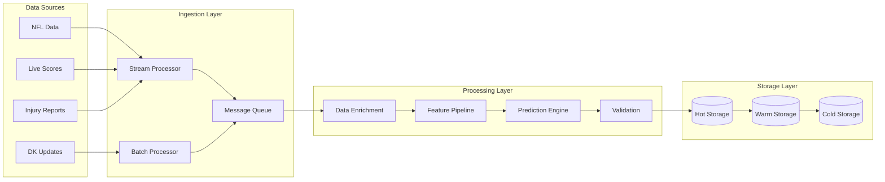

# Real-Time Data Processing Architecture

## Overview

This document defines the data processing pipeline architecture for handling NFL data updates, real-time predictions, and continuous model improvements. The system processes data in near real-time during games and batch processing during off-hours.

## Processing Pipeline Architecture



## Data Processing Modes

### Real-Time Processing

**For time-sensitive data during game time**

```python
class RealTimeProcessor:
    def __init__(self):
        self.event_stream = EventStream()
        self.processor_pool = ProcessorPool(workers=8)
        self.cache = InMemoryCache()

    async def process_live_update(self, update: LiveUpdate) -> ProcessedUpdate:
        """
        Process live game updates in real-time
        """
        # Immediate validation
        if not self._validate_update(update):
            raise ValidationError(f"Invalid update: {update}")

        # Quick feature extraction
        features = await self._extract_real_time_features(update)

        # Update predictions
        predictions = await self._update_predictions(features)

        # Cache for immediate access
        await self.cache.set(update.player_id, predictions, ttl=60)

        # Emit event for subscribers
        await self.event_stream.emit('prediction_update', predictions)

        return ProcessedUpdate(
            update=update,
            features=features,
            predictions=predictions,
            timestamp=datetime.utcnow()
        )
```

### Batch Processing

**For comprehensive data updates and model retraining**

```python
class BatchProcessor:
    def __init__(self):
        self.scheduler = APScheduler()
        self.batch_size = 1000
        self.parallel_workers = 4

    def schedule_batch_jobs(self):
        """
        Schedule regular batch processing jobs
        """
        # Daily data refresh
        self.scheduler.add_job(
            self.refresh_all_data,
            'cron',
            hour=3,  # 3 AM
            minute=0
        )

        # Weekly model retraining
        self.scheduler.add_job(
            self.retrain_models,
            'cron',
            day_of_week='tue',  # Tuesday after MNF
            hour=4,
            minute=0
        )

        # Pre-game feature updates
        self.scheduler.add_job(
            self.update_game_features,
            'interval',
            hours=1,
            start_date=self._get_next_game_day()
        )

    async def process_batch(self, data: List[Record]) -> BatchResult:
        """
        Process data in efficient batches
        """
        results = []

        for i in range(0, len(data), self.batch_size):
            batch = data[i:i + self.batch_size]

            # Parallel processing
            batch_results = await asyncio.gather(*[
                self._process_record(record)
                for record in batch
            ])

            results.extend(batch_results)

        return BatchResult(
            processed=len(results),
            success=len([r for r in results if r.success]),
            failed=len([r for r in results if not r.success])
        )
```

## Stream Processing

### Event Stream Architecture

```python
class EventStream:
    def __init__(self):
        self.subscribers = defaultdict(list)
        self.event_queue = asyncio.Queue()
        self.processor = StreamProcessor()

    async def subscribe(self, event_type: str, handler: Callable):
        """
        Subscribe to specific event types
        """
        self.subscribers[event_type].append(handler)

    async def emit(self, event_type: str, data: Any):
        """
        Emit event to all subscribers
        """
        event = Event(
            type=event_type,
            data=data,
            timestamp=datetime.utcnow()
        )

        await self.event_queue.put(event)

    async def process_events(self):
        """
        Continuous event processing loop
        """
        while True:
            event = await self.event_queue.get()

            # Process event
            processed = await self.processor.process(event)

            # Notify subscribers
            for handler in self.subscribers[event.type]:
                asyncio.create_task(handler(processed))
```

### Live Data Ingestion

```python
class LiveDataIngester:
    def __init__(self):
        self.sources = {
            'scores': ScoreboardMonitor(),
            'injuries': InjuryMonitor(),
            'weather': WeatherMonitor(),
            'vegas': OddsMonitor()
        }
        self.update_interval = 30  # seconds

    async def start_monitoring(self):
        """
        Start monitoring all live data sources
        """
        tasks = []

        for source_name, monitor in self.sources.items():
            task = asyncio.create_task(
                self._monitor_source(source_name, monitor)
            )
            tasks.append(task)

        await asyncio.gather(*tasks)

    async def _monitor_source(self, name: str, monitor: Monitor):
        """
        Monitor individual data source
        """
        while True:
            try:
                # Fetch latest data
                updates = await monitor.fetch_updates()

                if updates:
                    # Process updates
                    await self._process_updates(name, updates)

                # Wait before next check
                await asyncio.sleep(self.update_interval)

            except Exception as e:
                logger.error(f"Error monitoring {name}: {e}")
                await asyncio.sleep(60)  # Back off on error
```

## Data Enrichment Pipeline

### Feature Enrichment

```python
class FeatureEnrichmentPipeline:
    def __init__(self):
        self.enrichers = [
            PlayerContextEnricher(),
            GameEnvironmentEnricher(),
            HistoricalStatsEnricher(),
            CorrelationEnricher(),
            OwnershipProjectionEnricher()
        ]

    async def enrich_player_data(self, player_data: PlayerData) -> EnrichedData:
        """
        Enrich player data with additional features
        """
        enriched = EnrichedData(player_data)

        for enricher in self.enrichers:
            try:
                enriched = await enricher.enrich(enriched)
            except Exception as e:
                logger.warning(f"Enrichment failed for {enricher.__class__.__name__}: {e}")
                # Continue with other enrichers

        return enriched
```

### Rolling Window Calculations

```python
class RollingWindowCalculator:
    def __init__(self):
        self.windows = {
            'L3': 3,   # Last 3 games
            'L5': 5,   # Last 5 games
            'L10': 10, # Last 10 games
            'Season': None  # Full season
        }

    def calculate_rolling_stats(self,
                               player_id: str,
                               stat_history: pd.DataFrame) -> RollingStats:
        """
        Calculate rolling statistics for different windows
        """
        rolling_stats = RollingStats()

        for window_name, window_size in self.windows.items():
            if window_size:
                window_data = stat_history.tail(window_size)
            else:
                window_data = stat_history

            rolling_stats[window_name] = {
                'mean': window_data.mean(),
                'std': window_data.std(),
                'min': window_data.min(),
                'max': window_data.max(),
                'trend': self._calculate_trend(window_data)
            }

        return rolling_stats
```

## Prediction Update Pipeline

### Incremental Prediction Updates

```python
class IncrementalPredictor:
    def __init__(self):
        self.model_cache = ModelCache()
        self.feature_cache = FeatureCache()
        self.update_threshold = 0.1  # 10% change triggers update

    async def update_predictions(self, trigger: UpdateTrigger) -> UpdateResult:
        """
        Update predictions based on new information
        """
        affected_players = await self._identify_affected_players(trigger)

        updates = []
        for player_id in affected_players:
            # Get cached features
            features = await self.feature_cache.get(player_id)

            # Update affected features
            updated_features = await self._update_features(features, trigger)

            # Check if update is significant
            if self._is_significant_change(features, updated_features):
                # Recalculate prediction
                new_prediction = await self._predict(player_id, updated_features)

                updates.append(PredictionUpdate(
                    player_id=player_id,
                    old_prediction=features.prediction,
                    new_prediction=new_prediction,
                    trigger=trigger
                ))

                # Update cache
                await self.feature_cache.set(player_id, updated_features)

        return UpdateResult(updates=updates, timestamp=datetime.utcnow())
```

### Model Hot-Swapping

```python
class ModelHotSwapper:
    def __init__(self):
        self.active_models = {}
        self.staging_models = {}
        self.performance_monitor = PerformanceMonitor()

    async def deploy_new_model(self, position: str, model: Model) -> bool:
        """
        Deploy new model without downtime
        """
        # Load model to staging
        self.staging_models[position] = model

        # Run parallel predictions for validation
        validation_result = await self._validate_model(position, model)

        if validation_result.is_valid:
            # Atomic swap
            old_model = self.active_models.get(position)
            self.active_models[position] = model

            # Monitor performance
            asyncio.create_task(
                self._monitor_model_performance(position, model)
            )

            # Clean up old model
            if old_model:
                await self._cleanup_model(old_model)

            return True

        return False
```

## Data Validation Pipeline

### Multi-Stage Validation

```python
class DataValidationPipeline:
    def __init__(self):
        self.validators = [
            SchemaValidator(),
            RangeValidator(),
            ConsistencyValidator(),
            AnomalyDetector()
        ]

    async def validate(self, data: Any) -> ValidationResult:
        """
        Run data through validation pipeline
        """
        results = []

        for validator in self.validators:
            result = await validator.validate(data)
            results.append(result)

            if result.is_critical_failure:
                # Stop on critical failures
                break

        return ValidationResult(
            is_valid=all(r.is_valid for r in results),
            errors=[e for r in results for e in r.errors],
            warnings=[w for r in results for w in r.warnings]
        )
```

### Anomaly Detection

```python
class AnomalyDetector:
    def __init__(self):
        self.isolation_forest = IsolationForest(contamination=0.1)
        self.zscore_threshold = 3

    async def detect_anomalies(self, data: pd.DataFrame) -> List[Anomaly]:
        """
        Detect statistical anomalies in data
        """
        anomalies = []

        # Statistical outliers
        for column in data.select_dtypes(include=[np.number]).columns:
            z_scores = np.abs(stats.zscore(data[column]))
            outliers = data[z_scores > self.zscore_threshold]

            if not outliers.empty:
                anomalies.append(Anomaly(
                    type='statistical_outlier',
                    column=column,
                    values=outliers[column].tolist()
                ))

        # Machine learning based detection
        if len(data) > 10:
            predictions = self.isolation_forest.fit_predict(data.select_dtypes(include=[np.number]))
            ml_anomalies = data[predictions == -1]

            if not ml_anomalies.empty:
                anomalies.append(Anomaly(
                    type='ml_detected',
                    indices=ml_anomalies.index.tolist()
                ))

        return anomalies
```

## Message Queue System

### Queue Configuration

```python
class MessageQueueConfig:
    QUEUES = {
        'high_priority': {
            'max_size': 1000,
            'ttl': 300,  # 5 minutes
            'retry_attempts': 3
        },
        'predictions': {
            'max_size': 5000,
            'ttl': 3600,  # 1 hour
            'retry_attempts': 2
        },
        'batch_processing': {
            'max_size': 10000,
            'ttl': 86400,  # 24 hours
            'retry_attempts': 5
        }
    }
```

### Queue Manager

```python
class QueueManager:
    def __init__(self):
        self.queues = {}
        self._initialize_queues()

    async def publish(self, queue_name: str, message: Message) -> bool:
        """
        Publish message to queue
        """
        queue = self.queues.get(queue_name)
        if not queue:
            raise ValueError(f"Unknown queue: {queue_name}")

        # Add metadata
        message.timestamp = datetime.utcnow()
        message.id = str(uuid.uuid4())

        # Publish with retry
        for attempt in range(3):
            try:
                await queue.put(message)
                return True
            except QueueFullError:
                if attempt < 2:
                    await asyncio.sleep(1)
                else:
                    raise

        return False

    async def consume(self, queue_name: str, handler: Callable):
        """
        Consume messages from queue
        """
        queue = self.queues.get(queue_name)

        while True:
            try:
                message = await queue.get()

                # Process message
                await handler(message)

                # Acknowledge
                await queue.task_done()

            except Exception as e:
                logger.error(f"Error processing message: {e}")

                # Requeue or dead letter
                if message.retry_count < 3:
                    message.retry_count += 1
                    await queue.put(message)
                else:
                    await self._send_to_dead_letter(message)
```

## Data Storage Strategy

### Tiered Storage

```python
class TieredStorage:
    def __init__(self):
        self.hot_storage = RedisCache()      # < 1 hour old
        self.warm_storage = SQLiteDB()       # < 1 week old
        self.cold_storage = CompressedFiles() # > 1 week old

    async def store(self, data: Any, data_type: str) -> bool:
        """
        Store data in appropriate tier
        """
        # Always store in hot for immediate access
        await self.hot_storage.set(
            key=f"{data_type}:{data.id}",
            value=data,
            ttl=3600
        )

        # Persist to warm storage
        await self.warm_storage.insert(data_type, data)

        # Schedule cold storage archival
        if self._should_archive(data_type):
            asyncio.create_task(self._archive_to_cold(data))

        return True

    async def retrieve(self, key: str) -> Optional[Any]:
        """
        Retrieve data from appropriate tier
        """
        # Try hot storage first
        data = await self.hot_storage.get(key)
        if data:
            return data

        # Try warm storage
        data = await self.warm_storage.query(key)
        if data:
            # Promote to hot storage
            await self.hot_storage.set(key, data, ttl=600)
            return data

        # Try cold storage
        data = await self.cold_storage.retrieve(key)
        if data:
            # Promote to warm and hot
            await self.warm_storage.insert(data)
            await self.hot_storage.set(key, data, ttl=600)
            return data

        return None
```

## Performance Optimization

### Parallel Processing

```python
class ParallelProcessor:
    def __init__(self, max_workers: int = 8):
        self.executor = ProcessPoolExecutor(max_workers=max_workers)
        self.semaphore = asyncio.Semaphore(max_workers * 2)

    async def process_parallel(self,
                              items: List[Any],
                              processor: Callable) -> List[Any]:
        """
        Process items in parallel with controlled concurrency
        """
        async def process_with_semaphore(item):
            async with self.semaphore:
                loop = asyncio.get_event_loop()
                return await loop.run_in_executor(
                    self.executor,
                    processor,
                    item
                )

        results = await asyncio.gather(*[
            process_with_semaphore(item) for item in items
        ])

        return results
```

### Caching Strategy

```python
class CacheStrategy:
    def __init__(self):
        self.cache_layers = [
            MemoryCache(size=1000, ttl=60),      # L1: Memory
            RedisCache(ttl=3600),                # L2: Redis
            FileCache(ttl=86400)                 # L3: File
        ]

    async def get_with_fallback(self, key: str) -> Optional[Any]:
        """
        Get from cache with fallback layers
        """
        for i, cache in enumerate(self.cache_layers):
            value = await cache.get(key)

            if value is not None:
                # Promote to higher cache layers
                for j in range(i):
                    await self.cache_layers[j].set(key, value)

                return value

        return None
```

## Monitoring and Metrics

### Pipeline Metrics

```python
class PipelineMetrics:
    def __init__(self):
        self.metrics = {
            'throughput': Counter('pipeline_throughput_total'),
            'latency': Histogram('pipeline_latency_seconds'),
            'errors': Counter('pipeline_errors_total'),
            'queue_size': Gauge('pipeline_queue_size')
        }

    def record_processing(self, stage: str, duration: float, success: bool):
        """
        Record pipeline processing metrics
        """
        self.metrics['throughput'].inc()
        self.metrics['latency'].observe(duration)

        if not success:
            self.metrics['errors'].inc()

        # Custom metrics per stage
        stage_metric = Histogram(f'pipeline_{stage}_duration')
        stage_metric.observe(duration)
```

### Health Monitoring

```python
class PipelineHealthMonitor:
    def __init__(self):
        self.health_checks = {
            'ingestion': self._check_ingestion,
            'processing': self._check_processing,
            'storage': self._check_storage,
            'predictions': self._check_predictions
        }

    async def check_health(self) -> HealthStatus:
        """
        Check overall pipeline health
        """
        results = {}

        for component, checker in self.health_checks.items():
            try:
                status = await checker()
                results[component] = status
            except Exception as e:
                results[component] = HealthStatus.UNHEALTHY
                logger.error(f"Health check failed for {component}: {e}")

        overall = HealthStatus.HEALTHY if all(
            s == HealthStatus.HEALTHY for s in results.values()
        ) else HealthStatus.DEGRADED

        return PipelineHealth(
            status=overall,
            components=results,
            timestamp=datetime.utcnow()
        )
```
