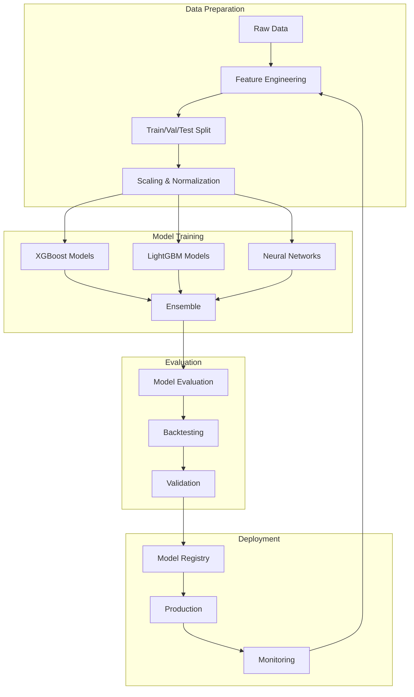

# Machine Learning Pipeline Architecture

## Overview

This document details the machine learning pipeline architecture for the NFL DFS system, including model training, evaluation, deployment, and self-improvement mechanisms. The pipeline supports position-specific models with continuous learning capabilities.

## ML Pipeline Overview



## Feature Engineering Pipeline

### Feature Categories

```python
class FeatureCategories:
    """Define feature groups for NFL player predictions"""

    BASE_FEATURES = [
        'games_played', 'snaps', 'snap_percentage',
        'team_implied_total', 'opponent_implied_total',
        'spread', 'game_total', 'is_home'
    ]

    QB_FEATURES = [
        # Performance metrics
        'pass_attempts_avg', 'completion_percentage', 'yards_per_attempt',
        'touchdown_rate', 'interception_rate', 'sack_rate',
        'passer_rating', 'qbr', 'epa_per_play', 'cpoe',

        # Rushing metrics
        'rush_attempts_avg', 'rush_yards_avg', 'rush_td_rate',
        'scramble_rate', 'designed_rush_rate',

        # Situational metrics
        'red_zone_attempts', 'red_zone_td_rate',
        'third_down_conversion_rate', 'pressure_rate',
        'blitz_performance', 'primetime_differential',

        # Opponent adjustments
        'opp_pass_dvoa', 'opp_qb_pressure_rate',
        'opp_passing_yards_allowed', 'opp_passing_td_allowed'
    ]

    RB_FEATURES = [
        # Rushing metrics
        'carries_avg', 'yards_per_carry', 'rush_td_rate',
        'yards_after_contact', 'broken_tackle_rate',
        'stuffed_rate', 'explosive_run_rate',

        # Receiving metrics
        'targets_avg', 'target_share', 'catches_avg',
        'receiving_yards_avg', 'yards_per_reception',
        'catch_rate', 'receiving_td_rate',

        # Usage metrics
        'touch_share', 'red_zone_touches', 'goal_line_touches',
        'third_down_usage', 'two_minute_usage',
        'snap_share_trend', 'routes_run_rate',

        # Game script
        'positive_game_script_usage', 'negative_game_script_usage',
        'clock_killing_usage', 'comeback_usage'
    ]

    WR_TE_FEATURES = [
        # Target metrics
        'targets_avg', 'target_share', 'air_yards_share',
        'adot', 'wopr', 'racr', 'target_quality',

        # Efficiency metrics
        'catch_rate', 'yards_per_reception', 'yards_per_target',
        'td_rate', 'first_down_rate', 'yac_per_reception',

        # Route metrics
        'routes_run', 'route_participation', 'slot_rate',
        'deep_target_rate', 'red_zone_target_share',

        # Matchup metrics
        'cb_matchup_rating', 'zone_vs_man_differential',
        'separation_score', 'contested_catch_rate'
    ]
```

### Feature Engineering Pipeline

```python
class FeatureEngineeringPipeline:
    def __init__(self):
        self.feature_generators = {
            'QB': QBFeatureGenerator(),
            'RB': RBFeatureGenerator(),
            'WR': WRFeatureGenerator(),
            'TE': TEFeatureGenerator(),
            'DST': DSTFeatureGenerator()
        }
        self.scaler = StandardScaler()
        self.encoder = TargetEncoder()

    def engineer_features(self, raw_data: pd.DataFrame, position: str) -> np.ndarray:
        """
        Complete feature engineering pipeline for a position
        """
        # Generate position-specific features
        generator = self.feature_generators[position]
        features = generator.generate(raw_data)

        # Add interaction features
        features = self._add_interactions(features, position)

        # Add polynomial features for key metrics
        features = self._add_polynomials(features, position)

        # Add time-based features
        features = self._add_temporal_features(features)

        # Handle missing values
        features = self._impute_missing(features)

        # Encode categorical variables
        features = self._encode_categoricals(features)

        # Scale numerical features
        features = self._scale_features(features)

        return features

    def _add_interactions(self, features: pd.DataFrame, position: str) -> pd.DataFrame:
        """
        Add interaction features between key variables
        """
        if position == 'QB':
            # QB-specific interactions
            features['pass_volume_x_efficiency'] = (
                features['pass_attempts_avg'] * features['yards_per_attempt']
            )
            features['td_rate_x_redzone'] = (
                features['touchdown_rate'] * features['red_zone_attempts']
            )

        elif position == 'RB':
            # RB-specific interactions
            features['touches_x_efficiency'] = (
                features['touch_share'] * features['yards_per_touch']
            )
            features['receiving_x_gamescript'] = (
                features['target_share'] * features['negative_game_script_usage']
            )

        return features
```

## Model Training Architecture

### CPU Optimization Strategy

The system is optimized for CPU-based training with the following considerations:

```python
class CPUOptimizationConfig:
    """CPU-specific optimization settings"""
    
    # Thread configuration
    num_threads: int = 8  # Adjust based on CPU cores
    use_mkl: bool = True  # Intel MKL for optimized linear algebra
    
    # Batch processing
    batch_size: int = 32  # Smaller batches for CPU memory efficiency
    prefetch_batches: int = 2  # Prefetch data while processing
    
    # Training optimization
    use_mixed_precision: bool = False  # CPU doesn't benefit from mixed precision
    gradient_accumulation_steps: int = 1  # No need for gradient accumulation on CPU
    
    # Future GPU support
    device_strategy: str = "cpu"  # Can be changed to "cuda" when GPU available
    gpu_ready: bool = True  # Architecture supports GPU acceleration when available
```

### Base Model Class

```python
class BaseModel(ABC):
    """Abstract base class for all position models"""

    def __init__(self, config: ModelConfig):
        self.config = config
        self.model = None
        self.feature_names = None
        self.scaler = None
        self.training_history = []

    @abstractmethod
    def build_model(self) -> Any:
        """Build the model architecture"""
        pass

    @abstractmethod
    def train(self, X_train: np.ndarray, y_train: np.ndarray,
              X_val: np.ndarray, y_val: np.ndarray) -> TrainingResult:
        """Train the model"""
        pass

    @abstractmethod
    def predict(self, X: np.ndarray) -> PredictionResult:
        """Generate predictions"""
        pass

    def evaluate(self, X_test: np.ndarray, y_test: np.ndarray) -> EvaluationMetrics:
        """Evaluate model performance"""
        predictions = self.predict(X_test)

        return EvaluationMetrics(
            mae=mean_absolute_error(y_test, predictions.point_estimate),
            rmse=np.sqrt(mean_squared_error(y_test, predictions.point_estimate)),
            r2=r2_score(y_test, predictions.point_estimate),
            mape=mean_absolute_percentage_error(y_test, predictions.point_estimate),
            quantile_loss=self._calculate_quantile_loss(y_test, predictions)
        )
```

### Position-Specific Models

#### QB Model

```python
class QBModel(BaseModel):
    """Quarterback-specific prediction model"""

    def build_model(self) -> XGBRegressor:
        """Build XGBoost model optimized for QB predictions"""
        return XGBRegressor(
            n_estimators=500,
            max_depth=8,
            learning_rate=0.03,
            subsample=0.8,
            colsample_bytree=0.8,
            reg_alpha=0.1,
            reg_lambda=1.0,
            objective='reg:squarederror',
            eval_metric='mae',
            random_state=42
        )

    def train(self, X_train: np.ndarray, y_train: np.ndarray,
              X_val: np.ndarray, y_val: np.ndarray) -> TrainingResult:
        """Train QB model with early stopping"""

        # Apply time decay weights
        weights = self._calculate_time_weights(X_train)

        # Train primary model
        self.model = self.build_model()
        self.model.fit(
            X_train, y_train,
            sample_weight=weights,
            eval_set=[(X_val, y_val)],
            early_stopping_rounds=50,
            verbose=False
        )

        # Train auxiliary models
        self.rushing_model = self._train_rushing_model(X_train, y_train)
        self.primetime_model = self._train_primetime_model(X_train, y_train)

        return TrainingResult(
            model=self.model,
            best_iteration=self.model.best_iteration,
            feature_importance=self._get_feature_importance()
        )

    def predict(self, X: np.ndarray) -> QBPrediction:
        """Generate QB predictions with confidence intervals"""

        # Base prediction
        base_pred = self.model.predict(X)

        # Adjust for rushing upside
        rushing_adj = self.rushing_model.predict(X)

        # Adjust for primetime games
        primetime_adj = self.primetime_model.predict(X)

        # Combine predictions
        point_estimate = base_pred + rushing_adj + primetime_adj

        # Calculate prediction intervals
        lower_bound, upper_bound = self._calculate_intervals(X, point_estimate)

        return QBPrediction(
            point_estimate=point_estimate,
            floor=lower_bound,
            ceiling=upper_bound,
            rushing_projection=rushing_adj,
            passing_projection=base_pred
        )
```

#### RB Model

```python
class RBModel(BaseModel):
    """Running back-specific prediction model using LightGBM"""

    def build_model(self) -> LGBMRegressor:
        """Build LightGBM model optimized for RB predictions"""
        return LGBMRegressor(
            n_estimators=400,
            num_leaves=31,
            max_depth=7,
            learning_rate=0.05,
            feature_fraction=0.9,
            bagging_fraction=0.8,
            bagging_freq=5,
            lambda_l1=0.1,
            lambda_l2=0.1,
            min_child_samples=20,
            objective='regression',
            metric='mae',
            random_state=42
        )

    def train(self, X_train: np.ndarray, y_train: np.ndarray,
              X_val: np.ndarray, y_val: np.ndarray) -> TrainingResult:
        """Train RB model with workload clustering"""

        # Cluster RBs by workload type
        clusters = self._cluster_by_workload(X_train)

        # Train separate models for each cluster
        self.cluster_models = {}
        for cluster_id in np.unique(clusters):
            cluster_mask = clusters == cluster_id

            model = self.build_model()
            model.fit(
                X_train[cluster_mask],
                y_train[cluster_mask],
                eval_set=[(X_val, y_val)],
                callbacks=[early_stopping(50), log_evaluation(0)]
            )

            self.cluster_models[cluster_id] = model

        return TrainingResult(
            models=self.cluster_models,
            clusters=clusters,
            feature_importance=self._aggregate_feature_importance()
        )
```

### Ensemble Models

```python
class EnsembleModel:
    """Ensemble of multiple model types"""

    def __init__(self, position: str):
        self.position = position
        self.base_models = []
        self.meta_model = None
        self.weights = None

    def add_model(self, model: BaseModel, weight: float = None):
        """Add a model to the ensemble"""
        self.base_models.append({
            'model': model,
            'weight': weight
        })

    def train_ensemble(self, X_train: np.ndarray, y_train: np.ndarray,
                       X_val: np.ndarray, y_val: np.ndarray):
        """Train ensemble with stacking or weighted average"""

        # Get predictions from all base models
        train_preds = []
        val_preds = []

        for model_dict in self.base_models:
            model = model_dict['model']

            # Train if not already trained
            if not model.is_trained:
                model.train(X_train, y_train, X_val, y_val)

            # Get predictions
            train_preds.append(model.predict(X_train).point_estimate)
            val_preds.append(model.predict(X_val).point_estimate)

        # Stack predictions
        train_meta = np.column_stack(train_preds)
        val_meta = np.column_stack(val_preds)

        # Train meta-model
        self.meta_model = Ridge(alpha=1.0)
        self.meta_model.fit(train_meta, y_train)

        # Calculate optimal weights
        self.weights = self._optimize_weights(val_meta, y_val)

    def predict(self, X: np.ndarray) -> EnsemblePrediction:
        """Generate ensemble predictions"""

        predictions = []
        for model_dict in self.base_models:
            pred = model_dict['model'].predict(X)
            predictions.append(pred.point_estimate)

        # Stack predictions
        stacked = np.column_stack(predictions)

        # Meta-model prediction
        meta_pred = self.meta_model.predict(stacked)

        # Weighted average
        weighted_pred = np.average(stacked, weights=self.weights, axis=1)

        # Combine both approaches
        final_pred = 0.6 * meta_pred + 0.4 * weighted_pred

        return EnsemblePrediction(
            point_estimate=final_pred,
            individual_predictions=predictions,
            weights=self.weights,
            confidence=self._calculate_confidence(stacked)
        )
```

## Self-Improvement System

### Error Analysis Engine

```python
class ErrorAnalysisEngine:
    """Analyze prediction errors to improve models"""

    def __init__(self):
        self.error_patterns = defaultdict(list)
        self.feature_importance_evolution = []

    def analyze_errors(self, predictions: List[Prediction],
                       actuals: List[float]) -> ErrorAnalysis:
        """Comprehensive error analysis"""

        errors = np.array(actuals) - np.array(predictions)

        analysis = ErrorAnalysis()

        # Basic statistics
        analysis.mae = np.mean(np.abs(errors))
        analysis.rmse = np.sqrt(np.mean(errors ** 2))
        analysis.bias = np.mean(errors)

        # Error distribution
        analysis.error_percentiles = np.percentile(errors, [5, 25, 50, 75, 95])

        # Systematic patterns
        analysis.patterns = self._identify_patterns(errors, predictions)

        # Feature correlation with errors
        analysis.feature_correlations = self._correlate_features_with_errors(errors)

        # Temporal patterns
        analysis.temporal_patterns = self._analyze_temporal_patterns(errors)

        return analysis

    def _identify_patterns(self, errors: np.ndarray,
                          predictions: List[Prediction]) -> List[ErrorPattern]:
        """Identify systematic error patterns"""

        patterns = []

        # Check for prediction range bias
        low_pred_mask = predictions < np.percentile(predictions, 33)
        high_pred_mask = predictions > np.percentile(predictions, 67)

        if np.mean(errors[low_pred_mask]) > 0.5:
            patterns.append(ErrorPattern(
                type='underestimation_low_range',
                magnitude=np.mean(errors[low_pred_mask]),
                frequency=np.sum(low_pred_mask) / len(predictions)
            ))

        if np.mean(errors[high_pred_mask]) < -0.5:
            patterns.append(ErrorPattern(
                type='overestimation_high_range',
                magnitude=np.mean(errors[high_pred_mask]),
                frequency=np.sum(high_pred_mask) / len(predictions)
            ))

        return patterns
```

### Adaptive Learning System

```python
class AdaptiveLearningSystem:
    """Continuously improve models based on new data"""

    def __init__(self):
        self.learning_rate = 0.01
        self.momentum = 0.9
        self.weight_updates = defaultdict(float)

    def update_model(self, model: BaseModel,
                    error_analysis: ErrorAnalysis) -> UpdatedModel:
        """Update model based on error analysis"""

        # Calculate feature weight adjustments
        weight_adjustments = self._calculate_weight_adjustments(error_analysis)

        # Update feature importance
        new_feature_weights = self._update_feature_weights(
            model.feature_importance,
            weight_adjustments
        )

        # Retrain if significant changes
        if self._should_retrain(weight_adjustments):
            updated_model = self._retrain_with_adjustments(
                model,
                new_feature_weights
            )
        else:
            # Incremental update
            updated_model = self._incremental_update(
                model,
                new_feature_weights
            )

        return UpdatedModel(
            model=updated_model,
            adjustments=weight_adjustments,
            improvement_metrics=self._calculate_improvement(model, updated_model)
        )

    def _calculate_weight_adjustments(self,
                                     error_analysis: ErrorAnalysis) -> Dict[str, float]:
        """Calculate how to adjust feature weights"""

        adjustments = {}

        for feature, correlation in error_analysis.feature_correlations.items():
            # Features highly correlated with errors need adjustment
            if abs(correlation) > 0.2:
                adjustment = -correlation * self.learning_rate

                # Apply momentum
                self.weight_updates[feature] = (
                    self.momentum * self.weight_updates[feature] + adjustment
                )

                adjustments[feature] = self.weight_updates[feature]

        return adjustments
```

## Model Evaluation and Validation

### Cross-Validation Strategy

```python
class TimeSeriesCrossValidator:
    """Time series aware cross-validation"""

    def __init__(self, n_splits: int = 5, gap: int = 0):
        self.n_splits = n_splits
        self.gap = gap  # Gap between train and test

    def split(self, X: np.ndarray, y: np.ndarray,
             timestamps: np.ndarray) -> Iterator[Tuple[np.ndarray, np.ndarray]]:
        """Generate train/test indices for time series CV"""

        # Sort by timestamp
        sorted_indices = np.argsort(timestamps)
        n_samples = len(X)

        # Calculate split sizes
        test_size = n_samples // (self.n_splits + 1)

        for i in range(self.n_splits):
            # Training data: all data up to split point
            train_end = (i + 1) * test_size
            train_indices = sorted_indices[:train_end]

            # Test data: next chunk after gap
            test_start = train_end + self.gap
            test_end = test_start + test_size
            test_indices = sorted_indices[test_start:test_end]

            yield train_indices, test_indices
```

### Model Validation Pipeline

```python
class ModelValidationPipeline:
    """Comprehensive model validation"""

    def __init__(self):
        self.validators = [
            StatisticalValidator(),
            BusinessRulesValidator(),
            StabilityValidator(),
            FairnessValidator()
        ]

    def validate_model(self, model: BaseModel,
                       test_data: TestData) -> ValidationReport:
        """Run full validation suite"""

        report = ValidationReport()

        # Statistical validation
        stat_results = self._statistical_validation(model, test_data)
        report.add_results('statistical', stat_results)

        # Business rules validation
        business_results = self._business_rules_validation(model, test_data)
        report.add_results('business', business_results)

        # Stability validation
        stability_results = self._stability_validation(model, test_data)
        report.add_results('stability', stability_results)

        # Performance by segment
        segment_results = self._segment_validation(model, test_data)
        report.add_results('segments', segment_results)

        return report

    def _statistical_validation(self, model: BaseModel,
                               test_data: TestData) -> StatisticalResults:
        """Validate statistical properties"""

        predictions = model.predict(test_data.X)
        residuals = test_data.y - predictions.point_estimate

        return StatisticalResults(
            normality_test=stats.normaltest(residuals),
            autocorrelation=self._check_autocorrelation(residuals),
            heteroscedasticity=self._check_heteroscedasticity(residuals, predictions),
            outlier_percentage=np.mean(np.abs(residuals) > 3 * np.std(residuals))
        )
```

## Model Deployment

### Model Registry

```python
class ModelRegistry:
    """Central registry for model management"""

    def __init__(self, storage_path: Path):
        self.storage_path = storage_path
        self.registry = {}
        self._load_registry()

    def register_model(self, model: TrainedModel) -> str:
        """Register a new model"""

        model_id = self._generate_model_id(model)

        # Save model artifacts
        model_path = self.storage_path / model_id
        model_path.mkdir(exist_ok=True)

        # Save model
        joblib.dump(model.model, model_path / 'model.pkl')

        # Save metadata
        metadata = {
            'id': model_id,
            'position': model.position,
            'version': model.version,
            'training_date': model.training_date,
            'metrics': model.metrics,
            'feature_names': model.feature_names,
            'hyperparameters': model.hyperparameters
        }

        with open(model_path / 'metadata.json', 'w') as f:
            json.dump(metadata, f)

        # Update registry
        self.registry[model_id] = metadata

        return model_id

    def deploy_model(self, model_id: str, environment: str = 'production') -> bool:
        """Deploy model to specified environment"""

        if model_id not in self.registry:
            raise ValueError(f"Model {model_id} not found")

        # Load model
        model = self.load_model(model_id)

        # Run deployment checks
        if not self._deployment_checks(model):
            return False

        # Update deployment status
        self.registry[model_id]['deployed_to'] = environment
        self.registry[model_id]['deployment_date'] = datetime.utcnow()

        # Save updated registry
        self._save_registry()

        return True
```

### Model Monitoring

```python
class ModelMonitor:
    """Monitor deployed model performance"""

    def __init__(self):
        self.metrics_buffer = deque(maxlen=1000)
        self.alert_thresholds = {
            'mae_increase': 0.2,  # 20% increase
            'prediction_drift': 0.15,
            'feature_drift': 0.1
        }

    async def monitor_predictions(self, model_id: str,
                                 predictions: np.ndarray,
                                 features: np.ndarray):
        """Monitor model predictions in real-time"""

        # Calculate metrics
        metrics = ModelMetrics(
            model_id=model_id,
            timestamp=datetime.utcnow(),
            prediction_mean=np.mean(predictions),
            prediction_std=np.std(predictions),
            feature_stats=self._calculate_feature_stats(features)
        )

        # Add to buffer
        self.metrics_buffer.append(metrics)

        # Check for drift
        drift_detected = self._check_for_drift()

        if drift_detected:
            await self._trigger_alert(drift_detected)

        # Log metrics
        await self._log_metrics(metrics)

    def _check_for_drift(self) -> Optional[DriftAlert]:
        """Check for prediction or feature drift"""

        if len(self.metrics_buffer) < 100:
            return None

        recent = list(self.metrics_buffer)[-50:]
        baseline = list(self.metrics_buffer)[-100:-50]

        # Check prediction drift
        recent_mean = np.mean([m.prediction_mean for m in recent])
        baseline_mean = np.mean([m.prediction_mean for m in baseline])

        if abs(recent_mean - baseline_mean) / baseline_mean > self.alert_thresholds['prediction_drift']:
            return DriftAlert(
                type='prediction_drift',
                magnitude=abs(recent_mean - baseline_mean) / baseline_mean,
                timestamp=datetime.utcnow()
            )

        return None
```

## Hyperparameter Optimization

### Bayesian Optimization

```python
class BayesianOptimizer:
    """Bayesian optimization for hyperparameter tuning"""

    def __init__(self, model_class: Type[BaseModel], position: str):
        self.model_class = model_class
        self.position = position
        self.study = optuna.create_study(
            direction='minimize',
            sampler=optuna.samplers.TPESampler()
        )

    def optimize(self, X_train: np.ndarray, y_train: np.ndarray,
                X_val: np.ndarray, y_val: np.ndarray,
                n_trials: int = 100) -> OptimizationResult:
        """Run Bayesian optimization"""

        def objective(trial):
            # Suggest hyperparameters
            params = self._suggest_params(trial)

            # Create and train model
            model = self.model_class(params)
            model.train(X_train, y_train, X_val, y_val)

            # Evaluate
            predictions = model.predict(X_val)
            mae = mean_absolute_error(y_val, predictions.point_estimate)

            return mae

        # Run optimization
        self.study.optimize(objective, n_trials=n_trials)

        return OptimizationResult(
            best_params=self.study.best_params,
            best_value=self.study.best_value,
            trials=self.study.trials
        )

    def _suggest_params(self, trial: optuna.Trial) -> Dict:
        """Suggest hyperparameters based on position"""

        if self.position == 'QB':
            return {
                'n_estimators': trial.suggest_int('n_estimators', 100, 1000),
                'max_depth': trial.suggest_int('max_depth', 3, 15),
                'learning_rate': trial.suggest_float('learning_rate', 0.01, 0.3, log=True),
                'subsample': trial.suggest_float('subsample', 0.5, 1.0),
                'colsample_bytree': trial.suggest_float('colsample_bytree', 0.5, 1.0),
                'reg_alpha': trial.suggest_float('reg_alpha', 0.0, 10.0),
                'reg_lambda': trial.suggest_float('reg_lambda', 0.0, 10.0)
            }
        # Add other positions...
```
