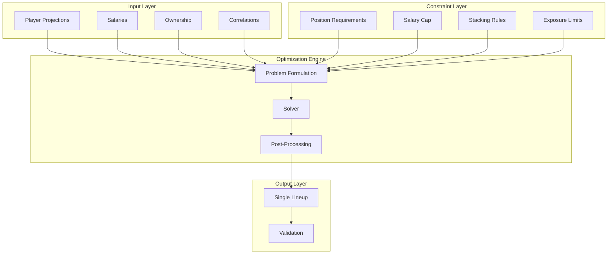

# Lineup Optimization Algorithms and Strategies

## Overview

This document details the optimization algorithms and strategies for generating optimal DraftKings lineups for single-entry classic contests. The system uses mixed-integer linear programming with advanced stacking rules and multi-objective optimization for GPP and cash game contest types. All optimizations are designed for classic contest format with the ability to plan lineups up to 48 hours before games.

## Optimization Framework



## Core Optimization Algorithm

### Mixed-Integer Linear Programming Formulation

```python
class LineupOptimizer:
    """Core lineup optimization using MILP"""

    def __init__(self):
        self.solver = pulp.PULP_CBC_CMD(msg=0, timeLimit=30)

    def formulate_problem(self, players: List[Player],
                         settings: OptimizationSettings) -> pulp.LpProblem:
        """
        Formulate the lineup optimization as a MILP problem

        Variables:
        x_i ∈ {0,1} : Binary variable for player i selection

        Objective:
        maximize Σ(projection_i * x_i)

        Constraints:
        1. Salary: Σ(salary_i * x_i) ≤ 50000
        2. Positions: Exactly 1 QB, 2 RB, 3 WR, 1 TE, 1 FLEX, 1 DST
        3. Unique players: Each player selected at most once
        4. Stacking rules: Correlation constraints
        """

        # Create problem
        prob = pulp.LpProblem("DFS_Lineup_Optimization", pulp.LpMaximize)

        # Decision variables
        player_vars = {}
        for player in players:
            player_vars[player.id] = pulp.LpVariable(
                f"player_{player.id}",
                cat='Binary'
            )

        # Objective function
        if settings.optimization_type == 'ceiling':
            # GPP optimization - maximize ceiling
            prob += pulp.lpSum([
                player.ceiling * player_vars[player.id]
                for player in players
            ])
        else:
            # Cash game optimization - maximize floor
            prob += pulp.lpSum([
                player.floor * player_vars[player.id]
                for player in players
            ])

        # Add constraints
        self._add_salary_constraint(prob, players, player_vars, settings)
        self._add_position_constraints(prob, players, player_vars)
        self._add_stacking_constraints(prob, players, player_vars, settings)

        return prob, player_vars

    def _add_position_constraints(self, prob: pulp.LpProblem,
                                 players: List[Player],
                                 player_vars: Dict):
        """Add DraftKings Classic roster constraints"""

        # Position groups
        qbs = [p for p in players if p.position == 'QB']
        rbs = [p for p in players if p.position == 'RB']
        wrs = [p for p in players if p.position == 'WR']
        tes = [p for p in players if p.position == 'TE']
        dsts = [p for p in players if p.position == 'DST']

        # Exactly 1 QB
        prob += pulp.lpSum([player_vars[p.id] for p in qbs]) == 1

        # At least 2 RBs (2-3 with FLEX)
        prob += pulp.lpSum([player_vars[p.id] for p in rbs]) >= 2
        prob += pulp.lpSum([player_vars[p.id] for p in rbs]) <= 3

        # At least 3 WRs (3-4 with FLEX)
        prob += pulp.lpSum([player_vars[p.id] for p in wrs]) >= 3
        prob += pulp.lpSum([player_vars[p.id] for p in wrs]) <= 4

        # At least 1 TE (1-2 with FLEX)
        prob += pulp.lpSum([player_vars[p.id] for p in tes]) >= 1
        prob += pulp.lpSum([player_vars[p.id] for p in tes]) <= 2

        # Exactly 1 DST
        prob += pulp.lpSum([player_vars[p.id] for p in dsts]) == 1

        # Total 9 players
        prob += pulp.lpSum([player_vars[p.id] for p in players]) == 9
```

### Stacking Algorithm

```python
class StackingOptimizer:
    """Advanced stacking strategies for correlation plays"""

    def add_qb_stacking_constraints(self, prob: pulp.LpProblem,
                                   players: List[Player],
                                   player_vars: Dict,
                                   settings: StackingSettings):
        """
        Implement QB stacking constraints

        Common stacks:
        - QB + WR1 (highest correlation)
        - QB + WR2 (leverage play)
        - QB + TE (red zone correlation)
        - QB + Multiple (onslaught)
        """

        qbs = [p for p in players if p.position == 'QB']

        for qb in qbs:
            # Find teammates
            teammates = [p for p in players
                        if p.team == qb.team and p.position in ['WR', 'TE']]

            if settings.require_qb_stack:
                # If QB selected, must have at least min_stack teammates
                prob += (
                    pulp.lpSum([player_vars[t.id] for t in teammates]) >=
                    settings.min_stack_size * player_vars[qb.id]
                )

                # But not more than max_stack
                prob += (
                    pulp.lpSum([player_vars[t.id] for t in teammates]) <=
                    settings.max_stack_size * player_vars[qb.id]
                )

    def add_game_stacking_constraints(self, prob: pulp.LpProblem,
                                     players: List[Player],
                                     player_vars: Dict,
                                     settings: StackingSettings):
        """
        Implement game stacking for correlated fantasy scoring

        Strategy: Players from same game tend to correlate
        (shootouts, garbage time, etc.)
        """

        games = self._group_players_by_game(players)

        for game_id, game_players in games.items():
            if settings.use_game_stacks:
                # Binary variable for game stack
                game_stack_var = pulp.LpVariable(
                    f"game_stack_{game_id}",
                    cat='Binary'
                )

                # If game stack selected, need min players from game
                prob += (
                    pulp.lpSum([player_vars[p.id] for p in game_players]) >=
                    settings.min_game_stack_size * game_stack_var
                )

                # Limit max players from single game
                prob += (
                    pulp.lpSum([player_vars[p.id] for p in game_players]) <=
                    settings.max_game_stack_size
                )

    def calculate_correlation_bonus(self, lineup: List[Player]) -> float:
        """Calculate correlation-based bonus for lineup"""

        bonus = 0.0

        # QB-WR/TE correlations
        qb = next((p for p in lineup if p.position == 'QB'), None)
        if qb:
            teammates = [p for p in lineup
                        if p.team == qb.team and p.position in ['WR', 'TE']]

            for teammate in teammates:
                correlation = self._get_historical_correlation(qb.id, teammate.id)
                bonus += correlation * 0.1  # Weight correlation bonus

        # Game stack correlations
        game_groups = defaultdict(list)
        for player in lineup:
            game_groups[player.game_id].append(player)

        for game_players in game_groups.values():
            if len(game_players) >= 3:
                # Bonus for game stacks
                bonus += 0.05 * len(game_players)

        return bonus
```

### Single-Entry Lineup Optimization

```python
class SingleEntryOptimizer:
    """Optimize single lineup for classic DraftKings contests"""

    def optimize_single_lineup(self, players: List[Player],
                              settings: OptimizationSettings) -> Lineup:
        """Generate optimal single lineup for classic contest"""

        # Optimize for single best lineup
        optimizer = LineupOptimizer()
        prob, player_vars = optimizer.formulate_problem(players, settings)
        
        # Solve optimization
        prob.solve(optimizer.solver)

        if prob.status == pulp.LpStatusOptimal:
            selected_players = [
                p for p in players
                if player_vars[p.id].value() == 1
            ]
            lineup = Lineup(players=selected_players)
            
            # Validate lineup meets DraftKings requirements
            if self._validate_classic_lineup(lineup):
                return lineup
            else:
                raise OptimizationError("Generated lineup violates contest rules")
        else:
            raise OptimizationError("No optimal solution found")

    def _validate_classic_lineup(self, lineup: Lineup) -> bool:
        """Validate lineup meets classic DraftKings requirements"""
        
        # Check position requirements: 1 QB, 2 RB, 3 WR, 1 TE, 1 FLEX, 1 DST
        positions = [p.position for p in lineup.players]
        
        if positions.count('QB') != 1:
            return False
        if positions.count('RB') < 2 or positions.count('RB') > 3:
            return False
        if positions.count('WR') < 3 or positions.count('WR') > 4:
            return False
        if positions.count('TE') < 1 or positions.count('TE') > 2:
            return False
        if positions.count('DST') != 1:
            return False
        if len(lineup.players) != 9:
            return False
            
        # Check salary cap
        total_salary = sum(p.salary for p in lineup.players)
        if total_salary > 50000:
            return False
            
        return True
```

## Contest-Specific Strategies

### Cash Game Optimization

```python
class CashGameOptimizer:
    """Optimization strategy for 50/50s and double-ups"""

    def optimize(self, players: List[Player]) -> Lineup:
        """
        Cash game strategy:
        - Maximize floor (consistency)
        - Prefer high-ownership players
        - Minimize variance
        - Safe correlations only
        """

        # Adjust projections for cash games
        for player in players:
            # Use floor projections
            player.optimization_score = (
                0.7 * player.floor +
                0.2 * player.median +
                0.1 * player.ownership_projection
            )

            # Penalize high variance
            variance_penalty = player.std_dev / player.median
            player.optimization_score *= (1 - min(0.3, variance_penalty))

        # Optimize with conservative stacking
        settings = OptimizationSettings(
            optimization_type='floor',
            require_qb_stack=True,
            min_stack_size=1,
            max_stack_size=2,
            use_game_stacks=False
        )

        optimizer = LineupOptimizer()
        return optimizer.optimize(players, settings)
```

### GPP Tournament Optimization

```python
class GPPOptimizer:
    """Optimization strategy for large-field tournaments"""

    def optimize(self, players: List[Player],
                contest_size: int) -> List[Lineup]:
        """
        GPP strategy:
        - Maximize ceiling (upside)
        - Find leverage (low ownership, high correlation)
        - Embrace variance
        - Multiple unique lineups
        """

        # Calculate leverage scores
        for player in players:
            leverage = self._calculate_leverage(player, contest_size)

            # GPP scoring emphasizes ceiling and leverage
            player.optimization_score = (
                0.5 * player.ceiling +
                0.3 * leverage +
                0.2 * player.correlation_upside
            )

        # Generate multiple lineups with different strategies
        lineups = []

        # Balanced lineups
        balanced_settings = OptimizationSettings(
            optimization_type='ceiling',
            require_qb_stack=True,
            min_stack_size=2,
            max_stack_size=3,
            use_game_stacks=True
        )
        lineups.extend(self._generate_lineups(players, 5, balanced_settings))

        # Contrarian lineups
        contrarian_settings = OptimizationSettings(
            optimization_type='leverage',
            ownership_fade=True,
            max_cumulative_ownership=100
        )
        lineups.extend(self._generate_lineups(players, 3, contrarian_settings))

        # Onslaught lineups
        onslaught_settings = OptimizationSettings(
            optimization_type='ceiling',
            require_qb_stack=True,
            min_stack_size=3,
            max_stack_size=4,
            force_game_stack=True
        )
        lineups.extend(self._generate_lineups(players, 2, onslaught_settings))

        return lineups

    def _calculate_leverage(self, player: Player, contest_size: int) -> float:
        """
        Calculate leverage score:
        High ceiling + Low ownership + High correlation = Leverage
        """

        # Ownership leverage (lower is better for GPPs)
        ownership_leverage = max(0, 1 - player.ownership_projection / 30)

        # Ceiling leverage (compare to salary peers)
        salary_range = (player.salary - 500, player.salary + 500)
        peers = self._get_salary_peers(player, salary_range)
        ceiling_percentile = self._calculate_ceiling_percentile(player, peers)

        # Correlation leverage
        correlation_bonus = self._get_max_correlation(player)

        # Contest size adjustment
        size_multiplier = min(2.0, math.log10(contest_size) / 3)

        return (
            ownership_leverage * 0.4 +
            ceiling_percentile * 0.4 +
            correlation_bonus * 0.2
        ) * size_multiplier
```

### Classic Contest Strategy

```python
class ClassicContestStrategy:
    """Strategic approach for classic DraftKings contests with single-entry focus"""

    def apply_strategy(self, players: List[Player], 
                      contest_type: str) -> OptimizationSettings:
        """
        Apply contest-specific strategy for single-entry classic lineups
        
        Supports GPP and Cash game strategies with 48-hour advance planning
        """
        
        if contest_type.upper() == 'GPP':
            return self._gpp_strategy(players)
        elif contest_type.upper() in ['CASH', 'H2H', '50/50']:
            return self._cash_strategy(players)
        else:
            raise ValueError(f"Unsupported contest type: {contest_type}")
    
    def _gpp_strategy(self, players: List[Player]) -> OptimizationSettings:
        """GPP tournament strategy for single-entry contests"""
        
        return OptimizationSettings(
            optimization_type='ceiling',
            require_qb_stack=True,
            min_stack_size=2,
            max_stack_size=3,
            use_game_stacks=True,
            max_ownership_concentration=0.25,  # Avoid chalk plays
            correlation_weight=0.3,
            leverage_focus=True
        )
    
    def _cash_strategy(self, players: List[Player]) -> OptimizationSettings:
        """Cash game strategy for single-entry contests"""
        
        return OptimizationSettings(
            optimization_type='floor',
            require_qb_stack=True,
            min_stack_size=1,
            max_stack_size=2,
            use_game_stacks=False,
            max_ownership_concentration=0.35,  # Accept higher ownership
            correlation_weight=0.1,
            leverage_focus=False,
            safety_multiplier=1.2  # Emphasize floor projections
        )
```

## Advanced Optimization Techniques

### Simulated Annealing

```python
class SimulatedAnnealingOptimizer:
    """Alternative optimization using simulated annealing"""

    def optimize(self, players: List[Player],
                constraints: Constraints,
                iterations: int = 10000) -> Lineup:
        """
        Simulated annealing for complex constraint scenarios
        """

        # Initial solution
        current = self._generate_random_valid_lineup(players, constraints)
        best = current.copy()

        # Temperature schedule
        temp = 100.0
        cooling_rate = 0.995

        for i in range(iterations):
            # Generate neighbor solution
            neighbor = self._get_neighbor(current, players, constraints)

            if not neighbor:
                continue

            # Calculate energy difference
            delta = neighbor.total_projection - current.total_projection

            # Accept or reject
            if delta > 0 or random.random() < math.exp(delta / temp):
                current = neighbor

                if current.total_projection > best.total_projection:
                    best = current

            # Cool down
            temp *= cooling_rate

        return best

    def _get_neighbor(self, lineup: Lineup,
                     players: List[Player],
                     constraints: Constraints) -> Optional[Lineup]:
        """Generate valid neighbor by swapping players"""

        new_lineup = lineup.copy()

        # Random swap
        remove_player = random.choice(new_lineup.players)

        # Find valid replacement
        candidates = [
            p for p in players
            if p.position == remove_player.position
            and p.id != remove_player.id
            and self._is_valid_swap(new_lineup, remove_player, p, constraints)
        ]

        if candidates:
            add_player = random.choice(candidates)
            new_lineup.remove(remove_player)
            new_lineup.add(add_player)
            return new_lineup

        return None
```

### Genetic Algorithm

```python
class GeneticOptimizer:
    """Genetic algorithm for lineup optimization"""

    def optimize(self, players: List[Player],
                population_size: int = 100,
                generations: int = 50) -> Lineup:
        """
        Evolve optimal lineups using genetic algorithm
        """

        # Initialize population
        population = [
            self._generate_random_lineup(players)
            for _ in range(population_size)
        ]

        for generation in range(generations):
            # Evaluate fitness
            fitness_scores = [
                self._calculate_fitness(lineup)
                for lineup in population
            ]

            # Selection
            parents = self._tournament_selection(population, fitness_scores)

            # Crossover
            offspring = []
            for i in range(0, len(parents), 2):
                if i + 1 < len(parents):
                    child1, child2 = self._crossover(parents[i], parents[i+1])
                    offspring.extend([child1, child2])

            # Mutation
            for lineup in offspring:
                if random.random() < 0.1:  # 10% mutation rate
                    self._mutate(lineup, players)

            # Create next generation
            population = self._select_next_generation(
                population + offspring,
                population_size
            )

        # Return best lineup
        return max(population, key=self._calculate_fitness)

    def _crossover(self, parent1: Lineup, parent2: Lineup) -> Tuple[Lineup, Lineup]:
        """Position-based crossover"""

        # Randomly select positions to inherit from each parent
        positions = ['QB', 'RB', 'WR', 'TE', 'DST']
        inherit_from_p1 = random.sample(positions, k=len(positions)//2)

        child1_players = []
        child2_players = []

        for pos in positions:
            if pos in inherit_from_p1:
                child1_players.extend(parent1.get_players_by_position(pos))
                child2_players.extend(parent2.get_players_by_position(pos))
            else:
                child1_players.extend(parent2.get_players_by_position(pos))
                child2_players.extend(parent1.get_players_by_position(pos))

        return Lineup(child1_players), Lineup(child2_players)
```

## Performance Metrics

### Optimization Performance Tracking

```python
class OptimizationMetrics:
    """Track and analyze optimization performance"""

    def __init__(self):
        self.metrics = {
            'solve_time': [],
            'iterations': [],
            'objective_value': [],
            'constraint_violations': [],
            'lineup_quality': []
        }

    def track_optimization(self, start_time: float,
                         end_time: float,
                         lineup: Lineup,
                         problem: pulp.LpProblem):
        """Track optimization metrics"""

        self.metrics['solve_time'].append(end_time - start_time)
        self.metrics['objective_value'].append(pulp.value(problem.objective))

        # Check constraint satisfaction
        violations = self._check_constraints(lineup)
        self.metrics['constraint_violations'].append(violations)

        # Lineup quality metrics
        quality = LineupQuality(
            total_projection=lineup.total_projection,
            total_salary=lineup.total_salary,
            correlation_score=self._calculate_correlation_score(lineup),
            ownership_sum=sum(p.ownership for p in lineup.players),
            position_balance=self._calculate_position_balance(lineup)
        )
        self.metrics['lineup_quality'].append(quality)

    def get_performance_summary(self) -> Dict:
        """Generate performance summary"""

        return {
            'avg_solve_time': np.mean(self.metrics['solve_time']),
            'p95_solve_time': np.percentile(self.metrics['solve_time'], 95),
            'success_rate': sum(v == 0 for v in self.metrics['constraint_violations']) / len(self.metrics['constraint_violations']),
            'avg_objective': np.mean(self.metrics['objective_value']),
            'quality_metrics': self._summarize_quality_metrics()
        }
```
