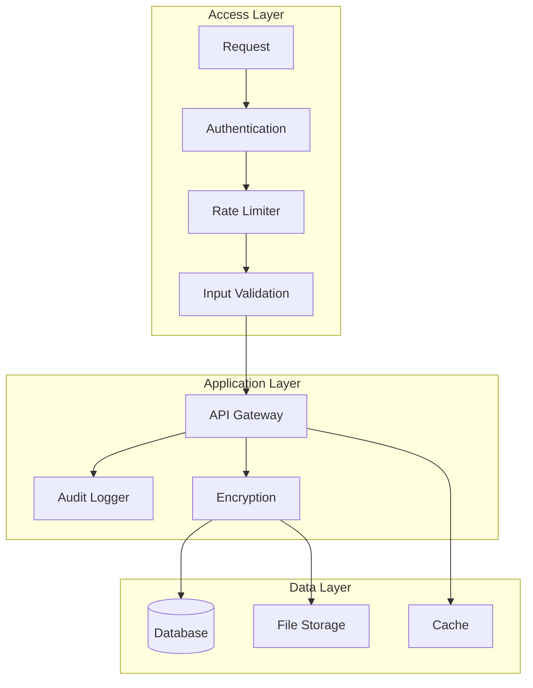

# Security, Authentication, and Rate Limiting Design

## Overview

This document outlines the security architecture for the NFL DFS system. While designed for local deployment, the system implements security best practices to protect data integrity and prevent abuse.

## Security Architecture



## Authentication Strategy

### Local Authentication

```python
class LocalAuthenticationManager:
    """Simple authentication for local deployment"""

    def __init__(self):
        self.api_key = self._load_api_key()
        self.session_manager = SessionManager()

    def authenticate_request(self, request: Request) -> AuthResult:
        """Authenticate incoming API request"""

        # Check API key in header
        api_key = request.headers.get('X-API-Key')
        if api_key and self._validate_api_key(api_key):
            return AuthResult(authenticated=True, method='api_key')

        # Check session token
        session_token = request.cookies.get('session_token')
        if session_token and self.session_manager.validate(session_token):
            return AuthResult(authenticated=True, method='session')

        # Local requests always authenticated
        if request.client.host in ['127.0.0.1', 'localhost']:
            return AuthResult(authenticated=True, method='local')

        return AuthResult(authenticated=False)

    def _validate_api_key(self, provided_key: str) -> bool:
        """Validate API key with timing attack protection"""
        return hmac.compare_digest(provided_key, self.api_key)
```

### Session Management

```python
class SessionManager:
    """Manage user sessions"""

    def __init__(self):
        self.sessions = {}
        self.session_ttl = 3600  # 1 hour

    def create_session(self, user_id: str) -> str:
        """Create new session"""
        session_token = secrets.token_urlsafe(32)

        self.sessions[session_token] = {
            'user_id': user_id,
            'created_at': datetime.utcnow(),
            'last_activity': datetime.utcnow()
        }

        return session_token

    def validate(self, session_token: str) -> bool:
        """Validate and refresh session"""
        if session_token not in self.sessions:
            return False

        session = self.sessions[session_token]

        # Check expiration
        if (datetime.utcnow() - session['created_at']).seconds > self.session_ttl:
            del self.sessions[session_token]
            return False

        # Update last activity
        session['last_activity'] = datetime.utcnow()
        return True
```

## Rate Limiting

### Token Bucket Algorithm

```python
class RateLimiter:
    """Token bucket rate limiting implementation"""

    def __init__(self):
        self.buckets = defaultdict(lambda: TokenBucket())
        self.limits = {
            'predictions': RateLimit(rate=60, burst=10, period=60),
            'optimization': RateLimit(rate=20, burst=5, period=60),
            'data_upload': RateLimit(rate=10, burst=2, period=60),
            'backtesting': RateLimit(rate=5, burst=1, period=60)
        }

    def check_rate_limit(self, client_id: str, endpoint: str) -> RateLimitResult:
        """Check if request is within rate limits"""

        bucket_key = f"{client_id}:{endpoint}"
        bucket = self.buckets[bucket_key]
        limit = self._get_limit_for_endpoint(endpoint)

        if bucket.consume(1, limit):
            return RateLimitResult(
                allowed=True,
                remaining=bucket.tokens,
                reset_after=bucket.next_refill_time()
            )

        return RateLimitResult(
            allowed=False,
            remaining=0,
            reset_after=bucket.next_refill_time(),
            retry_after=bucket.time_until_token()
        )

class TokenBucket:
    """Token bucket for rate limiting"""

    def __init__(self):
        self.tokens = 0
        self.last_refill = time.time()

    def consume(self, tokens: int, limit: RateLimit) -> bool:
        """Try to consume tokens"""
        self._refill(limit)

        if self.tokens >= tokens:
            self.tokens -= tokens
            return True
        return False

    def _refill(self, limit: RateLimit):
        """Refill bucket based on rate"""
        now = time.time()
        elapsed = now - self.last_refill

        # Add tokens based on rate
        tokens_to_add = elapsed * (limit.rate / limit.period)
        self.tokens = min(limit.burst, self.tokens + tokens_to_add)
        self.last_refill = now
```

## Input Validation

### Request Validation

```python
class InputValidator:
    """Comprehensive input validation"""

    def validate_request(self, request: Request, schema: Schema) -> ValidationResult:
        """Validate request against schema"""

        errors = []

        # Validate required fields
        for field in schema.required_fields:
            if field not in request.data:
                errors.append(f"Missing required field: {field}")

        # Validate data types
        for field, expected_type in schema.field_types.items():
            if field in request.data:
                if not isinstance(request.data[field], expected_type):
                    errors.append(f"Invalid type for {field}")

        # Validate ranges
        for field, (min_val, max_val) in schema.ranges.items():
            if field in request.data:
                value = request.data[field]
                if value < min_val or value > max_val:
                    errors.append(f"{field} out of range [{min_val}, {max_val}]")

        # SQL injection prevention
        if self._contains_sql_injection(request.data):
            errors.append("Potential SQL injection detected")

        # XSS prevention
        if self._contains_xss(request.data):
            errors.append("Potential XSS detected")

        return ValidationResult(
            valid=len(errors) == 0,
            errors=errors
        )

    def _contains_sql_injection(self, data: Dict) -> bool:
        """Check for SQL injection patterns"""
        sql_patterns = [
            r"(\b(SELECT|INSERT|UPDATE|DELETE|DROP|UNION|ALTER)\b)",
            r"(--|#|\/\*|\*\/)",
            r"(\bOR\b\s*\d+\s*=\s*\d+)",
            r"('|\")(\s*OR\s*)'?\"?\s*=\s*'?\"?"
        ]

        for value in self._flatten_dict(data):
            if isinstance(value, str):
                for pattern in sql_patterns:
                    if re.search(pattern, value, re.IGNORECASE):
                        return True
        return False
```

## Data Protection

### Encryption at Rest

```python
class DataEncryption:
    """Encrypt sensitive data at rest"""

    def __init__(self):
        self.key = self._load_or_generate_key()
        self.cipher = Fernet(self.key)

    def encrypt_sensitive_data(self, data: str) -> bytes:
        """Encrypt sensitive information"""
        return self.cipher.encrypt(data.encode())

    def decrypt_sensitive_data(self, encrypted: bytes) -> str:
        """Decrypt sensitive information"""
        return self.cipher.decrypt(encrypted).decode()

    def _load_or_generate_key(self) -> bytes:
        """Load or generate encryption key"""
        key_file = Path.home() / '.nfl_dfs' / 'encryption.key'

        if key_file.exists():
            with open(key_file, 'rb') as f:
                return f.read()

        # Generate new key
        key = Fernet.generate_key()
        key_file.parent.mkdir(parents=True, exist_ok=True)

        with open(key_file, 'wb') as f:
            f.write(key)

        # Secure file permissions
        os.chmod(key_file, 0o600)

        return key
```

### Database Security

```python
class DatabaseSecurity:
    """Database security measures"""

    def __init__(self):
        self.connection_string = self._get_secure_connection_string()

    def _get_secure_connection_string(self) -> str:
        """Build secure database connection string"""

        # Use environment variables for sensitive data
        db_path = os.getenv('NFL_DFS_DB_PATH', 'data/database/nfl_dfs.db')

        # SQLite specific security
        connection_string = f"sqlite:///{db_path}"

        # Add security parameters
        params = {
            'check_same_thread': False,
            'timeout': 10,
            'isolation_level': 'DEFERRED'
        }

        return connection_string

    def secure_query(self, query: str, params: Dict) -> QueryResult:
        """Execute query with parameterization"""

        # Always use parameterized queries
        with self.get_connection() as conn:
            # Use SQLAlchemy's text() for safe execution
            result = conn.execute(
                text(query),
                **params  # Parameters are automatically escaped
            )

            return QueryResult(result)
```

## Audit Logging

### Security Audit Logger

```python
class SecurityAuditLogger:
    """Log security-relevant events"""

    def __init__(self):
        self.logger = self._setup_logger()

    def log_authentication(self, event: AuthEvent):
        """Log authentication attempts"""
        self.logger.info(
            "Authentication",
            extra={
                'event_type': 'auth',
                'success': event.success,
                'method': event.method,
                'client_ip': event.client_ip,
                'timestamp': event.timestamp
            }
        )

    def log_rate_limit(self, event: RateLimitEvent):
        """Log rate limit violations"""
        if not event.allowed:
            self.logger.warning(
                "Rate limit exceeded",
                extra={
                    'event_type': 'rate_limit',
                    'client_id': event.client_id,
                    'endpoint': event.endpoint,
                    'timestamp': event.timestamp
                }
            )

    def log_security_violation(self, event: SecurityEvent):
        """Log security violations"""
        self.logger.error(
            "Security violation",
            extra={
                'event_type': 'security',
                'violation_type': event.violation_type,
                'details': event.details,
                'client_ip': event.client_ip,
                'timestamp': event.timestamp
            }
        )

    def _setup_logger(self) -> Logger:
        """Configure secure logging"""
        logger = logging.getLogger('security_audit')

        # Rotate logs daily, keep 30 days
        handler = RotatingFileHandler(
            'logs/security_audit.log',
            maxBytes=10485760,  # 10MB
            backupCount=30
        )

        # Secure log format
        formatter = logging.Formatter(
            '%(asctime)s - %(name)s - %(levelname)s - %(message)s - %(extra)s',
            datefmt='%Y-%m-%d %H:%M:%S'
        )

        handler.setFormatter(formatter)
        logger.addHandler(handler)
        logger.setLevel(logging.INFO)

        return logger
```

## API Security Headers

### Security Headers Middleware

```python
class SecurityHeadersMiddleware:
    """Add security headers to responses"""

    async def __call__(self, request: Request, call_next):
        response = await call_next(request)

        # Security headers
        response.headers['X-Content-Type-Options'] = 'nosniff'
        response.headers['X-Frame-Options'] = 'DENY'
        response.headers['X-XSS-Protection'] = '1; mode=block'
        response.headers['Strict-Transport-Security'] = 'max-age=31536000; includeSubDomains'
        response.headers['Content-Security-Policy'] = "default-src 'self'"
        response.headers['Referrer-Policy'] = 'strict-origin-when-cross-origin'

        return response
```

## Error Handling

### Secure Error Responses

```python
class SecureErrorHandler:
    """Handle errors without leaking sensitive information"""

    def handle_error(self, error: Exception, request: Request) -> Response:
        """Generate secure error response"""

        # Log full error internally
        logger.error(
            f"Error processing request",
            exc_info=error,
            extra={'request_id': request.id}
        )

        # Return sanitized error to client
        if isinstance(error, ValidationError):
            return Response(
                status_code=400,
                content={
                    'error': 'Validation Error',
                    'message': self._sanitize_message(str(error))
                }
            )
        elif isinstance(error, AuthenticationError):
            return Response(
                status_code=401,
                content={'error': 'Authentication Required'}
            )
        elif isinstance(error, RateLimitError):
            return Response(
                status_code=429,
                content={
                    'error': 'Rate Limit Exceeded',
                    'retry_after': error.retry_after
                }
            )
        else:
            # Generic error for unexpected exceptions
            return Response(
                status_code=500,
                content={
                    'error': 'Internal Server Error',
                    'request_id': request.id
                }
            )

    def _sanitize_message(self, message: str) -> str:
        """Remove sensitive information from error messages"""

        # Remove file paths
        message = re.sub(r'\/[\w\/\-\.]+', '[PATH]', message)

        # Remove SQL queries
        message = re.sub(r'SELECT.*FROM.*', '[QUERY]', message, flags=re.IGNORECASE)

        # Remove stack traces
        message = re.sub(r'File ".*", line \d+.*', '[STACK]', message)

        return message
```

## Security Best Practices

### Configuration Security

```python
class SecureConfiguration:
    """Secure configuration management"""

    def __init__(self):
        self.config = self._load_secure_config()

    def _load_secure_config(self) -> Dict:
        """Load configuration securely"""

        # Use environment variables for secrets
        config = {
            'api_key': os.getenv('NFL_DFS_API_KEY'),
            'db_path': os.getenv('NFL_DFS_DB_PATH'),
            'secret_key': os.getenv('NFL_DFS_SECRET_KEY')
        }

        # Validate required secrets
        missing = [k for k, v in config.items() if not v]
        if missing:
            logger.warning(f"Missing configuration: {missing}")

        # Never log secrets
        safe_config = {k: '***' if 'key' in k.lower() else v
                      for k, v in config.items()}
        logger.info(f"Configuration loaded: {safe_config}")

        return config
```

### Dependency Security

```yaml
# Security scanning configuration
security:
  dependency_check:
    enabled: true
    fail_on_severity: high

  static_analysis:
    tools:
      - bandit
      - safety
      - uv pip audit  # UV's built-in security auditing (faster than pip-audit)

  secrets_scanning:
    patterns:
      - "api[_-]?key"
      - "secret"
      - "password"
      - "token"
```
