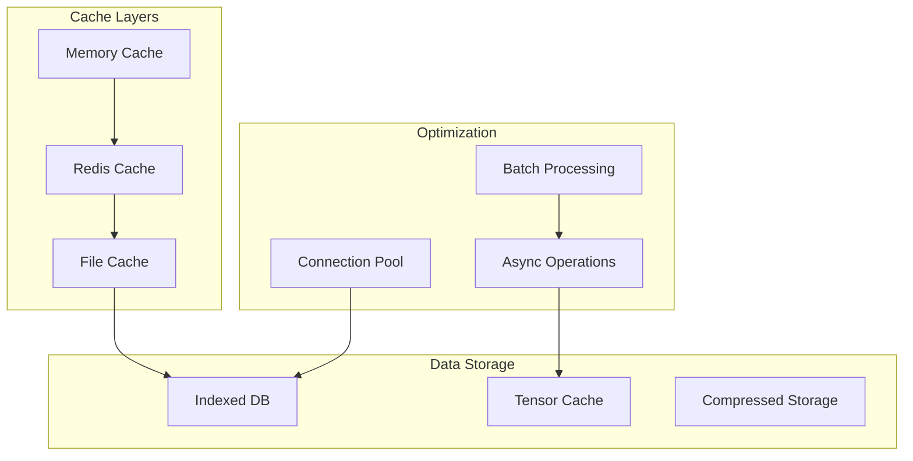

# Performance, Caching, and Scalability Considerations

## Overview

This document outlines performance optimization strategies, caching mechanisms, and scalability considerations for the NFL DFS system. The focus is on achieving sub-second response times for predictions and optimizations while maintaining data freshness.

## Performance Architecture



## Caching Strategy

### Multi-Level Cache Architecture

```python
class CacheManager:
    """Multi-level caching system"""

    def __init__(self):
        # L1: In-memory cache (fastest, smallest)
        self.l1_cache = TTLCache(maxsize=1000, ttl=60)

        # L2: Redis cache (fast, medium size)
        self.l2_cache = RedisCache(host='localhost', db=0)

        # L3: File-based cache (slower, largest)
        self.l3_cache = FileCache(directory='cache/')

        self.cache_config = {
            'predictions': CacheConfig(l1_ttl=60, l2_ttl=3600, l3_ttl=86400),
            'features': CacheConfig(l1_ttl=300, l2_ttl=3600, l3_ttl=86400),
            'lineups': CacheConfig(l1_ttl=30, l2_ttl=300, l3_ttl=3600),
            'models': CacheConfig(l1_ttl=3600, l2_ttl=86400, l3_ttl=604800)
        }

    async def get(self, key: str, cache_type: str) -> Optional[Any]:
        """Get from cache with fallback"""

        # Try L1
        value = self.l1_cache.get(key)
        if value is not None:
            self.metrics.record_hit('l1')
            return value

        # Try L2
        value = await self.l2_cache.get(key)
        if value is not None:
            self.metrics.record_hit('l2')
            # Promote to L1
            self.l1_cache[key] = value
            return value

        # Try L3
        value = await self.l3_cache.get(key)
        if value is not None:
            self.metrics.record_hit('l3')
            # Promote to L1 and L2
            self.l1_cache[key] = value
            await self.l2_cache.set(key, value)
            return value

        self.metrics.record_miss()
        return None

    async def set(self, key: str, value: Any, cache_type: str):
        """Set in appropriate cache levels"""

        config = self.cache_config[cache_type]

        # Set in all appropriate levels
        if config.l1_ttl:
            self.l1_cache[key] = value

        if config.l2_ttl:
            await self.l2_cache.set(key, value, ttl=config.l2_ttl)

        if config.l3_ttl:
            await self.l3_cache.set(key, value, ttl=config.l3_ttl)
```

### Cache Key Strategy

```python
class CacheKeyGenerator:
    """Generate consistent cache keys"""

    def generate_prediction_key(self, player_id: str, week: int, model_version: str) -> str:
        """Generate cache key for predictions"""
        return f"pred:{player_id}:{week}:{model_version}"

    def generate_lineup_key(self, slate_id: str, settings_hash: str) -> str:
        """Generate cache key for lineups"""
        return f"lineup:{slate_id}:{settings_hash}"

    def generate_feature_key(self, player_id: str, week: int) -> str:
        """Generate cache key for features"""
        return f"features:{player_id}:{week}"

    def hash_settings(self, settings: Dict) -> str:
        """Create hash of settings for cache key"""
        # Sort keys for consistency
        sorted_settings = json.dumps(settings, sort_keys=True)
        return hashlib.md5(sorted_settings.encode()).hexdigest()[:8]
```

## Database Performance

### Query Optimization

```python
class DatabaseOptimizer:
    """Database query optimization"""

    def __init__(self):
        self.query_cache = {}
        self.prepared_statements = {}

    def optimize_player_stats_query(self, season: int, week: int) -> Query:
        """Optimized query for player statistics"""

        # Use prepared statement
        if 'player_stats' not in self.prepared_statements:
            self.prepared_statements['player_stats'] = text("""
                SELECT
                    ps.*,
                    p.full_name,
                    p.position,
                    p.team,
                    fs.l3_dk_points,
                    fs.l5_dk_points,
                    fs.season_dk_points
                FROM player_stats ps
                INNER JOIN players p ON ps.player_id = p.player_id
                LEFT JOIN feature_store fs ON
                    ps.player_id = fs.player_id
                    AND ps.season = fs.season
                    AND ps.week = fs.week
                WHERE ps.season = :season
                    AND ps.week = :week
                    AND p.status = 'Active'
                ORDER BY ps.draftkings_points DESC
            """)

        return self.prepared_statements['player_stats']

    def create_indexes(self):
        """Create performance indexes"""

        indexes = [
            "CREATE INDEX IF NOT EXISTS idx_player_stats_composite ON player_stats(season, week, player_id)",
            "CREATE INDEX IF NOT EXISTS idx_predictions_composite ON predictions(game_id, model_version)",
            "CREATE INDEX IF NOT EXISTS idx_features_lookup ON feature_store(player_id, season, week)",
            "CREATE INDEX IF NOT EXISTS idx_salaries_slate ON draftkings_salaries(slate_id, position)",
            "CREATE INDEX IF NOT EXISTS idx_games_date ON games(game_date, game_status)"
        ]

        for index_sql in indexes:
            self.execute(index_sql)
```

### Connection Pooling

```python
class DatabaseConnectionPool:
    """Manage database connections efficiently"""

    def __init__(self, max_connections: int = 10):
        self.engine = create_engine(
            'sqlite:///data/database/nfl_dfs.db',
            pool_size=max_connections,
            max_overflow=5,
            pool_pre_ping=True,
            pool_recycle=3600
        )
        self.session_factory = sessionmaker(bind=self.engine)

    @contextmanager
    def get_connection(self):
        """Get connection from pool"""
        session = self.session_factory()
        try:
            yield session
            session.commit()
        except Exception:
            session.rollback()
            raise
        finally:
            session.close()
```

## Computation Optimization

### Vectorized Operations

```python
class VectorizedComputation:
    """Use NumPy/Pandas for vectorized operations"""

    def calculate_fantasy_points_vectorized(self, stats_df: pd.DataFrame) -> np.ndarray:
        """Calculate DraftKings points using vectorized operations"""

        # DraftKings scoring (vectorized)
        points = (
            stats_df['pass_yards'] * 0.04 +
            stats_df['pass_touchdowns'] * 4 +
            stats_df['pass_interceptions'] * -1 +
            stats_df['rush_yards'] * 0.1 +
            stats_df['rush_touchdowns'] * 6 +
            stats_df['receiving_yards'] * 0.1 +
            stats_df['receiving_touchdowns'] * 6 +
            stats_df['receptions'] * 1 +  # PPR
            (stats_df['pass_yards'] >= 300) * 3 +  # Bonus
            (stats_df['rush_yards'] >= 100) * 3 +
            (stats_df['receiving_yards'] >= 100) * 3
        )

        return points.values

    def batch_predict(self, features: np.ndarray, model: Any) -> np.ndarray:
        """Batch prediction for efficiency"""

        # Process in optimal batch size
        batch_size = 1000
        predictions = []

        for i in range(0, len(features), batch_size):
            batch = features[i:i + batch_size]
            batch_pred = model.predict(batch)
            predictions.append(batch_pred)

        return np.concatenate(predictions)
```

### Parallel Processing

```python
class ParallelProcessor:
    """Utilize multiple cores for parallel processing"""

    def __init__(self, max_workers: int = None):
        self.max_workers = max_workers or cpu_count()

    async def process_players_parallel(self, players: List[Player]) -> List[ProcessedPlayer]:
        """Process players in parallel"""

        # Split into chunks
        chunk_size = len(players) // self.max_workers
        chunks = [players[i:i + chunk_size]
                 for i in range(0, len(players), chunk_size)]

        # Process in parallel
        with ProcessPoolExecutor(max_workers=self.max_workers) as executor:
            loop = asyncio.get_event_loop()

            tasks = [
                loop.run_in_executor(executor, self._process_chunk, chunk)
                for chunk in chunks
            ]

            results = await asyncio.gather(*tasks)

        # Flatten results
        return [item for sublist in results for item in sublist]
```

## Model Performance

### Model Loading Optimization

```python
class ModelLoader:
    """Efficient model loading and caching"""

    def __init__(self):
        self.loaded_models = {}
        self.model_pool = {}

    async def load_model(self, position: str, version: str) -> Model:
        """Load model with caching"""

        cache_key = f"{position}:{version}"

        # Check if already loaded
        if cache_key in self.loaded_models:
            return self.loaded_models[cache_key]

        # Load model efficiently
        model_path = f"models/{position}/{version}/model.pkl"

        # Use memory mapping for large models
        with open(model_path, 'rb') as f:
            model = joblib.load(f, mmap_mode='r')

        # Cache loaded model
        self.loaded_models[cache_key] = model

        return model

    def preload_models(self, positions: List[str]):
        """Preload models at startup"""

        for position in positions:
            version = self.get_latest_version(position)
            self.load_model(position, version)
```

### Prediction Optimization

```python
class PredictionOptimizer:
    """Optimize prediction performance"""

    def __init__(self):
        self.feature_cache = {}
        self.prediction_cache = TTLCache(maxsize=5000, ttl=300)

    async def get_predictions_batch(self, player_ids: List[str]) -> Dict[str, Prediction]:
        """Batch prediction retrieval"""

        predictions = {}
        uncached_ids = []

        # Check cache first
        for player_id in player_ids:
            cached = self.prediction_cache.get(player_id)
            if cached:
                predictions[player_id] = cached
            else:
                uncached_ids.append(player_id)

        # Batch compute uncached predictions
        if uncached_ids:
            # Get features in batch
            features = await self._get_features_batch(uncached_ids)

            # Predict in batch
            new_predictions = await self._predict_batch(features)

            # Cache results
            for player_id, pred in new_predictions.items():
                self.prediction_cache[player_id] = pred
                predictions[player_id] = pred

        return predictions
```

## API Performance

### Response Optimization

```python
class ResponseOptimizer:
    """Optimize API response performance"""

    def __init__(self):
        self.compression_threshold = 1024  # bytes

    async def optimize_response(self, data: Any, request: Request) -> Response:
        """Optimize response based on client capabilities"""

        # Convert to JSON
        json_data = json.dumps(data, cls=OptimizedJSONEncoder)

        # Check if compression beneficial
        if len(json_data) > self.compression_threshold:
            # Check if client accepts gzip
            if 'gzip' in request.headers.get('Accept-Encoding', ''):
                compressed = gzip.compress(json_data.encode())

                return Response(
                    content=compressed,
                    headers={
                        'Content-Encoding': 'gzip',
                        'Content-Type': 'application/json'
                    }
                )

        return Response(
            content=json_data,
            headers={'Content-Type': 'application/json'}
        )

class OptimizedJSONEncoder(json.JSONEncoder):
    """Optimized JSON encoding"""

    def default(self, obj):
        if isinstance(obj, np.ndarray):
            return obj.tolist()
        if isinstance(obj, datetime):
            return obj.isoformat()
        if isinstance(obj, Decimal):
            return float(obj)
        return super().default(obj)
```

### Request Batching

```python
class RequestBatcher:
    """Batch multiple requests for efficiency"""

    def __init__(self):
        self.batch_window = 0.1  # seconds
        self.pending_requests = defaultdict(list)

    async def batch_request(self, request_type: str, params: Dict) -> Any:
        """Add request to batch"""

        batch_id = f"{request_type}:{int(time.time() / self.batch_window)}"

        # Add to batch
        future = asyncio.Future()
        self.pending_requests[batch_id].append((params, future))

        # Process batch if this is the first request
        if len(self.pending_requests[batch_id]) == 1:
            asyncio.create_task(self._process_batch(batch_id))

        return await future

    async def _process_batch(self, batch_id: str):
        """Process batched requests"""

        # Wait for batch window
        await asyncio.sleep(self.batch_window)

        # Get all requests in batch
        requests = self.pending_requests.pop(batch_id, [])

        if requests:
            # Process all requests together
            params_list = [r[0] for r in requests]
            results = await self._execute_batch(params_list)

            # Return results to futures
            for (params, future), result in zip(requests, results):
                future.set_result(result)
```

## Resource Management

### Memory Management

```python
class MemoryManager:
    """Manage memory usage efficiently"""

    def __init__(self):
        self.memory_limit = 4 * 1024 * 1024 * 1024  # 4GB
        self.gc_threshold = 0.8  # 80% usage triggers GC

    def check_memory_usage(self) -> MemoryStatus:
        """Monitor memory usage"""

        process = psutil.Process()
        memory_info = process.memory_info()

        return MemoryStatus(
            used=memory_info.rss,
            percent=process.memory_percent(),
            available=psutil.virtual_memory().available
        )

    def cleanup_if_needed(self):
        """Trigger cleanup if memory usage high"""

        status = self.check_memory_usage()

        if status.percent > self.gc_threshold * 100:
            # Force garbage collection
            gc.collect()

            # Clear caches
            self._clear_old_cache_entries()

            # Compact database
            self._vacuum_database()

    def _clear_old_cache_entries(self):
        """Remove old cache entries"""

        # Clear L1 cache entries older than TTL
        current_time = time.time()
        for cache in self.all_caches:
            cache.expire_old_entries(current_time)
```

## Performance Monitoring

### Performance Metrics

```python
class PerformanceMonitor:
    """Monitor system performance"""

    def __init__(self):
        self.metrics = {
            'response_times': deque(maxlen=1000),
            'query_times': deque(maxlen=1000),
            'cache_hits': Counter(),
            'cache_misses': Counter()
        }

    def record_response_time(self, endpoint: str, duration: float):
        """Record API response time"""

        self.metrics['response_times'].append({
            'endpoint': endpoint,
            'duration': duration,
            'timestamp': time.time()
        })

        # Alert if slow
        if duration > 1.0:  # 1 second threshold
            logger.warning(f"Slow response: {endpoint} took {duration:.2f}s")

    def get_performance_summary(self) -> Dict:
        """Get performance summary"""

        response_times = [r['duration'] for r in self.metrics['response_times']]

        return {
            'avg_response_time': np.mean(response_times) if response_times else 0,
            'p95_response_time': np.percentile(response_times, 95) if response_times else 0,
            'p99_response_time': np.percentile(response_times, 99) if response_times else 0,
            'cache_hit_rate': self._calculate_cache_hit_rate(),
            'memory_usage': self.get_memory_usage(),
            'cpu_usage': psutil.cpu_percent()
        }
```

## Scalability Considerations

### Horizontal Scaling Strategy

```python
class ScalabilityManager:
    """Manage system scalability"""

    def __init__(self):
        self.load_balancer = LoadBalancer()
        self.auto_scaler = AutoScaler()

    async def handle_load_spike(self):
        """Handle sudden load increases"""

        current_load = self.get_current_load()

        if current_load > 0.8:  # 80% capacity
            # Enable read replicas
            await self.enable_read_replicas()

            # Increase cache sizes
            self.increase_cache_capacity()

            # Enable request queuing
            self.enable_request_queuing()

    def partition_data(self):
        """Partition data for better performance"""

        # Partition by season
        self.partition_by_season()

        # Partition predictions by week
        self.partition_predictions_by_week()

        # Archive old data
        self.archive_old_seasons()
```
