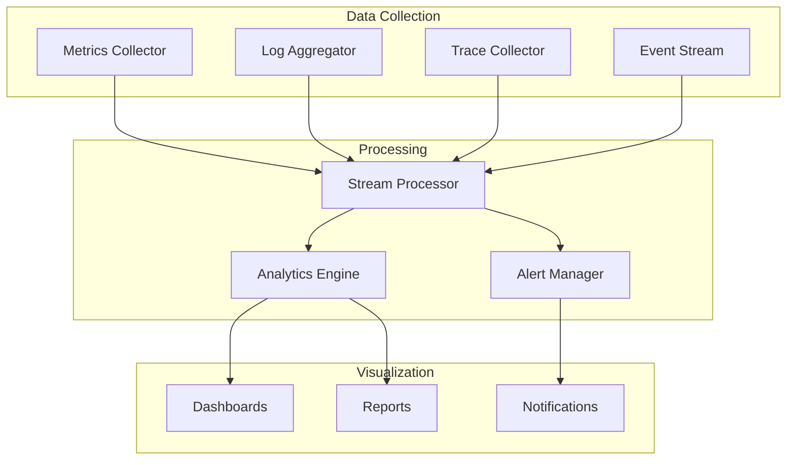

# Monitoring and Observability Strategy

## Overview

This document defines the monitoring and observability strategy for the NFL DFS system, ensuring comprehensive visibility into system health, performance, and behavior through metrics, logging, and tracing.

## Observability Architecture



## Metrics Collection

### System Metrics

```python
class SystemMetricsCollector:
    """Collect system-level metrics"""

    def __init__(self):
        self.metrics = {
            'cpu': Gauge('system_cpu_usage_percent'),
            'memory': Gauge('system_memory_usage_bytes'),
            'disk': Gauge('system_disk_usage_bytes'),
            'network': Counter('system_network_bytes_total'),
            'database_connections': Gauge('database_connections_active'),
            'cache_size': Gauge('cache_entries_total')
        }

    async def collect_metrics(self):
        """Collect all system metrics"""

        # CPU metrics
        self.metrics['cpu'].set(psutil.cpu_percent(interval=1))

        # Memory metrics
        memory = psutil.virtual_memory()
        self.metrics['memory'].set(memory.used)

        # Disk metrics
        disk = psutil.disk_usage('/')
        self.metrics['disk'].set(disk.used)

        # Database connections
        db_stats = await self.get_database_stats()
        self.metrics['database_connections'].set(db_stats['active_connections'])

        # Cache metrics
        cache_stats = await self.get_cache_stats()
        self.metrics['cache_size'].set(cache_stats['total_entries'])
```

### Application Metrics

```python
class ApplicationMetrics:
    """Application-specific metrics"""

    def __init__(self):
        self.metrics = {
            # Prediction metrics
            'predictions_generated': Counter('predictions_generated_total'),
            'prediction_latency': Histogram('prediction_latency_seconds'),
            'prediction_errors': Counter('prediction_errors_total'),

            # Optimization metrics
            'lineups_generated': Counter('lineups_generated_total'),
            'optimization_time': Histogram('optimization_time_seconds'),
            'optimization_failures': Counter('optimization_failures_total'),

            # Model metrics
            'model_accuracy': Gauge('model_accuracy_mae'),
            'model_drift': Gauge('model_drift_score'),
            'model_retraining': Counter('model_retraining_total'),

            # Data pipeline metrics
            'data_ingestion_rate': Counter('data_ingestion_records_per_second'),
            'data_processing_lag': Gauge('data_processing_lag_seconds'),
            'data_quality_score': Gauge('data_quality_score')
        }

    def record_prediction(self, player_id: str, latency: float, success: bool):
        """Record prediction metrics"""

        self.metrics['predictions_generated'].inc()
        self.metrics['prediction_latency'].observe(latency)

        if not success:
            self.metrics['prediction_errors'].inc()

    def record_optimization(self, lineup_count: int, duration: float, success: bool):
        """Record optimization metrics"""

        self.metrics['lineups_generated'].inc(lineup_count)
        self.metrics['optimization_time'].observe(duration)

        if not success:
            self.metrics['optimization_failures'].inc()
```

## Logging Strategy

### Structured Logging

```python
class StructuredLogger:
    """Structured logging with context"""

    def __init__(self, name: str):
        self.logger = self._setup_logger(name)
        self.context = {}

    def _setup_logger(self, name: str) -> Logger:
        """Configure structured logger"""

        logger = logging.getLogger(name)

        # JSON formatter for structured logs
        formatter = JsonFormatter(
            fmt_keys={
                'timestamp': 'asctime',
                'level': 'levelname',
                'logger': 'name',
                'module': 'module',
                'function': 'funcName',
                'line': 'lineno',
                'message': 'message'
            }
        )

        # Console handler
        console_handler = logging.StreamHandler()
        console_handler.setFormatter(formatter)
        logger.addHandler(console_handler)

        # File handler with rotation
        file_handler = RotatingFileHandler(
            f'logs/{name}.log',
            maxBytes=10485760,  # 10MB
            backupCount=10
        )
        file_handler.setFormatter(formatter)
        logger.addHandler(file_handler)

        logger.setLevel(logging.INFO)

        return logger

    def with_context(self, **kwargs) -> 'StructuredLogger':
        """Add context to logger"""
        self.context.update(kwargs)
        return self

    def info(self, message: str, **kwargs):
        """Log info with context"""
        extra = {**self.context, **kwargs}
        self.logger.info(message, extra=extra)
```

### Log Aggregation

```python
class LogAggregator:
    """Aggregate and analyze logs"""

    def __init__(self):
        self.log_buffer = deque(maxlen=10000)
        self.error_patterns = {}

    async def aggregate_logs(self, log_entry: Dict):
        """Aggregate log entries"""

        # Add to buffer
        self.log_buffer.append(log_entry)

        # Check for error patterns
        if log_entry.get('level') in ['ERROR', 'CRITICAL']:
            await self._analyze_error_pattern(log_entry)

        # Check for anomalies
        if self._is_anomalous(log_entry):
            await self._handle_anomaly(log_entry)

    def _analyze_error_pattern(self, log_entry: Dict):
        """Analyze error patterns"""

        error_key = f"{log_entry.get('module')}:{log_entry.get('function')}"

        if error_key not in self.error_patterns:
            self.error_patterns[error_key] = {
                'count': 0,
                'first_seen': log_entry['timestamp'],
                'last_seen': log_entry['timestamp']
            }

        self.error_patterns[error_key]['count'] += 1
        self.error_patterns[error_key]['last_seen'] = log_entry['timestamp']
```

## Distributed Tracing

### Trace Collection

```python
class TraceCollector:
    """Collect distributed traces"""

    def __init__(self):
        self.traces = {}
        self.span_processor = SpanProcessor()

    def start_trace(self, operation: str) -> TraceContext:
        """Start a new trace"""

        trace_id = str(uuid.uuid4())
        span_id = str(uuid.uuid4())

        trace = TraceContext(
            trace_id=trace_id,
            span_id=span_id,
            operation=operation,
            start_time=time.time()
        )

        self.traces[trace_id] = trace

        return trace

    def add_span(self, trace_id: str, operation: str, parent_span_id: str = None) -> Span:
        """Add span to trace"""

        span = Span(
            span_id=str(uuid.uuid4()),
            trace_id=trace_id,
            parent_span_id=parent_span_id,
            operation=operation,
            start_time=time.time()
        )

        if trace_id in self.traces:
            self.traces[trace_id].spans.append(span)

        return span

    def end_span(self, span: Span, status: str = 'success', metadata: Dict = None):
        """End a span"""

        span.end_time = time.time()
        span.duration = span.end_time - span.start_time
        span.status = status
        span.metadata = metadata or {}

        # Process span
        self.span_processor.process(span)
```

## Health Monitoring

### Health Checks

```python
class HealthMonitor:
    """Monitor system health"""

    def __init__(self):
        self.health_checks = {
            'database': self.check_database_health,
            'cache': self.check_cache_health,
            'models': self.check_model_health,
            'api': self.check_api_health,
            'data_pipeline': self.check_pipeline_health
        }

    async def check_system_health(self) -> HealthReport:
        """Run all health checks"""

        report = HealthReport()

        for component, checker in self.health_checks.items():
            try:
                status = await checker()
                report.add_component_status(component, status)
            except Exception as e:
                report.add_component_status(
                    component,
                    ComponentStatus(
                        healthy=False,
                        message=str(e)
                    )
                )

        report.overall_status = self._calculate_overall_status(report)

        return report

    async def check_database_health(self) -> ComponentStatus:
        """Check database health"""

        try:
            # Test query
            result = await self.db.execute("SELECT 1")

            # Check connection pool
            pool_stats = await self.db.get_pool_stats()

            return ComponentStatus(
                healthy=True,
                message="Database operational",
                metadata={
                    'active_connections': pool_stats['active'],
                    'idle_connections': pool_stats['idle']
                }
            )
        except Exception as e:
            return ComponentStatus(
                healthy=False,
                message=f"Database error: {e}"
            )
```

## Alert Management

### Alert Rules

```python
class AlertManager:
    """Manage alerts and notifications"""

    def __init__(self):
        self.alert_rules = [
            AlertRule(
                name='high_prediction_error',
                condition=lambda m: m['model_accuracy_mae'] > 5.0,
                severity='warning',
                message='Model prediction error exceeds threshold'
            ),
            AlertRule(
                name='slow_api_response',
                condition=lambda m: m['p95_response_time'] > 2.0,
                severity='warning',
                message='API response time degraded'
            ),
            AlertRule(
                name='database_connection_exhausted',
                condition=lambda m: m['database_connections_active'] >= m['max_connections'],
                severity='critical',
                message='Database connection pool exhausted'
            ),
            AlertRule(
                name='model_drift_detected',
                condition=lambda m: m['model_drift_score'] > 0.2,
                severity='warning',
                message='Model drift detected, retraining recommended'
            )
        ]

    async def evaluate_alerts(self, metrics: Dict):
        """Evaluate alert rules"""

        triggered_alerts = []

        for rule in self.alert_rules:
            if rule.condition(metrics):
                alert = Alert(
                    rule=rule,
                    timestamp=datetime.utcnow(),
                    metrics=metrics
                )
                triggered_alerts.append(alert)

                await self._send_alert(alert)

        return triggered_alerts

    async def _send_alert(self, alert: Alert):
        """Send alert notification"""

        # Log alert
        logger.warning(f"Alert triggered: {alert.rule.name} - {alert.rule.message}")

        # Send notifications based on severity
        if alert.rule.severity == 'critical':
            await self._send_critical_notification(alert)
        elif alert.rule.severity == 'warning':
            await self._send_warning_notification(alert)
```

## Dashboard Configuration

### Metrics Dashboard

```python
class DashboardConfig:
    """Dashboard configuration"""

    DASHBOARDS = {
        'system_overview': {
            'refresh_interval': 30,
            'panels': [
                {
                    'title': 'System Resources',
                    'type': 'graph',
                    'metrics': ['cpu_usage', 'memory_usage', 'disk_usage'],
                    'time_range': '1h'
                },
                {
                    'title': 'API Performance',
                    'type': 'graph',
                    'metrics': ['response_time_p50', 'response_time_p95', 'response_time_p99'],
                    'time_range': '1h'
                },
                {
                    'title': 'Prediction Accuracy',
                    'type': 'gauge',
                    'metric': 'model_accuracy_mae',
                    'thresholds': [3.0, 4.0, 5.0]
                }
            ]
        },
        'ml_performance': {
            'refresh_interval': 60,
            'panels': [
                {
                    'title': 'Model Accuracy by Position',
                    'type': 'bar',
                    'metrics': ['qb_mae', 'rb_mae', 'wr_mae', 'te_mae'],
                    'time_range': '24h'
                },
                {
                    'title': 'Prediction Distribution',
                    'type': 'histogram',
                    'metric': 'prediction_values',
                    'bins': 20
                },
                {
                    'title': 'Feature Importance',
                    'type': 'heatmap',
                    'data': 'feature_importance_matrix'
                }
            ]
        }
    }
```

## Performance Analysis

### Performance Profiler

```python
class PerformanceProfiler:
    """Profile application performance"""

    def __init__(self):
        self.profiles = {}

    @contextmanager
    def profile(self, operation: str):
        """Profile an operation"""

        start_time = time.perf_counter()
        start_memory = psutil.Process().memory_info().rss

        profiler = cProfile.Profile()
        profiler.enable()

        try:
            yield
        finally:
            profiler.disable()

            end_time = time.perf_counter()
            end_memory = psutil.Process().memory_info().rss

            # Store profile
            self.profiles[operation] = {
                'duration': end_time - start_time,
                'memory_delta': end_memory - start_memory,
                'profile': profiler,
                'timestamp': datetime.utcnow()
            }

            # Analyze if slow
            if end_time - start_time > 1.0:
                self._analyze_slow_operation(operation, profiler)

    def _analyze_slow_operation(self, operation: str, profiler: cProfile.Profile):
        """Analyze slow operations"""

        stats = pstats.Stats(profiler)
        stats.sort_stats('cumulative')

        # Log top time consumers
        logger.warning(f"Slow operation detected: {operation}")

        # Get top 10 functions
        top_functions = stats.get_print_list([10])[0]
        for func in top_functions:
            logger.debug(f"  {func}: {stats.stats[func]}")
```

## Monitoring Automation

### Auto-Recovery

```python
class AutoRecovery:
    """Automated recovery from common issues"""

    def __init__(self):
        self.recovery_actions = {
            'high_memory_usage': self.recover_from_high_memory,
            'database_connection_leak': self.recover_from_connection_leak,
            'cache_overflow': self.recover_from_cache_overflow,
            'model_loading_failure': self.recover_from_model_failure
        }

    async def check_and_recover(self):
        """Check for issues and auto-recover"""

        issues = await self.detect_issues()

        for issue in issues:
            if issue.type in self.recovery_actions:
                try:
                    await self.recovery_actions[issue.type](issue)
                    logger.info(f"Successfully recovered from {issue.type}")
                except Exception as e:
                    logger.error(f"Failed to recover from {issue.type}: {e}")

    async def recover_from_high_memory(self, issue: Issue):
        """Recover from high memory usage"""

        # Clear caches
        await self.clear_all_caches()

        # Force garbage collection
        gc.collect()

        # Restart heavy services if needed
        if self.get_memory_usage() > 0.9:
            await self.restart_services(['model_service'])
```
