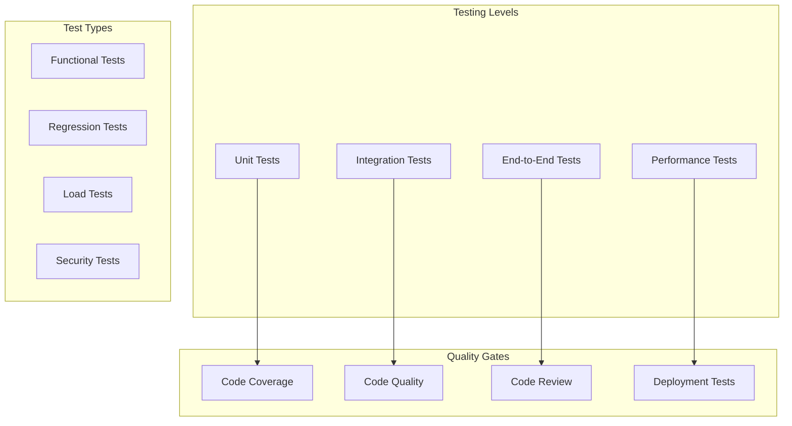

# Testing and Quality Assurance Approach

## Overview

This document outlines the comprehensive testing and quality assurance strategy for the NFL DFS system, covering unit testing, integration testing, performance testing, and continuous quality improvement.

## Testing Architecture



## Unit Testing Strategy

### Test Structure

```python
class TestPlayerPrediction(unittest.TestCase):
    """Unit tests for player prediction module"""

    def setUp(self):
        """Set up test fixtures"""
        self.predictor = PlayerPredictor()
        self.mock_data = self._load_mock_data()

    def tearDown(self):
        """Clean up after tests"""
        self.predictor = None

    def test_qb_prediction_accuracy(self):
        """Test QB prediction accuracy"""
        # Arrange
        qb_data = self.mock_data['qb']
        expected_points = 22.5

        # Act
        prediction = self.predictor.predict(qb_data)

        # Assert
        self.assertAlmostEqual(prediction.point_estimate, expected_points, delta=1.0)
        self.assertGreater(prediction.ceiling, prediction.point_estimate)
        self.assertLess(prediction.floor, prediction.point_estimate)

    @mock.patch('src.models.qb_model.QBModel.predict')
    def test_prediction_with_mock_model(self, mock_predict):
        """Test prediction with mocked model"""
        # Arrange
        mock_predict.return_value = PredictionResult(
            point_estimate=25.0,
            floor=20.0,
            ceiling=30.0
        )

        # Act
        result = self.predictor.predict_with_model(self.mock_data['qb'])

        # Assert
        mock_predict.assert_called_once()
        self.assertEqual(result.point_estimate, 25.0)

    @parameterized.expand([
        ('QB', 3.5),
        ('RB', 3.0),
        ('WR', 2.5),
        ('TE', 2.0)
    ])
    def test_position_mae_thresholds(self, position, max_mae):
        """Test MAE thresholds for each position"""
        predictions = self.predictor.predict_batch(
            self.mock_data[position.lower()]
        )

        mae = calculate_mae(predictions, self.mock_data[f'{position.lower()}_actual'])
        self.assertLessEqual(mae, max_mae)
```

### Mock Data Factory

```python
class MockDataFactory:
    """Generate mock data for testing"""

    @staticmethod
    def create_player(position: str = 'QB', **kwargs) -> Player:
        """Create mock player"""
        defaults = {
            'player_id': f'test_{position}_{uuid.uuid4().hex[:8]}',
            'name': f'Test {position}',
            'position': position,
            'team': 'TEST',
            'salary': 7000,
            'projection': 20.0
        }
        defaults.update(kwargs)
        return Player(**defaults)

    @staticmethod
    def create_game_data(**kwargs) -> GameData:
        """Create mock game data"""
        defaults = {
            'game_id': 'TEST_GAME_001',
            'home_team': 'HOME',
            'away_team': 'AWAY',
            'spread': -3.5,
            'total': 48.5,
            'weather': Weather(temp=72, wind=5, precipitation=0)
        }
        defaults.update(kwargs)
        return GameData(**defaults)

    @staticmethod
    def create_lineup(valid: bool = True) -> Lineup:
        """Create mock lineup"""
        if valid:
            return Lineup(
                players=[
                    MockDataFactory.create_player('QB', salary=8000),
                    MockDataFactory.create_player('RB', salary=7000),
                    MockDataFactory.create_player('RB', salary=5500),
                    MockDataFactory.create_player('WR', salary=7500),
                    MockDataFactory.create_player('WR', salary=6000),
                    MockDataFactory.create_player('WR', salary=5000),
                    MockDataFactory.create_player('TE', salary=4500),
                    MockDataFactory.create_player('FLEX', salary=5500),
                    MockDataFactory.create_player('DST', salary=3000)
                ]
            )
        else:
            # Invalid lineup (exceeds salary cap)
            return Lineup(
                players=[MockDataFactory.create_player('QB', salary=10000)] * 9
            )
```

## Integration Testing

### Database Integration Tests

```python
class TestDatabaseIntegration(TestCase):
    """Test database operations"""

    @classmethod
    def setUpClass(cls):
        """Set up test database"""
        cls.db = DatabaseManager(connection_string='sqlite:///:memory:')
        cls.db.create_tables()

    def test_player_crud_operations(self):
        """Test CRUD operations for players"""
        # Create
        player = self.db.create_player({
            'player_id': 'TEST001',
            'name': 'Test Player',
            'position': 'QB',
            'team': 'TEST'
        })
        self.assertIsNotNone(player)

        # Read
        retrieved = self.db.get_player('TEST001')
        self.assertEqual(retrieved.name, 'Test Player')

        # Update
        self.db.update_player('TEST001', {'team': 'NEW'})
        updated = self.db.get_player('TEST001')
        self.assertEqual(updated.team, 'NEW')

        # Delete
        self.db.delete_player('TEST001')
        deleted = self.db.get_player('TEST001')
        self.assertIsNone(deleted)

    def test_transaction_rollback(self):
        """Test transaction rollback on error"""
        with self.assertRaises(IntegrityError):
            with self.db.transaction() as tx:
                tx.create_player({'player_id': 'TEST002', 'name': 'Player 1'})
                tx.create_player({'player_id': 'TEST002', 'name': 'Player 2'})  # Duplicate

        # Verify rollback
        player = self.db.get_player('TEST002')
        self.assertIsNone(player)
```

### API Integration Tests

```python
class TestAPIIntegration(TestCase):
    """Test API endpoints"""

    def setUp(self):
        self.client = TestClient(app)

    def test_prediction_endpoint(self):
        """Test prediction API endpoint"""
        response = self.client.get('/api/v1/nfl/predictions/2024/1')

        self.assertEqual(response.status_code, 200)
        data = response.json()

        self.assertIn('data', data)
        self.assertIsInstance(data['data'], list)

        if data['data']:
            player = data['data'][0]
            self.assertIn('player_id', player)
            self.assertIn('projections', player)

    def test_optimization_endpoint(self):
        """Test lineup optimization endpoint"""
        request_data = {
            'slate_id': 'TEST_SLATE',
            'contest_type': 'GPP',
            'optimization_settings': {
                'num_lineups': 5
            }
        }

        response = self.client.post(
            '/api/v1/dk/lineups/optimize/classic',
            json=request_data
        )

        self.assertEqual(response.status_code, 200)
        data = response.json()

        self.assertIn('lineups', data)
        self.assertEqual(len(data['lineups']), 5)
```

## End-to-End Testing

### Complete Workflow Tests

```python
class TestEndToEnd(TestCase):
    """End-to-end workflow tests"""

    def test_complete_prediction_workflow(self):
        """Test complete prediction workflow"""
        # 1. Load data
        data_loader = DataLoader()
        raw_data = data_loader.load_week_data(2024, 1)
        self.assertIsNotNone(raw_data)

        # 2. Engineer features
        feature_engineer = FeatureEngineer()
        features = feature_engineer.process(raw_data)
        self.assertEqual(len(features), len(raw_data))

        # 3. Generate predictions
        predictor = Predictor()
        predictions = predictor.predict_all(features)
        self.assertGreater(len(predictions), 0)

        # 4. Optimize lineup
        optimizer = LineupOptimizer()
        lineup = optimizer.optimize(predictions)
        self.assertEqual(len(lineup.players), 9)
        self.assertLessEqual(lineup.total_salary, 50000)

    def test_model_retraining_workflow(self):
        """Test model retraining workflow"""
        # 1. Collect actual results
        results = ResultsCollector().collect_week(2024, 1)

        # 2. Compare with predictions
        error_analyzer = ErrorAnalyzer()
        analysis = error_analyzer.analyze(predictions, results)

        # 3. Trigger retraining if needed
        if analysis.mae > 4.0:
            trainer = ModelTrainer()
            new_model = trainer.retrain(analysis)

            # 4. Validate new model
            validator = ModelValidator()
            validation = validator.validate(new_model)

            self.assertLess(validation.mae, analysis.mae)
```

## Performance Testing

### Load Testing

```python
class LoadTest(TestCase):
    """Load testing for API endpoints"""

    def test_concurrent_predictions(self):
        """Test concurrent prediction requests"""

        async def make_request():
            async with aiohttp.ClientSession() as session:
                async with session.get('http://localhost:8000/api/v1/nfl/predictions/2024/1') as response:
                    return response.status, await response.json()

        async def run_load_test():
            # Simulate 100 concurrent requests
            tasks = [make_request() for _ in range(100)]
            results = await asyncio.gather(*tasks)

            # Verify all succeeded
            statuses = [r[0] for r in results]
            self.assertEqual(statuses.count(200), 100)

            # Check response times
            response_times = [r[1].get('response_time') for r in results]
            avg_time = sum(response_times) / len(response_times)
            self.assertLess(avg_time, 1.0)  # Average under 1 second

        asyncio.run(run_load_test())

    def test_optimization_performance(self):
        """Test optimization performance"""

        players = [MockDataFactory.create_player() for _ in range(500)]

        start_time = time.time()
        optimizer = LineupOptimizer()
        lineups = optimizer.optimize_multiple(players, num_lineups=20)
        duration = time.time() - start_time

        self.assertLess(duration, 5.0)  # Under 5 seconds for 20 lineups
        self.assertEqual(len(lineups), 20)
```

### Benchmark Tests

```python
class BenchmarkTests(TestCase):
    """Performance benchmark tests"""

    def test_feature_engineering_performance(self):
        """Benchmark feature engineering"""

        data = pd.DataFrame({
            'player_id': [f'P{i}' for i in range(1000)],
            'stats': np.random.randn(1000, 50)
        })

        engineer = FeatureEngineer()

        with Timer() as timer:
            features = engineer.process(data)

        self.assertLess(timer.elapsed, 1.0)  # Under 1 second for 1000 players

    def test_model_prediction_performance(self):
        """Benchmark model predictions"""

        features = np.random.randn(500, 100)  # 500 players, 100 features
        model = load_model('qb_model')

        with Timer() as timer:
            predictions = model.predict_batch(features)

        self.assertLess(timer.elapsed, 0.5)  # Under 500ms for batch prediction
```

## Data Validation Testing

### Input Validation Tests

```python
class TestDataValidation(TestCase):
    """Test data validation"""

    def test_salary_validation(self):
        """Test salary data validation"""

        validator = SalaryValidator()

        # Valid salaries
        valid_salaries = pd.DataFrame({
            'player_id': ['P1', 'P2', 'P3'],
            'salary': [8000, 5500, 3000],
            'position': ['QB', 'RB', 'DST']
        })

        result = validator.validate(valid_salaries)
        self.assertTrue(result.is_valid)

        # Invalid salaries (out of range)
        invalid_salaries = pd.DataFrame({
            'player_id': ['P4'],
            'salary': [15000],  # Too high
            'position': ['QB']
        })

        result = validator.validate(invalid_salaries)
        self.assertFalse(result.is_valid)
        self.assertIn('salary_out_of_range', result.errors)

    def test_statistical_validation(self):
        """Test statistical data validation"""

        validator = StatisticalValidator()

        # Test for impossible stats
        invalid_stats = {
            'completion_percentage': 150,  # > 100%
            'yards': -50,  # Negative yards
            'touchdowns': 20  # Unrealistic for single game
        }

        result = validator.validate(invalid_stats)
        self.assertFalse(result.is_valid)
```

## Model Testing

### Model Accuracy Tests

```python
class TestModelAccuracy(TestCase):
    """Test model accuracy requirements"""

    def test_position_specific_accuracy(self):
        """Test accuracy for each position"""

        test_data = load_test_dataset()

        for position in ['QB', 'RB', 'WR', 'TE', 'DST']:
            model = load_model(position)
            position_data = test_data[test_data.position == position]

            predictions = model.predict(position_data.features)
            actuals = position_data.actual_points

            mae = mean_absolute_error(actuals, predictions)

            # Position-specific thresholds
            thresholds = {
                'QB': 3.5,
                'RB': 3.0,
                'WR': 2.5,
                'TE': 2.0,
                'DST': 2.5
            }

            self.assertLess(mae, thresholds[position],
                          f"{position} MAE {mae} exceeds threshold {thresholds[position]}")

    def test_model_stability(self):
        """Test model prediction stability"""

        model = load_model('QB')
        features = create_test_features()

        # Run predictions multiple times
        predictions = [model.predict(features) for _ in range(10)]

        # Check consistency
        std_devs = np.std(predictions, axis=0)
        max_std = np.max(std_devs)

        self.assertLess(max_std, 0.01, "Model predictions are not stable")
```

## Test Automation

### Continuous Integration Tests

```yaml
# .github/workflows/test.yml
name: Test Suite

on: [push, pull_request]

jobs:
  test:
    runs-on: ubuntu-latest

    steps:
      - uses: actions/checkout@v2

      - name: Set up Python
        uses: actions/setup-python@v2
        with:
          python-version: "3.10"

      - name: Install UV (fastest Python package manager)
        run: |
          curl -LsSf https://astral.sh/uv/install.sh | sh
          export PATH="$HOME/.cargo/bin:$PATH"
          uv venv
          uv pip sync requirements.txt

      - name: Run unit tests
        run: uv run pytest tests/unit --cov=src --cov-report=xml

      - name: Run integration tests
        run: uv run pytest tests/integration

      - name: Run performance tests
        run: uv run pytest tests/performance -m benchmark

      - name: Upload coverage
        uses: codecov/codecov-action@v2
        with:
          file: ./coverage.xml
```

### Test Coverage Requirements

```python
class CoverageValidator:
    """Validate test coverage requirements"""

    MIN_COVERAGE = {
        'overall': 80,
        'models': 90,
        'optimization': 85,
        'api': 80,
        'utils': 70
    }

    def validate_coverage(self, coverage_report: Dict) -> bool:
        """Validate coverage meets requirements"""

        failures = []

        for module, min_coverage in self.MIN_COVERAGE.items():
            actual = coverage_report.get(module, 0)
            if actual < min_coverage:
                failures.append(f"{module}: {actual}% < {min_coverage}%")

        if failures:
            raise CoverageError(f"Coverage requirements not met: {failures}")

        return True
```

## Quality Assurance Process

### Code Quality Checks

```python
class CodeQualityChecker:
    """Automated code quality checks"""

    def run_quality_checks(self, code_path: str) -> QualityReport:
        """Run all quality checks"""

        report = QualityReport()

        # Linting
        report.linting = self.run_linting(code_path)

        # Type checking
        report.type_checking = self.run_type_checking(code_path)

        # Complexity analysis
        report.complexity = self.analyze_complexity(code_path)

        # Security scanning
        report.security = self.run_security_scan(code_path)

        return report

    def run_linting(self, code_path: str) -> LintResult:
        """Run code linting"""

        result = subprocess.run(
            ['flake8', code_path, '--max-line-length=100'],
            capture_output=True
        )

        return LintResult(
            passed=result.returncode == 0,
            issues=result.stdout.decode().split('\n')
        )
```

### Regression Testing

```python
class RegressionTestSuite:
    """Regression testing for critical functionality"""

    def test_historical_predictions(self):
        """Test predictions against historical data"""

        for season in [2021, 2022, 2023]:
            for week in range(1, 18):
                # Load historical data
                historical = load_historical_data(season, week)

                # Generate predictions
                predictions = generate_predictions(historical)

                # Compare with actuals
                mae = calculate_mae(predictions, historical.actuals)

                # Ensure no regression
                baseline_mae = get_baseline_mae(season, week)
                self.assertLessEqual(mae, baseline_mae * 1.1,
                                   f"Regression detected for {season} week {week}")
```
