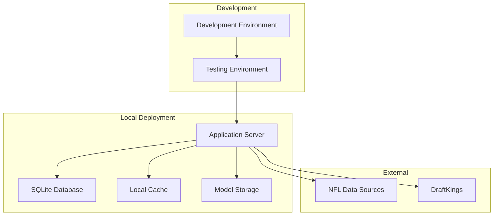

# Deployment and Infrastructure Architecture

## Overview

This document outlines the deployment and infrastructure architecture for the NFL DFS system, designed for local deployment with provisions for potential cloud migration. The focus is on simple, maintainable deployment with automated processes.

## Deployment Architecture



## Local Deployment Setup

### System Requirements

```yaml
minimum_requirements:
  os:
    - macOS 12+
    - Ubuntu 20.04+
    - Windows 11 with WSL2

  hardware:
    cpu: 4 cores
    ram: 8 GB
    storage: 20 GB

recommended_requirements:
  hardware:
    cpu: 8+ cores (Intel/AMD with AVX2 support recommended)
    ram: 16-32 GB
    storage: 50 GB SSD
    gpu: Not currently required
    # Note: Architecture supports future GPU acceleration
    # When available, NVIDIA GPU with CUDA 11+ will be supported
```

### Installation Script

```bash
#!/bin/bash
# install.sh - NFL DFS System Installation Script

set -e

echo "NFL DFS System Installer"
echo "========================"

# Check Python version
check_python() {
    if ! command -v python3 &> /dev/null; then
        echo "Python 3.10+ is required"
        exit 1
    fi

    version=$(python3 -c 'import sys; print(".".join(map(str, sys.version_info[:2])))')
    if [ $(echo "$version < 3.10" | bc) -eq 1 ]; then
        echo "Python 3.10+ is required (found $version)"
        exit 1
    fi
}

# Install UV (blazing fast Python package manager)
install_uv() {
    if ! command -v uv &> /dev/null; then
        echo "Installing UV - the fastest Python package manager (10-100x faster than pip/poetry)..."
        curl -LsSf https://astral.sh/uv/install.sh | sh
        export PATH="$HOME/.cargo/bin:$PATH"
        echo "UV installed successfully! UV is written in Rust for maximum performance."
    fi
}

# Setup project
setup_project() {
    echo "Setting up project..."

    # Clone repository (if not already cloned)
    if [ ! -d "nfl-dfs-system" ]; then
        git clone https://github.com/yourusername/nfl-dfs-system.git
        cd nfl-dfs-system
    fi

    # Create virtual environment and install dependencies with UV
    uv venv
    source .venv/bin/activate
    uv pip sync requirements.txt  # Uses deterministic lockfile for reproducible installs

    # Create necessary directories
    mkdir -p data/{database,cache,models,logs,tensors}
    mkdir -p data/nfl_raw/{play_by_play,player_stats,rosters,schedules}
    mkdir -p data/draftkings/{salaries,historical_salaries}

    # Initialize database
    uv run python scripts/init_database.py

    # Download initial data
    uv run python scripts/download_initial_data.py
}

# Create environment file
create_env_file() {
    if [ ! -f ".env" ]; then
        echo "Creating environment file..."
        cat > .env << EOF
# NFL DFS Environment Configuration
DATABASE_URL=sqlite:///data/database/nfl_dfs.db
API_HOST=127.0.0.1
API_PORT=8000
MLFLOW_TRACKING_URI=file:///$(pwd)/data/mlflow
DEFAULT_MODEL_PATH=models/production
ENABLE_SELF_TUNING=true
NFL_SEASONS_TO_LOAD=3
NFL_DATA_CACHE_DIR=data/cache
DK_CLASSIC_SALARY_CAP=50000
# Note: Showdown cap removed - single-entry classic contests only
EOF
    fi
}

# Main installation
main() {
    check_python
    install_uv
    setup_project
    create_env_file

    echo ""
    echo "Installation complete!"
    echo "To start the system, run: ./start.sh"
}

main
```

### Startup Script

```bash
#!/bin/bash
# start.sh - Start NFL DFS System

set -e

# Load environment
source .env

# Activate virtual environment (UV creates standard .venv)
source .venv/bin/activate

# Start services
start_services() {
    echo "Starting NFL DFS System..."

    # Start database migration (if needed)
    echo "Checking database migrations..."
    uv run alembic upgrade head

    # Start cache service
    if command -v redis-server &> /dev/null; then
        echo "Starting Redis cache..."
        redis-server --daemonize yes
    fi

    # Start API server
    echo "Starting API server on http://$API_HOST:$API_PORT"
    uv run uvicorn src.api.main:app \
        --host $API_HOST \
        --port $API_PORT \
        --reload &

    # Start scheduler
    echo "Starting task scheduler..."
    uv run python src/scheduler/main.py &

    # Start monitoring
    echo "Starting monitoring service..."
    uv run python src/monitoring/main.py &

    echo "All services started successfully!"
    echo "API available at: http://$API_HOST:$API_PORT"
    echo "Documentation at: http://$API_HOST:$API_PORT/docs"
}

# Health check
health_check() {
    sleep 5
    if curl -f http://$API_HOST:$API_PORT/health > /dev/null 2>&1; then
        echo "System health check: PASSED"
    else
        echo "System health check: FAILED"
        exit 1
    fi
}

start_services
health_check
```

## Docker Deployment

### Dockerfile

```dockerfile
# Dockerfile
FROM python:3.10-slim

# Set working directory
WORKDIR /app

# Install system dependencies
RUN apt-get update && apt-get install -y \
    gcc \
    g++ \
    curl \
    git \
    && rm -rf /var/lib/apt/lists/*

# Install UV - the fastest Python package manager (10-100x faster than pip/poetry)
# Written in Rust for blazing fast dependency resolution
RUN curl -LsSf https://astral.sh/uv/install.sh | sh
ENV PATH="/root/.cargo/bin:$PATH"

# Copy project files (UV uses requirements.txt and uv.lock for deterministic builds)
COPY requirements.txt uv.lock ./
COPY src/ ./src/
COPY scripts/ ./scripts/
COPY data/ ./data/

# Install dependencies with UV (10-100x faster than traditional package managers)
RUN uv venv && \
    . .venv/bin/activate && \
    uv pip sync requirements.txt  # Deterministic install from lockfile

# Create data directories
RUN mkdir -p data/{database,cache,models,logs,tensors}

# Expose API port
EXPOSE 8000

# Health check
HEALTHCHECK --interval=30s --timeout=10s --start-period=5s --retries=3 \
    CMD curl -f http://localhost:8000/health || exit 1

# Start command
CMD ["uvicorn", "src.api.main:app", "--host", "0.0.0.0", "--port", "8000"]
```

### Docker Compose

```yaml
# docker-compose.yml
version: "3.8"

services:
  nfl-dfs-api:
    build: .
    container_name: nfl-dfs-api
    ports:
      - "8000:8000"
    volumes:
      - ./data:/app/data
      - ./models:/app/models
      - ./logs:/app/logs
    environment:
      - DATABASE_URL=sqlite:///app/data/database/nfl_dfs.db
      - API_HOST=0.0.0.0
      - API_PORT=8000
      - PYTHONUNBUFFERED=1
    restart: unless-stopped

  redis:
    image: redis:7-alpine
    container_name: nfl-dfs-redis
    ports:
      - "6379:6379"
    volumes:
      - redis-data:/data
    restart: unless-stopped

  scheduler:
    build: .
    container_name: nfl-dfs-scheduler
    command: python src/scheduler/main.py
    volumes:
      - ./data:/app/data
      - ./models:/app/models
    depends_on:
      - nfl-dfs-api
      - redis
    restart: unless-stopped

volumes:
  redis-data:
```

## Configuration Management

### Environment Configuration

```python
# src/config/settings.py
from pydantic import BaseSettings
from pathlib import Path

class Settings(BaseSettings):
    """Application settings"""

    # API Configuration
    api_host: str = "127.0.0.1"
    api_port: int = 8000
    api_workers: int = 1

    # Database Configuration
    database_url: str = "sqlite:///data/database/nfl_dfs.db"
    database_pool_size: int = 5
    database_echo: bool = False

    # Model Configuration
    model_path: Path = Path("models/production")
    enable_cpu_optimization: bool = True  # CPU-specific optimizations
    num_cpu_threads: int = 8  # Configure based on available cores
    batch_size: int = 32  # Optimized for CPU memory efficiency
    # Future GPU support - currently disabled
    gpu_available: bool = False  # Will auto-detect when GPU support added

    # Cache Configuration
    cache_backend: str = "memory"  # memory, redis, file
    cache_ttl: int = 3600
    redis_url: str = "redis://localhost:6379"

    # Data Configuration
    nfl_seasons_to_load: int = 3
    data_refresh_interval: int = 3600

    # DraftKings Configuration (Single-Entry Classic Contests)
    dk_classic_salary_cap: int = 50000
    # Note: showdown_salary_cap removed - classic contests only

    # Feature Flags
    enable_self_tuning: bool = True
    enable_monitoring: bool = True
    enable_caching: bool = True

    class Config:
        env_file = ".env"
        env_file_encoding = "utf-8"

settings = Settings()
```

### Configuration Profiles

```yaml
# config/profiles.yml

development:
  api:
    debug: true
    reload: true
    workers: 1
  database:
    echo: true
  cache:
    backend: memory
  monitoring:
    level: debug

testing:
  api:
    debug: false
    reload: false
    workers: 1
  database:
    url: "sqlite:///:memory:"
  cache:
    backend: memory
  monitoring:
    level: info

production:
  api:
    debug: false
    reload: false
    workers: 4
  database:
    echo: false
    pool_size: 10
  cache:
    backend: redis
    ttl: 7200
  monitoring:
    level: warning
```

## Database Management

### Migration System

```python
# scripts/manage_db.py
import click
from alembic import command
from alembic.config import Config

@click.group()
def cli():
    """Database management commands"""
    pass

@cli.command()
def init():
    """Initialize database"""
    from src.database import create_tables, init_data

    click.echo("Creating database tables...")
    create_tables()

    click.echo("Loading initial data...")
    init_data()

    click.echo("Database initialized successfully!")

@cli.command()
def migrate():
    """Run database migrations"""
    alembic_cfg = Config("alembic.ini")
    command.upgrade(alembic_cfg, "head")
    click.echo("Migrations completed!")

@cli.command()
def backup():
    """Backup database"""
    import shutil
    from datetime import datetime

    timestamp = datetime.now().strftime("%Y%m%d_%H%M%S")
    source = "data/database/nfl_dfs.db"
    destination = f"backups/nfl_dfs_{timestamp}.db"

    shutil.copy2(source, destination)
    click.echo(f"Database backed up to {destination}")

@cli.command()
@click.argument('backup_file')
def restore(backup_file):
    """Restore database from backup"""
    import shutil

    destination = "data/database/nfl_dfs.db"
    shutil.copy2(backup_file, destination)
    click.echo(f"Database restored from {backup_file}")

if __name__ == "__main__":
    cli()
```

## Model Deployment

### Model Versioning

```python
# src/deployment/model_manager.py
class ModelManager:
    """Manage model deployment and versioning"""

    def __init__(self):
        self.model_registry = Path("models/registry")
        self.production_path = Path("models/production")

    def deploy_model(self, model_path: Path, position: str, version: str):
        """Deploy a model to production"""

        # Validate model
        if not self.validate_model(model_path):
            raise ValueError("Model validation failed")

        # Version the model
        versioned_path = self.model_registry / position / version
        versioned_path.mkdir(parents=True, exist_ok=True)

        # Copy model files
        shutil.copytree(model_path, versioned_path, dirs_exist_ok=True)

        # Update production symlink
        production_link = self.production_path / position
        if production_link.exists():
            production_link.unlink()
        production_link.symlink_to(versioned_path)

        # Log deployment
        self.log_deployment(position, version)

    def rollback_model(self, position: str, version: str):
        """Rollback to a previous model version"""

        previous_version = self.get_previous_version(position, version)
        if previous_version:
            self.deploy_model(
                self.model_registry / position / previous_version,
                position,
                previous_version
            )

    def validate_model(self, model_path: Path) -> bool:
        """Validate model before deployment"""

        # Check required files exist
        required_files = ['model.pkl', 'metadata.json', 'features.json']
        for file in required_files:
            if not (model_path / file).exists():
                return False

        # Load and test model
        try:
            model = joblib.load(model_path / 'model.pkl')
            test_input = np.random.randn(1, 100)  # Test with dummy input
            _ = model.predict(test_input)
            return True
        except Exception:
            return False
```

## Monitoring Setup

### System Monitoring

```bash
#!/bin/bash
# scripts/setup_monitoring.sh

# Install monitoring tools
install_monitoring() {
    # Install Prometheus (optional)
    if [ "$ENABLE_PROMETHEUS" = "true" ]; then
        wget https://github.com/prometheus/prometheus/releases/download/v2.37.0/prometheus-2.37.0.linux-amd64.tar.gz
        tar xvf prometheus-*.tar.gz
        mv prometheus-*/prometheus /usr/local/bin/
    fi

    # Setup log rotation
    cat > /etc/logrotate.d/nfl-dfs << EOF
/app/logs/*.log {
    daily
    rotate 7
    compress
    delaycompress
    missingok
    notifempty
    create 0644 app app
}
EOF
}

# Setup alerts
setup_alerts() {
    cat > config/alerts.yml << EOF
alerts:
  - name: high_memory_usage
    condition: memory_percent > 80
    action: email

  - name: model_accuracy_degraded
    condition: mae > 5.0
    action: log

  - name: api_slow_response
    condition: p95_response_time > 2.0
    action: email
EOF
}
```

## Backup and Recovery

### Automated Backup

```python
# scripts/backup_system.py
import schedule
import time
from pathlib import Path
import tarfile
from datetime import datetime

class BackupManager:
    """Manage system backups"""

    def __init__(self):
        self.backup_dir = Path("backups")
        self.backup_dir.mkdir(exist_ok=True)

    def backup_database(self):
        """Backup SQLite database"""
        timestamp = datetime.now().strftime("%Y%m%d_%H%M%S")
        source = Path("data/database/nfl_dfs.db")
        destination = self.backup_dir / f"database_{timestamp}.db"

        shutil.copy2(source, destination)
        print(f"Database backed up to {destination}")

    def backup_models(self):
        """Backup production models"""
        timestamp = datetime.now().strftime("%Y%m%d_%H%M%S")
        source = Path("models/production")
        destination = self.backup_dir / f"models_{timestamp}.tar.gz"

        with tarfile.open(destination, "w:gz") as tar:
            tar.add(source, arcname="models")

        print(f"Models backed up to {destination}")

    def cleanup_old_backups(self, days=7):
        """Remove backups older than specified days"""
        cutoff = datetime.now().timestamp() - (days * 86400)

        for backup_file in self.backup_dir.glob("*"):
            if backup_file.stat().st_mtime < cutoff:
                backup_file.unlink()
                print(f"Removed old backup: {backup_file}")

    def schedule_backups(self):
        """Schedule automated backups"""
        schedule.every().day.at("03:00").do(self.backup_database)
        schedule.every().week.do(self.backup_models)
        schedule.every().day.do(lambda: self.cleanup_old_backups(7))

        while True:
            schedule.run_pending()
            time.sleep(60)

if __name__ == "__main__":
    manager = BackupManager()
    manager.schedule_backups()
```

## Deployment Checklist

### Pre-Deployment Checklist

```yaml
pre_deployment:
  code:
    - [ ] All tests passing
    - [ ] Code review completed
    - [ ] Documentation updated
    - [ ] Version bumped

  data:
    - [ ] Database migrations ready
    - [ ] Initial data prepared
    - [ ] Backup created

  models:
    - [ ] Models validated
    - [ ] Performance benchmarked
    - [ ] Versioning applied

  configuration:
    - [ ] Environment variables set
    - [ ] Secrets secured
    - [ ] Feature flags configured

post_deployment:
  validation:
    - [ ] Health check passing
    - [ ] API endpoints responding
    - [ ] Models loading correctly

  monitoring:
    - [ ] Metrics collecting
    - [ ] Logs aggregating
    - [ ] Alerts configured

  performance:
    - [ ] Response times acceptable
    - [ ] Memory usage normal
    - [ ] CPU usage normal
```

## Troubleshooting Guide

### Common Issues and Solutions

```python
# scripts/troubleshoot.py
class Troubleshooter:
    """System troubleshooting utilities"""

    def diagnose_system(self):
        """Run system diagnostics"""

        issues = []

        # Check database
        if not self.check_database():
            issues.append("Database connection failed")

        # Check models
        if not self.check_models():
            issues.append("Model loading failed")

        # Check API
        if not self.check_api():
            issues.append("API not responding")

        # Check disk space
        if not self.check_disk_space():
            issues.append("Low disk space")

        # Check memory
        if not self.check_memory():
            issues.append("High memory usage")

        if issues:
            print("Issues detected:")
            for issue in issues:
                print(f"  - {issue}")
            self.suggest_fixes(issues)
        else:
            print("System healthy!")

    def suggest_fixes(self, issues):
        """Suggest fixes for detected issues"""

        fixes = {
            "Database connection failed": "Run: uv run python scripts/init_database.py",
            "Model loading failed": "Run: uv run python scripts/download_models.py",
            "API not responding": "Run: ./restart.sh",
            "Low disk space": "Clean up old logs and backups",
            "High memory usage": "Restart services or increase RAM"
        }

        print("\nSuggested fixes:")
        for issue in issues:
            if issue in fixes:
                print(f"  {issue}: {fixes[issue]}")
```
